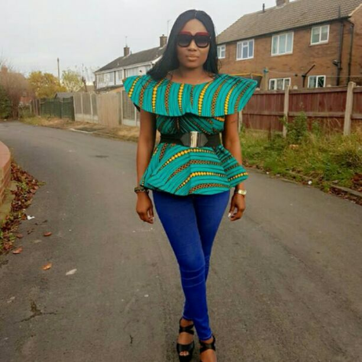
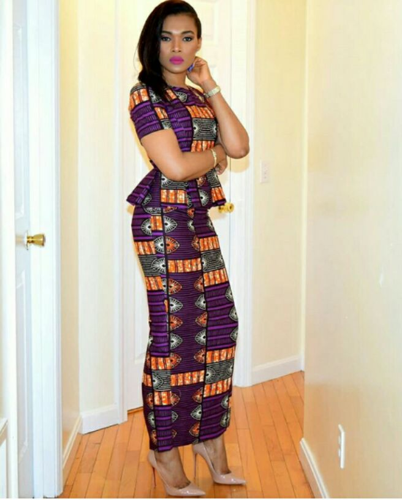

# Interestingly Beautiful Ankara Styles I Found on Instagram

[Fashion](https://estheradeniyi.com/category/fashion/)
# Interestingly Beautiful Ankara Styles I Found on Instagram

by [Esther Adeniyi](https://estheradeniyi.com/author/esther-adeniyi/)on [December 14, 2017May 25, 2018](https://estheradeniyi.com/interestingly-beautiful-ankara-styles-i/)[2 Comments on Interestingly Beautiful Ankara Styles I Found on Instagram](https://estheradeniyi.com/interestingly-beautiful-ankara-styles-i/#comments)

Sharing is caring!

- [0](https://www.facebook.com/sharer/sharer.php?u=https%3A%2F%2Festheradeniyi.com%2Finterestingly-beautiful-ankara-styles-i%2F&amp;t=Interestingly%20Beautiful%20Ankara%20Styles%20I%20Found%20on%20Instagram)
- [0](https://twitter.com/intent/tweet?text=Interestingly%20Beautiful%20Ankara%20Styles%20I%20Found%20on%20Instagram&amp;url=https%3A%2F%2Festheradeniyi.com%2Finterestingly-beautiful-ankara-styles-i%2F)
- [35](#)

35shares

If you are like me, you will be out and about looking for Ankara styles on Instagram. You know that my sister is now a professional tailor (Let me first scatter ground and laugh, I am coming). God catch una tailors! Hehehe&#x2026;. So when we want to pick beautiful Ankara styles, the two both of us will go and be looking everywhere on Instagram. We are waka waka like that o, hia!

So sha, in my church mind, I decided to compile 10 of the most beautiful [ankara styles](https://www.estheradeniyi.com/ankara-styles-in-12-fabulous-outfits) I have seen this week or this month so far. You can find inspiration from these styles if your Ankara fabric is lying fallow. Christmas is kuku around the corner na tele.
photo via&#xA0;@bibisquintessence
I personally like this [ankara top](https://www.estheradeniyi.com/fabulous-ankara-tops-in-33-different) because of the peplum and cape and there is also a good waist &#xA0;definition. It can be sometimes difficult to combine two major styles hence you come out with an extraordinarily busy looking outfit. This one however is clean and gorgeous.

&#xA0;
photo via&#xA0;@allseasons111
This ankara playsuit na die o. The one hand cut is refreshingly innovative. I feel you can wear this to casual parties and still look fabulously hot. Her Ankara style combination is also on point.

&#xA0;
photo via&#xA0;@ogodordesigns
I am a figure A sized girl, this style personally does it for me as it balances well. The bulky and wide sleeve will create a balanced silhouette for me especially because the waist is defined.

&#xA0;
photo via&#xA0;@kikiclothing
This kid&#x2019;s high-low Ankara top is very beautiful. Also, look at the high neck and no sleeve concept. I would like this because it is a very excellent [ankara style to conceal big tummy](https://www.estheradeniyi.com/ankara-styles-that-will-hide-your-big). I don&#x2019;t like stress. I just like styles doubling up as both stylish and comfortable.

&#xA0;
photo via&#xA0;@obi_sky
See the cape of this ankara style, I love this so so much. Joy please, read this part and begin to think of what to do with it o. The straight skirt is a reminder of how quickly we left straight skirt for 6-pieces ankara skirts. I am however not sure if this a straight [ankara skirt](https://www.estheradeniyi.com/fabulously-amazing-ankara-skirts) or a wrapper.

&#xA0;
photo via&#xA0;@malaabisbymaymz
Omo! See [ankara style](http://weddingdigestnaija.com/latest-2017-ankara-styles-spectacular-and-modern-gowns-tops-dresses/)! The gorgeousness of red. I like the red interruption in this outfit. I don&#x2019;t know if any other colour on this outfit would do as much justice to the cloth. The sleeves also. This ankara style is for inspiration abeg.

&#xA0;
photo via&#xA0;@styleyourselfie
I have been waiting for this moment to come. I love me this combination, see combination brethren. The red trench coat makes this outfit sleek. It&#x2019;s one of my favorites in this selection.

&#xA0;
photo via&#xA0;@doopie
So, I think this bag is a little bit distracting o. I love the style but I drift towards the bag a lot. I like its Africaness. Now the head turning outfit, the style is an effective shape accentuator. I think this will do well for mostly hour glass girls. What do you think? A bold plus sized hour glass woman can also rock this if she is good with carriage.
photo via&#xA0;@obi_sky
This is just like the yellow Ankara style. The difference is just the way the top is.

So guys, what do you think about these ankara styles? I get eyes abi? Which one of these ankara styles do you love the most?

Related : [Beautiful Ankara Styles to sew now](https://www.estheradeniyi.com/beautiful-ankara-styles-to-sew-now?m=1)

Sharing is caring!

- [0](https://www.facebook.com/sharer/sharer.php?u=https%3A%2F%2Festheradeniyi.com%2Finterestingly-beautiful-ankara-styles-i%2F&amp;t=Interestingly%20Beautiful%20Ankara%20Styles%20I%20Found%20on%20Instagram)
- [0](https://twitter.com/intent/tweet?text=Interestingly%20Beautiful%20Ankara%20Styles%20I%20Found%20on%20Instagram&amp;url=https%3A%2F%2Festheradeniyi.com%2Finterestingly-beautiful-ankara-styles-i%2F)
- [35](#)

35shares

Tags:[Styles](https://estheradeniyi.com/tag/styles/)