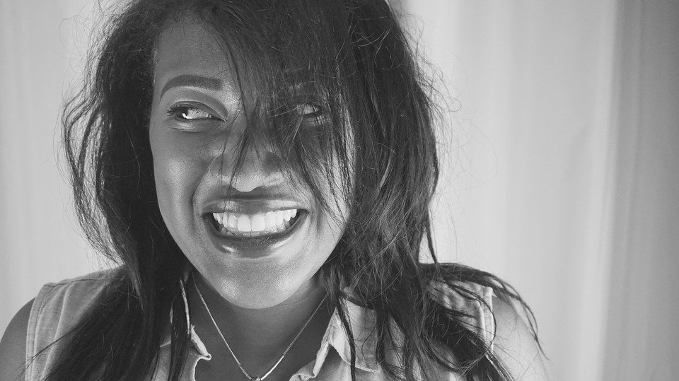

# It’s totally, absolutely, very much okay to be alone

[Uncategorized](https://estheradeniyi.com/category/uncategorized/)
# It&#x2019;s totally, absolutely, very much okay to be alone

by [Esther Adeniyi](https://estheradeniyi.com/author/esther-adeniyi/)on [May 24, 2017April 27, 2018](https://estheradeniyi.com/its-totally-absolutely-very-much-okay/)[Leave a Comment on It&#x2019;s totally, absolutely, very much okay to be alone](https://estheradeniyi.com/its-totally-absolutely-very-much-okay/#respond)

Sharing is caring!

- [0](https://www.facebook.com/sharer/sharer.php?u=https%3A%2F%2Festheradeniyi.com%2Fits-totally-absolutely-very-much-okay%2F&amp;t=It%27s%20totally%2C%20absolutely%2C%20very%20much%20okay%20to%20be%20alone)
- [0](https://twitter.com/intent/tweet?text=It%27s%20totally%2C%20absolutely%2C%20very%20much%20okay%20to%20be%20alone&amp;url=https%3A%2F%2Festheradeniyi.com%2Fits-totally-absolutely-very-much-okay%2F)
- [0](#)

0shares

 This is going to be one of my shortest blogs because I am going to be straightforward, concise and sharp. I am going to go pinpoint and hit the nail on the head.

In life , you are going to meet and interact with different sets and classes of people. You are one of such classes, but with a little bit of here and there and that is what makes you particularly unique.

As you grow older, you are going to refine some of your life values and perspectives. If you intend to make something very meaningful of your life, you are going to have less and less people in your circle as you progress. You are going to want to keep only people who will help you and assist you in fulfilling your goals. You are going to want to be with people whose ideas resonate with you, people who can gratefully accept your help and be on the same page with you. This weeding is going to happen naturally.

Am I saying that you should not have many friends? No.

Do I mean that you shouldn&#x2019;t be as outgoing as you comfortably are? No

This post is for a certain people. You can&#x2019;t seem to get everyone in. Life is beginning to get too pleasantly serious than what your friends can cope with. You really haven&#x2019;t had any need to ask them to go away, they have naturally gone, you have naturally reshuffled.

Here it is: that is okay. It is okay to be alone. It is okay to not have too many people. It is okay to also have just a handful of people who like to be on your life bus. It is okay to not have a best friend. It&#x2019;s all totally, absolutely, very much okay to be alone.

Sharing is caring!

- [0](https://www.facebook.com/sharer/sharer.php?u=https%3A%2F%2Festheradeniyi.com%2Fits-totally-absolutely-very-much-okay%2F&amp;t=It%27s%20totally%2C%20absolutely%2C%20very%20much%20okay%20to%20be%20alone)
- [0](https://twitter.com/intent/tweet?text=It%27s%20totally%2C%20absolutely%2C%20very%20much%20okay%20to%20be%20alone&amp;url=https%3A%2F%2Festheradeniyi.com%2Fits-totally-absolutely-very-much-okay%2F)
- [0](#)

0shares

Tags:[Life](https://estheradeniyi.com/tag/life/)