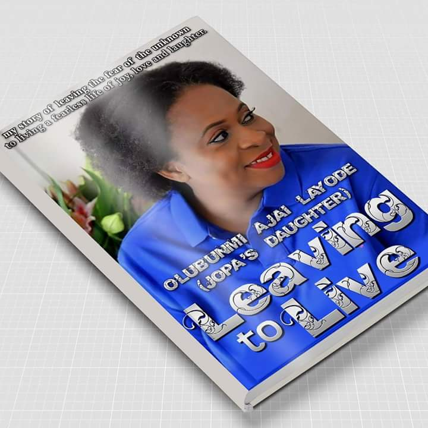

# Leaving to Live by OLubunmi Ajai (Jopa’s Daughter)

[Books](https://estheradeniyi.com/category/books/)
# Leaving to Live by OLubunmi Ajai (Jopa&#x2019;s Daughter)

by [Esther Adeniyi](https://estheradeniyi.com/author/esther-adeniyi/)on [January 13, 2018April 27, 2018](https://estheradeniyi.com/leaving-to-live-by-olubunmi-ajai-jopas/)[2 Comments on Leaving to Live by OLubunmi Ajai (Jopa&#x2019;s Daughter)](https://estheradeniyi.com/leaving-to-live-by-olubunmi-ajai-jopas/#comments)

Sharing is caring!

- [0](https://www.facebook.com/sharer/sharer.php?u=https%3A%2F%2Festheradeniyi.com%2Fleaving-to-live-by-olubunmi-ajai-jopas%2F&amp;t=Leaving%20to%20Live%20by%20OLubunmi%20Ajai%20%28Jopa%27s%20Daughter%29)
- [0](https://twitter.com/intent/tweet?text=Leaving%20to%20Live%20by%20OLubunmi%20Ajai%20%28Jopa%27s%20Daughter%29&amp;url=https%3A%2F%2Festheradeniyi.com%2Fleaving-to-live-by-olubunmi-ajai-jopas%2F)
- [0](#)

0shares

&#x2018;You won&#x2018;t believe what I did what next. I stood naked in the bathroom and started praying to God. I reminded God that the heart of the king is in his hands and that he could turn it which way he liked. I begged him to turn Dafe&#x2019;s heart to me. Yes, that was how messed up and stupid I was. Wasting God&#x2019;s precious time on a useless engagement. Even though it was apparent to me that my being in the shelter meant freedom to Dafe, as he&#x2018;d obviously not been home for days. I prayed to God to release him from the &#x2018;strange&#x2018; woman and bring him back home to me and his baby. Only that there was no strange woman. I knew his current side chic was Phoebe, the skinny, dark-skinned Zambian who was the direct opposite of the light-skinned chubby Bunmi.

As Funke continued packing up I and Daniel&#x2018;s stuff in the bedroom, I knelt, naked on the floor of the bathroom of our Chafford Hundred home and sobbed my heart out. I was brokenhearted. I was broken. The dam of tears broke as I wondered where I would start from. I did not want my son to be an only child. I begged God to bring Dafe back to us, so we could have more children and Daniel would have full blood siblings. I desperately wanted Daniel to have the kind of childhood I&#x2018;d had, one in a loving happy home with two parents together.

As I was doing this, I thought I heard his car in the driveway. I hurried to the guestroom which faced the driveway and truly, I saw him parking his car. My heart soared! Surely God answers prayers! And swiftly too. Oh, my sweet Lord! As I was marvelling at this instantaneous miracle, Dafe, probably sensing that someone was looking at him, looked up and our eyes locked. I stood still, with my heart thumping painfully in my ribcage as he calmly brought out his phone, and made a call. When he hung up, he turned on the ignition and drove off. Just like that.

I stood there, confused as I watched his car disappear. What had just happened? Had God not called him back to us? Had he not heard me calling him back home spiritually? Was he being stubborn to the call? I hoped he would turn back. I prayed he would turn back. Maybe he
 went to the corner-shop to pick up groceries for us. But in my heart, I knew he was going back to Phoebe. The phone call must have been to her, possibly to tell her of the latest situation. Hopes of reconciliation fell on the floor and shattered in a million pieces.

Funke, Daniel and I finally left the house. The next time I came to the house a few weeks later to pick up the rest of my things, it was Phoebe&#x2019;s car in the drive way. And when I went upstairs to the master bedroom to clear my remaining stuff, it was Phoebe who tiptoed to the guest bedroom to hide&#x2019;.

How did I turn this mess into a message? Find out and be inspired to turn any mess you might be in to a message for the world. Pre-order now.

&#xA3;5 &#x2013; Paypal &#x2026; Bunmiajai@yahoo.com

&#xA3;5 &#x2013; Barclays
 20-34-69, 33869946

N1750 &#x2013; Zenith, Olubunmi Ajai
 1004992429

Please email me confirmation of payment at
 Mamatobi@hotmail.com

Kindle available on Amazon for &#xA0;&#xA3;6.99. Search word &#x2013; Layode.

Hard copy will be available on Amazon for &#xA3;9.99 this week. Search word &#x2013; Layode

Will also be available on Kobo this week for pre-order.

Cheers!

Sharing is caring!

- [0](https://www.facebook.com/sharer/sharer.php?u=https%3A%2F%2Festheradeniyi.com%2Fleaving-to-live-by-olubunmi-ajai-jopas%2F&amp;t=Leaving%20to%20Live%20by%20OLubunmi%20Ajai%20%28Jopa%27s%20Daughter%29)
- [0](https://twitter.com/intent/tweet?text=Leaving%20to%20Live%20by%20OLubunmi%20Ajai%20%28Jopa%27s%20Daughter%29&amp;url=https%3A%2F%2Festheradeniyi.com%2Fleaving-to-live-by-olubunmi-ajai-jopas%2F)
- [0](#)

0shares

Tags:[Books](https://estheradeniyi.com/tag/books/)