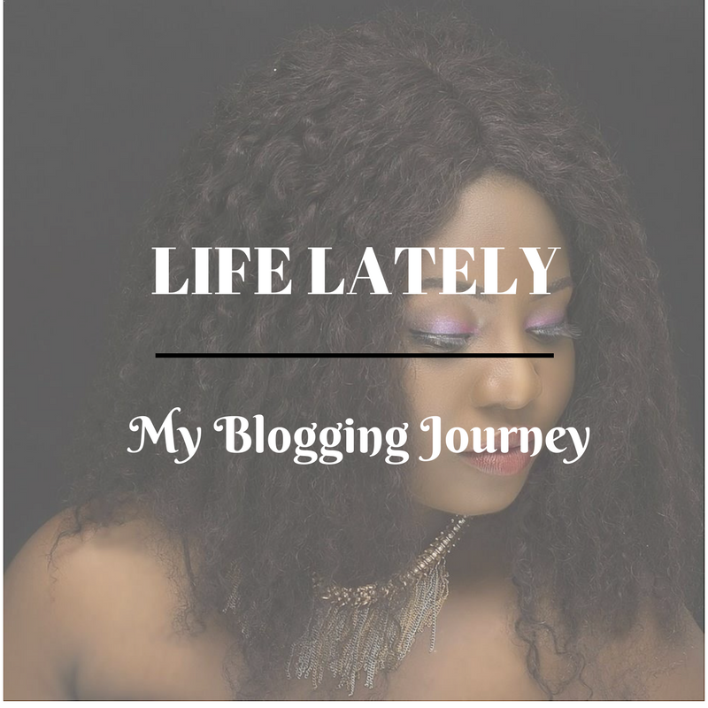

# Life Lately || My Blogging Journey is Taking a New Turn

[Blogging Resources](https://estheradeniyi.com/category/blogging-resources/)
# Life Lately || My Blogging Journey is Taking a New Turn

by [Esther Adeniyi](https://estheradeniyi.com/author/esther-adeniyi/)on [October 26, 2017May 25, 2018](https://estheradeniyi.com/life-lately-my-blogging-journey-is/)[13 Comments on Life Lately || My Blogging Journey is Taking a New Turn](https://estheradeniyi.com/life-lately-my-blogging-journey-is/#comments)

Sharing is caring!

- [0](https://www.facebook.com/sharer/sharer.php?u=https%3A%2F%2Festheradeniyi.com%2Flife-lately-my-blogging-journey-is%2F&amp;t=Life%20Lately%20%7C%7C%20My%20Blogging%20Journey%20is%20Taking%20a%20New%20Turn)
- [0](https://twitter.com/intent/tweet?text=Life%20Lately%20%7C%7C%20My%20Blogging%20Journey%20is%20Taking%20a%20New%20Turn&amp;url=https%3A%2F%2Festheradeniyi.com%2Flife-lately-my-blogging-journey-is%2F)
- [0](#)

0shares

Hello. If you regularly follow my blog, you must have noticed the drag around here. I honestly don&#x2019;t know what this blog post is going to be about but if I fulfill the promise I made to myself- to be as transparent as I can be- I should make some sense in the end.

I have been confused, burnt out and tired. I am currently at a cross road in my blogging journey. I know deep down, I want to blog. Blogging and everything around it makes me happy. Churning one more beautiful piece on this blog gives me so much of fulfillment. I think to myself- one more person helped, one more person informed, one more person equipped.

I want to admit that something is killing this joy. Finding the intersection between the right way and my own way is gradually killing my Blogging passion. I am left with just tasks and targets I have set for myself. Enough of the self denial and the pretense. There is so much of pressure. There is the pressure to be a successful blogger, the pressure to [make enough money from blogging](https://www.estheradeniyi.com/how-do-i-earn-money-as-blogger), the pressure to narrow down to a niche, the pressure to do SEO the right way and to have a great Alexa ranking, the pressure to conform to the blogging rules. I wonder who set the blogging rules but they seem to exist.

I joined The Bloggers&#x2019; Advocate on Whatsapp from a link I followed from Instagram and I began to discover my true blogging self. Discussions in there have been an awakening. Some of them, casual, other discussions, serious but in all, I have been rudely awakened.

Maybe I do not have to follow the rules. Maybe. Just after my most recent collaboration with TravelStart Nigeria, I went on to check on some of the other Bloggers on the [&#x201C;How to be a travel blogger&#x201D; Infographic](https://www.estheradeniyi.com/how-to-become-travel-blogger) project and I began to develop my form, my essence, what I really want.

I had always followed Daniela Uslan in the early years of my blogging. Somehow, her name just popped up in my head recently and I decided to go check her out again. Surprisingly, one of her posts on was evidence that [she has been here before](http://danielauslan.com/the-trap-of-the-niche/). She has been at the cross road before. I have been confused many times on my blogging journey, not like this.

Just yesterday, a friend had sent me a link to [lifestyle blog post ideas](https://heleneinbetween.com/2016/02/75-blog-post-ideas-for-lifestyle.html). I went in to check and realized that I was also an ardent reader of that blog. How much I had lost touch of how I started. I had read Helene In Between so much that I was addicted to reading her travel experiences and life generally.

This time around, I think I am starting my blogging journey all over again and I am going to take a deep breathe, I am going to relax and truly enjoy this journey. I am not going to be pressured to narrow down anymore. I am just going to be me, Esther Adeniyi and if in future, my Blogging is steered towards a particular niche along the line, oh great. I am going to listen to myself, listen to my readers and then we meet at an interesting point.

Finding new Blogging friends in [The Bloggers&#x2019; Advocate](https://www.facebook.com/thebloggersadvocate/), going back to read Daniela Uslan and Helene In Between is such an awakening. If for now, the only thing I can do is talk about Life, I take that as the first new segment in this new blogging journey. All former posts remain, every single one of them. I and the contributing writers of this blog have worked so very hard to produce the beautiful content we have in here, so, take time to check through if you would like to.

I would rather build on the foundation this blog has presented me with than start a new one. I am happy to be called Blogger. It&#x2019;s such a call, a responsibility and hopefully all the source of income I need.

Is there a way I am supposed to end this blog post? I think I am excited on this new blogging journey. I just want to create content that matter to me and find my own audience. That&#x2019;s the most important to me right now.

Sharing is caring!

- [0](https://www.facebook.com/sharer/sharer.php?u=https%3A%2F%2Festheradeniyi.com%2Flife-lately-my-blogging-journey-is%2F&amp;t=Life%20Lately%20%7C%7C%20My%20Blogging%20Journey%20is%20Taking%20a%20New%20Turn)
- [0](https://twitter.com/intent/tweet?text=Life%20Lately%20%7C%7C%20My%20Blogging%20Journey%20is%20Taking%20a%20New%20Turn&amp;url=https%3A%2F%2Festheradeniyi.com%2Flife-lately-my-blogging-journey-is%2F)
- [0](#)

0shares

Tags:[Blogging](https://estheradeniyi.com/tag/blogging/)[Life](https://estheradeniyi.com/tag/life/)[Life lately](https://estheradeniyi.com/tag/life-lately/)