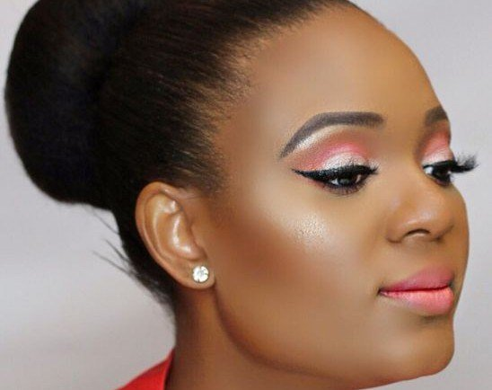
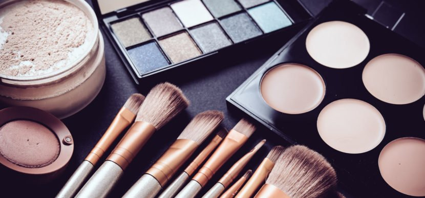

# Makeup for Beginners: Starter Kit

[Beauty](https://estheradeniyi.com/category/beauty/)
# Makeup for Beginners: Starter Kit

by [Esther Adeniyi](https://estheradeniyi.com/author/esther-adeniyi/)on [October 2, 2017May 25, 2018](https://estheradeniyi.com/makeup-for-beginners-starter-ki/)[Leave a Comment on Makeup for Beginners: Starter Kit](https://estheradeniyi.com/makeup-for-beginners-starter-ki/#respond)

Sharing is caring!

- [0](https://www.facebook.com/sharer/sharer.php?u=https%3A%2F%2Festheradeniyi.com%2Fmakeup-for-beginners-starter-ki%2F&amp;t=Makeup%20for%20Beginners%3A%20Starter%20Kit)
- [0](https://twitter.com/intent/tweet?text=Makeup%20for%20Beginners%3A%20Starter%20Kit&amp;url=https%3A%2F%2Festheradeniyi.com%2Fmakeup-for-beginners-starter-ki%2F)
- [2](#)

2shares

&#xA0;

#### Makeup for Beginners: Starter Kit

I am assuming that you have no idea on how to put on makeup, hence this makeup for beginners tutorial. You probably don&#x2019;t even know what and what &#x2018;they&#x2019; smear up on the face. Even pros need to come back to revise makeup for beginners once in a while. There are [makeup for beginners tips](https://www.buzzfeed.com/christinalan/ways-to-trick-people-into-thinking-youre-good) to help you get started all over the Internet too, so not to worry.

You might have been at one time or the other confused about what makeup products to use, how much of makeup to apply for beginners and where to start from in makeup application. This makeup for beginners blog post is to get you familiar with these items.

I know of people who apply only lipstick. They invest in quality lipstick and they are good to go. Their faces are brightened. For these people, they have already applied makeup and it&#x2019;s perfectly fine because makeup should never kill your natural glow, it should only enhance and accentuate your facial features.

If it is looking like you&#x2019;ve just been baked, it is not okay then. If you are ever going to be sticking to only lipstick, get your brows properly groomed. You can check out [how to pull off the all natural look](https://www.estheradeniyi.com/how-to-pull-off-all-natural-look) here. I explained how to achieve an effortless glow even without makeup.

So, let&#x2019;s begin on a makeup for beginners tour, shall we?

FACE

Moisturizer: &#xA0;this helps to prepare your face and protect it from breakouts as a result of these products. Some of us have sensitive skins. Get a moisturizer for your facial skin needs. There are different types of moisturizers for oily and dry skin.

Primer: it helps to set your makeup and keep them in place for a very long time. It is also a good base that separates your face from makeup products. Every makeup for beginners student should not forget how important primer is.

Foundation: you can actually go without foundation if you want to go easy and light; retain your natural skin glow or avoid looking too &#x2018;madeup&#x2019;. When buying a foundation, be careful to go for one that is your exact shade. Here is a [complete guide on how to choose the right foundation for your skin.](https://www.estheradeniyi.com/a-complete-guide-to-choosing-right)

Concealer: this helps to conceal blemishes and spots on your face. Apply on those areas you want to correct and under your eyes to reduce the appearance of eye bags.[&#xA0;](http://www.konga.com/catalogsearch/result/?q=CONCEALER&amp;category_name=Makeup&amp;k_id=palacedaughter)

Powder: it helps to create a fine finish. If you are confused about shades and numbers, you can go for translucent powders for a start.

Blush: this is an optional item for makeup for beginners. I would advice for light blush application when anyone is just starting out. Light peach or cream blushes are the best. It helps to brighten your face. Create a false smile and apply on the most protruding part of your cheeks.

&#xA0;

EYES

Eye primer: this helps to prepare your eyelids for the makeup. It allows for the eye shadow to be distinct and perfect.

Eye brow filler: you can get one at a makeup store. You can also use a fluid liner or pencil to fill in your brows.

Eye liner: this is a tricky makeup for beginners procedure. Go light with just a thin stroke for a start. Make it thicker for special events or to create a dramatic look. I will be making a blog post (an infographic) about it soon.

Eye shadow: I recommend a chord of neutrals for a start. Go easy on colours and experiment on what and what colours accentuate your eyes.[&#xA0;](http://www.konga.com/catalogsearch/result/?q=EYE%20SHADOW&amp;k_id=palacedaughter)

Mascara: this is an excellent item to bring life to your lashes. Even if you don&#x2019;t have long lashes, &#xA0;the mascara helps to define them and make you look dashing.

Fake lashes and glue: this is optional. Fake lashes compensate for very short lashes.

You can check out these [makeup for beginners brushes](https://www.estheradeniyi.com/the-only-makeup-brushes-you-need-as?m=1) blog post

LIPS

Clear lip gloss:&#xA0;this is definitely one of the makeup for beginners staples. Every woman needs a clear lip gloss. In fact, everyone. You probably have this already!

Coloured lip gloss: this is for when you don&#x2019;t like matte and other dry lipstick variants.

Lip liner: this helps to [define your lips](http://www.amwayconnections.com/make-up-cosmetics/artistry-tips-4-ways-define-lips/). Choose a shade darker than your lipstick. They bring out a good shape to have a nice colour fill in. You can also make your lips look fuller with lip liner. It also prevents lipstick bleed.

Lipstick: this will take more of experimenting. You get to invest in colours that make your makeup perfect. Your lipstick can help to create a natural, nude finish or play up your makeup to look more dramatic.[&#xA0;](http://www.konga.com/catalogsearch/result/?q=LIPSTICK&amp;category_name=Makeup&amp;k_id=palacedaughter)

CONTOURING AND HIGHLIGHTING

This is absolutely optional for makeup for beginners classes. [Applying foundation](http://www.cosmopolitan.com/style-beauty/beauty/how-to/a62357/how-to-apply-foundation/) has a way of making your face lose definition. Countouring helps to correct that. Highlighten helps to liven up your face for a perfect finish.

Foundation: use a foundation two shades lighter than your skin tone to highlight. Highlight the bridge of your nose, between the brows where a furrow may appear, under the eyebrow arch and the high point of the cheek.

By the way, have you heard of this method of [applying powder before foundation](https://www.estheradeniyi.com/applying-powder-before-foundation) tutorial?

Bronzer: use a low or non-shimmer bronzer to contour. Contour on each side of the nose, the tip of the nose, under the jaw line, around the hair line and underside of the cheekbone.[&#xA0;](http://www.konga.com/catalogsearch/result/?q=BRONZER&amp;k_id=palacedaughter)

Apply powder to set.

Makeup for beginners isn&#x2019;t as difficult as you may presume. It is only for you to get a grasp of basic makeup for beginners tips here and there and you are good to go. Check out other makeup for beginners tutorials, tips, tricks and methods all over the Internet.

Photo credits&#xA0;: [Signature Podozi](http://signature.podozi.com/simple-makeup-tips-to-slay-at-a-nigerian-wedding/) ;&#xA0;[Fremont Beauty College](http://www.fremontbeautycollege.com/makeup/)

Sharing is caring!

- [0](https://www.facebook.com/sharer/sharer.php?u=https%3A%2F%2Festheradeniyi.com%2Fmakeup-for-beginners-starter-ki%2F&amp;t=Makeup%20for%20Beginners%3A%20Starter%20Kit)
- [0](https://twitter.com/intent/tweet?text=Makeup%20for%20Beginners%3A%20Starter%20Kit&amp;url=https%3A%2F%2Festheradeniyi.com%2Fmakeup-for-beginners-starter-ki%2F)
- [2](#)

2shares

Tags:[Beauty](https://estheradeniyi.com/tag/beauty/)