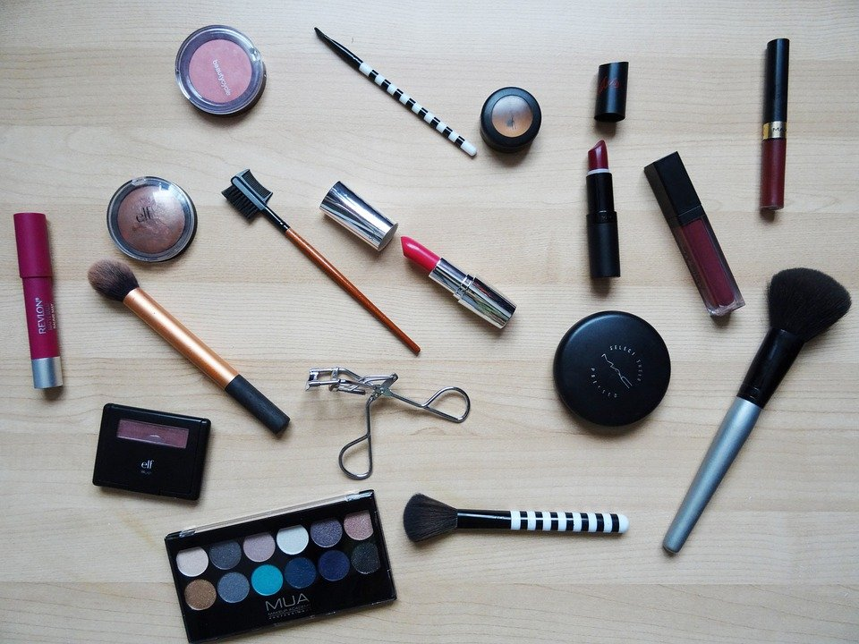

# Makeup hacks you probably didn’t know

[Uncategorized](https://estheradeniyi.com/category/uncategorized/)
# Makeup hacks you probably didn&#x2019;t know

by [Esther Adeniyi](https://estheradeniyi.com/author/esther-adeniyi/)on [July 7, 2017April 27, 2018](https://estheradeniyi.com/makeup-hacks-you-probably-didnt-know/)[2 Comments on Makeup hacks you probably didn&#x2019;t know](https://estheradeniyi.com/makeup-hacks-you-probably-didnt-know/#comments)

Sharing is caring!

- [0](https://www.facebook.com/sharer/sharer.php?u=https%3A%2F%2Festheradeniyi.com%2Fmakeup-hacks-you-probably-didnt-know%2F&amp;t=Makeup%20hacks%20you%20probably%20didn%27t%20know)
- [0](https://twitter.com/intent/tweet?text=Makeup%20hacks%20you%20probably%20didn%27t%20know&amp;url=https%3A%2F%2Festheradeniyi.com%2Fmakeup-hacks-you-probably-didnt-know%2F)
- [0](#)

0shares

 Hi&#xA0;girls, today, you will be exposed to&#xA0;Makeup hacks you probably didn&#x2019;t know

I&#xA0;bring y&#x2019;all&#xA0;good&#xA0;tidings of great joy?. This blog post is for some of us that don&#x2019;t&#xA0;have a&#xA0;complete makeup kit. Sometimes we&#xA0;travel and forget to pack everything.&#xA0;Yeah, most&#xA0;of&#xA0;us&#xA0;have&#xA0;been and&#xA0;will be victims of this.

Improvised makeup, if&#xA0;done&#xA0;correctly&#xA0;will&#xA0;look as&#xA0;good and neat as the original.&#xA0;I&#x2019;ll&#xA0;just list out some&#xA0;of the&#xA0;improvisations and Makeup hacks we&#xA0;can&#xA0;do

- Cotton bud for eye shadow, &#xA0;liner and eyebrow concealer&#xA0;brush
- Lipstick as&#xA0;blusher or&#xA0;vice versa&#xA0;
- Hair&#xA0;spray as makeup spray?. Let&#xA0;me give&#xA0;directive&#xA0;on&#xA0;this one.&#xA0;Hold the&#xA0;spray a bit away&#xA0;from face and&#xA0;spray a&#xA0;little to hold makeup in&#xA0;place&#xA0;for long. &#xA0;Please&#xA0;we&#x2019;re advised to use&#xA0;this only in&#xA0;emergency situations.&#xA0;
- Eye pencil/maskara for&#xA0;eyeliner .&#xA0;
- Black&#xA0;eye&#xA0;pencil as&#xA0;black&#xA0;lipstick .&#xA0;
- Foundation as eyebrow concealer .&#xA0;
- Eyeshadow and&#xA0;foundation as contour.&#xA0;

 Are&#xA0;there&#xA0;other Makeup hacks you think we should know about?&#xA0;

Sharing is caring!

- [0](https://www.facebook.com/sharer/sharer.php?u=https%3A%2F%2Festheradeniyi.com%2Fmakeup-hacks-you-probably-didnt-know%2F&amp;t=Makeup%20hacks%20you%20probably%20didn%27t%20know)
- [0](https://twitter.com/intent/tweet?text=Makeup%20hacks%20you%20probably%20didn%27t%20know&amp;url=https%3A%2F%2Festheradeniyi.com%2Fmakeup-hacks-you-probably-didnt-know%2F)
- [0](#)

0shares

Tags:[Beauty](https://estheradeniyi.com/tag/beauty/)[makeup](https://estheradeniyi.com/tag/makeup/)