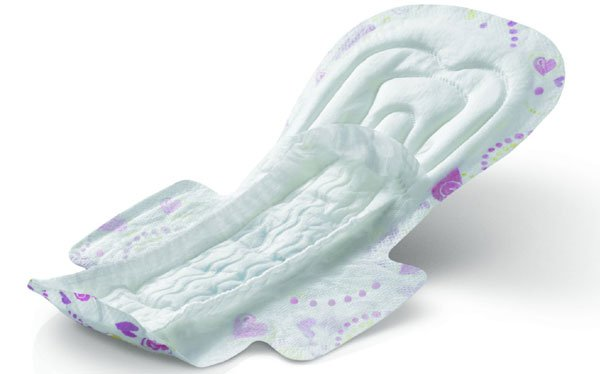

# Menstrual Hygiene: AHF calls on the Federal Government

[News](https://estheradeniyi.com/category/news/)
# Menstrual Hygiene: AHF calls on the Federal Government

by [Esther Adeniyi](https://estheradeniyi.com/author/esther-adeniyi/)on [October 12, 2017May 25, 2018](https://estheradeniyi.com/menstrual-hygiene-ahf-calls-on-federa/)[Leave a Comment on Menstrual Hygiene: AHF calls on the Federal Government](https://estheradeniyi.com/menstrual-hygiene-ahf-calls-on-federa/#respond)

Sharing is caring!

- [0](https://www.facebook.com/sharer/sharer.php?u=https%3A%2F%2Festheradeniyi.com%2Fmenstrual-hygiene-ahf-calls-on-federa%2F&amp;t=Menstrual%20Hygiene%3A%20AHF%20calls%20on%20the%20Federal%20Government)
- [0](https://twitter.com/intent/tweet?text=Menstrual%20Hygiene%3A%20AHF%20calls%20on%20the%20Federal%20Government&amp;url=https%3A%2F%2Festheradeniyi.com%2Fmenstrual-hygiene-ahf-calls-on-federa%2F)
- [0](#)

0shares

&#x201C;Aids Health Care Foundation (AHF), an NGO, on Tuesday in
 Abuja called on the Federal Government to show commitment to the Nigerian
 girl-child by investing in their menstrual hygiene.&#x201D;- [PM News](https://www.pmnewsnigeria.com/2017/10/11/foundation-task-govt-commitment-menstrual-hygiene/)

Mr Michael Weinstein, President of the Foundation, made the
 appeal at the distribution of 330,000 sanitary pads to young girls ahead of the
 International Day of the Girl-Child.

The global girl-child day is celebrated annually on Oct. 11.

Weinstein said that prioritising the menstrual hygiene of
 the girl-child would empower young girls in developing their capacities and
 leadership skills, as most girls in Africa were extremely disadvantaged.

[Read: How to be comfortable on your menstrual period](https://www.estheradeniyi.com/on-your-menstrual-period-10-effortless)

Weinstein said most often young girls in Africa had to skip
 school and stay home because they could not afford to buy sanitary pads during
 their menstrual periods.

He added that menstruation, which was natural and integral
 to a growing woman&#x2019;s development, should not be a barrier to her success or
 meant as an embarrassment or shame.

Weinstein further urged the Nigerian government to give
 every girl-child confidence to succeed in building a better world.

Also speaking, Mr Job Ominyi, Wash, Sanitation and Hygiene
 Officer UNICEF, defined menstruation as a natural and normal biological process
 experienced by all adolescent girls and women.

Ominyi said parents, guardians, teachers and the government
 should serve as advocates in ensuring proper menstruation management of the
 girl-child.

He urged the Federal Government to create a favourable
 learning environment for children by providing hygiene facilities in schools to
 ensure proper treatment and examination.

Dr Joe Odumakin, a women&#x2019;s rights activist and President,
 Women Arise for Change Initiative, said there was no justification for a
 girl-child to grieve in maintaining herself during menstruation.

She noted that sanitary pads were sold at exorbitant prices
 from N300 to N500, which the poor and less privileged girls were unable to
 afford.

&#x201C;Most girls in rural communities cannot afford sanitary
 pads; they suffer self-esteem, become demoralised and stay out of school due to
 embarrassing moments they have experienced.

[Also read: How to predict your next menstrual date](https://www.estheradeniyi.com/how-to-predict-your-next-menstrual-date)

&#x201C;There are health implications when they use alternatives
 such as wrappers and cotton wool which can cause them infection,&#x2019;&#x2019; she said.

&#xA0;

Odumakin further called on manufacturers and youths to be
 innovative in producing sanitary pads at cheaper rates for young girls as
 condoms were made available and free for men.

Source: [PM News](https://www.pmnewsnigeria.com/2017/10/11/foundation-task-govt-commitment-menstrual-hygiene/)

Pic Credit : [Crunchy Mums](http://crunchymoms.com/whats-in-my-disposable-menstrual-pad/)

Sharing is caring!

- [0](https://www.facebook.com/sharer/sharer.php?u=https%3A%2F%2Festheradeniyi.com%2Fmenstrual-hygiene-ahf-calls-on-federa%2F&amp;t=Menstrual%20Hygiene%3A%20AHF%20calls%20on%20the%20Federal%20Government)
- [0](https://twitter.com/intent/tweet?text=Menstrual%20Hygiene%3A%20AHF%20calls%20on%20the%20Federal%20Government&amp;url=https%3A%2F%2Festheradeniyi.com%2Fmenstrual-hygiene-ahf-calls-on-federa%2F)
- [0](#)

0shares

Tags:[Health and fitness](https://estheradeniyi.com/tag/health-and-fitness/)[News](https://estheradeniyi.com/tag/news/)