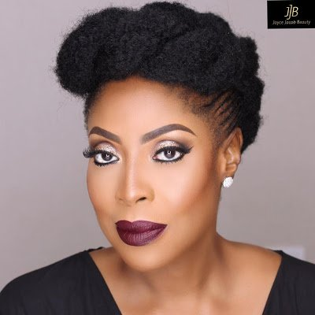

# Mo Abudu Makes List Of 25 Most Powerful Women In Global Television

[News](https://estheradeniyi.com/category/news/)
# Mo Abudu Makes List Of 25 Most Powerful Women In Global Television

by [Esther Adeniyi](https://estheradeniyi.com/author/esther-adeniyi/)on [September 30, 2017May 25, 2018](https://estheradeniyi.com/mo-abudu-makes-list-of-25-most-powerfu/)[Leave a Comment on Mo Abudu Makes List Of 25 Most Powerful Women In Global Television](https://estheradeniyi.com/mo-abudu-makes-list-of-25-most-powerfu/#respond)

Sharing is caring!

- [0](https://www.facebook.com/sharer/sharer.php?u=https%3A%2F%2Festheradeniyi.com%2Fmo-abudu-makes-list-of-25-most-powerfu%2F&amp;t=Mo%20Abudu%20Makes%20List%20Of%2025%20Most%20Powerful%20Women%20In%20Global%20Television)
- [0](https://twitter.com/intent/tweet?text=Mo%20Abudu%20Makes%20List%20Of%2025%20Most%20Powerful%20Women%20In%20Global%20Television&amp;url=https%3A%2F%2Festheradeniyi.com%2Fmo-abudu-makes-list-of-25-most-powerfu%2F)
- [0](#)

0shares

&#x201C;Mosunmola
 Abudu, Chief Executive Officer of EbonyLife Television (EL TV) has been listed
 among 25 most powerful women in global TV by Hollywood Reporter.&#x201D;- [PM News](https://www.pmnewsnigeria.com/2017/10/11/nigerias-mo-abudu-makes-list-25-powerful-women-global-television/)

The
 Hollywood Reporter is one of the most respected show business magazines in the
 world.

EL TV is
 Africa&#x2019;s first Global Black Entertainment & Lifestyle network which began
 broadcasting in July, 2013 to a pan-African audience, on Multichoice DSTV Ch 165.

According to
 Hollywood Reporter&#x2019;s review, Abudu, popular called Mo, has been at the
 forefront of media innovation on the continent since transitioning from a
 career in human resources at oil giant Exxon Mobil to hosting a talk show
 &#x201C;Moments with Mo&#x201D;.

Mo&#x2019;s global
 network, EbonyLife TV, the largest pan-African network is available in about 50
 countries.

Her media
 empire now extends to movies.

In 2016,
 EbonyLife&#x2019;s film division co-produced Nollywood rom-com The Wedding Party,
 which smashed local box-office records, taking in more than $1.3 million at the
 Nigerian box office.

Her goal for
 the coming year: &#x201C;To successfully produce Africa&#x2019;s first sci-fi TV series.

Mo in her
 reaction to the listing said it was an honor and privilege to be included in
 global review.

&#x201C;It&#x2019;s an
 honor to continue to fly the flag for Nigeria and the continent.

&#x201C;I continue
 to give God all the glory.

&#xA0;

&#x201C;Thank you
 Lord and a big thank you to the EbonyLife team, my family and friends, partners
 and sponsors who give me so much support,&#x201D; Mo said.

Source: [PM News](https://www.pmnewsnigeria.com/2017/10/11/nigerias-mo-abudu-makes-list-25-powerful-women-global-television/)

Sharing is caring!

- [0](https://www.facebook.com/sharer/sharer.php?u=https%3A%2F%2Festheradeniyi.com%2Fmo-abudu-makes-list-of-25-most-powerfu%2F&amp;t=Mo%20Abudu%20Makes%20List%20Of%2025%20Most%20Powerful%20Women%20In%20Global%20Television)
- [0](https://twitter.com/intent/tweet?text=Mo%20Abudu%20Makes%20List%20Of%2025%20Most%20Powerful%20Women%20In%20Global%20Television&amp;url=https%3A%2F%2Festheradeniyi.com%2Fmo-abudu-makes-list-of-25-most-powerfu%2F)
- [0](#)

0shares

Tags:[News](https://estheradeniyi.com/tag/news/)