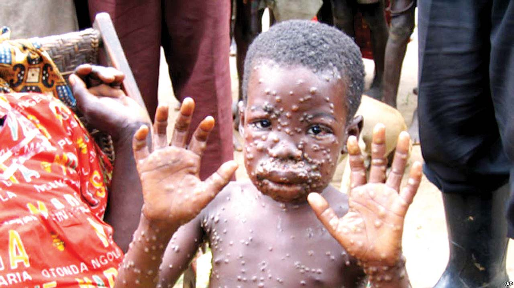

# Monkeypox: Things You Should Know About The Disease

[News](https://estheradeniyi.com/category/news/)
# Monkeypox: Things You Should Know About The Disease

by [Esther Adeniyi](https://estheradeniyi.com/author/esther-adeniyi/)on [October 10, 2017May 25, 2018](https://estheradeniyi.com/monkeypox-things-you-should-know-abou/)[Leave a Comment on Monkeypox: Things You Should Know About The Disease](https://estheradeniyi.com/monkeypox-things-you-should-know-abou/#respond)

Sharing is caring!

- [0](https://www.facebook.com/sharer/sharer.php?u=https%3A%2F%2Festheradeniyi.com%2Fmonkeypox-things-you-should-know-abou%2F&amp;t=Monkeypox%3A%20Things%20You%20Should%20Know%20About%20The%20Disease)
- [0](https://twitter.com/intent/tweet?text=Monkeypox%3A%20Things%20You%20Should%20Know%20About%20The%20Disease&amp;url=https%3A%2F%2Festheradeniyi.com%2Fmonkeypox-things-you-should-know-abou%2F)
- [0](#)

0shares

Contents

- [0.1 Things you should know about monkeypox](#Things_you_should_know_about_monkeypox)
- [0.2 Transmission of Monkeypox](#Transmission_of_Monkeypox)
- [0.3 Here are some ways to prevent the spread of Monkeypox:](#Here_are_some_ways_to_prevent_the_spread_of_Monkeypox)

- [1 Treatment of Monkeypox](#Treatment_of_Monkeypox)

#### Things you should know about monkeypox

Monkeypox is a rare disease that is caused by infection with
 monkeypox virus. The disease, which is a similar to but milder than Smallpox,
 is transmitted to people from various wild animals. It however, has limited
 secondary spread through human-to-human transmission.

It was first reported in 1970 in the Democratic Republic of
 Congo (then known as Zaire) in a 9 year old boy who lived in a region where
 smallpox had been eradicated 2 years prior.

It was also reported in Midwest U.S in 2003 and most
 patients, it was discovered, had had close contact with pet prairie dogs.

According to the U.S Centre for Disease Control, the natural
 reservoir of the disease remains unknown, however, some rodent species are
 expected to play a role in its transmission.

[World Health Organisation](https://en.wikipedia.org/wiki/World_Health_Organization) (WHO) reports that the infection
 has been found in many animal species: rope squirrels, tree squirrels, Gambian
 rats, striped mice, dormice and primates.

[You might also like to read what to do after a scorpion bite](https://www.estheradeniyi.com/what-to-do-after-scorpion-bite)

#### Transmission of Monkeypox

Through direct contact with the blood, bodily fluids, or
 handling of infected animals.

Eating infected animals is also another risk factor.

Human-human transmission is through infected respiratory
 tract secretions and skin lesions of an infected person or objects recently
 contaminated by patient fluids or lesion materials.

There is however, no evidence that

#### Here are some ways to prevent the spread of Monkeypox:

Avoid contact with animals that could harbor the virus
 (including animals that are sick or that have been found dead in areas where monkeypox
 occurs).

Avoid contact with any materials, such as bedding, that has
 been in contact with a sick animal.

Isolate infected patients from others who could be at risk
 for infection.

[Related: What&#x2019;s your HIV status?](https://www.estheradeniyi.com/getting-to-zero-what-is-your-hiv-status)

Practice good hand hygiene after contact with infected
 animals or humans. For example, washing your hands with soap and water or using
 an alcohol-based hand sanitizer.

Use personal protective equipment (PPE) when caring for
 patients.

Signs and symptoms of the disease include: Fever, Headache,
 Muscle aches, Backache, Swollen lymph nodes, Chills, Exhaustion. These signs
 occur between 0 &#x2013; 5 days of contracting the disease.

After about 1 &#x2013; 3 days of appearance of fever, the patient
 begins to develop rashes which starts from the face and spreads to several
 parts of the body.

### Treatment of Monkeypox

There is no proven treatment for the disease, however,
 smallpox vaccine, antivirals, and vaccinia immune globulin (VIG) can be used in
 controlling its spread.

&#xA0;

Please do well to report any of the above symptoms to the
 nearest appropriate medical centre as well as make sure the preventive measures
 listed above are taken.

&#x201C;The Nigeria Centre for Disease Control (NCDC) yesterday
 announced that fresh cases of Monkeypox disease had been recorded in the
 country. A statement by the NCDC Chief Executive Officer, Dr. Chikwe Ihekweazu,
 disclosed this.&#x201D;- [The Guardian](https://guardian.ng/news/monkeypox-spreads-in-lagos-six-other-states-cases-rise-to-31/)

According to [The Guardian](https://guardian.ng/news/monkeypox-spreads-in-lagos-six-other-states-cases-rise-to-31/), he said 19 fresh cases had been recorded across the country,
 aside from the 12 cases that were earlier recorded in Bayelsa State. According
 to the statement, other states where the disease has been discovered are
 Rivers, Ekiti, Akwa Ibom, Lagos, Ogun and Cross River States.

&#x201C;Following the notification of a suspected [Monkeypox outbreak](https://www.thisdaylive.com/index.php/2017/10/10/monkey-pox-spreads-to-lagos-rivers-five-other-states/) on September 22, 2017 in Bayelsa State, other suspected cases have
 been reported from six more states, bringing the total number of suspected
 cases to 31 across seven states.

&#x201C;Samples have been collected from each suspected case for
 laboratory confirmation and the results are still being awaited. So far, there
 have been no deaths recorded. It is unlikely that many of the suspected cases
 are actually monkeypox, as they were all being investigated.&#x201D;

Ihekweazu explained that the suspected cases are currently
 receiving appropriate medical care, even as the patients were improving
 clinically. He said the Federal Ministry of Health, through the NCDC was
 supporting the affected states to ensure that the outbreak was brought under
 control.

The epidemiologist disclosed that the NCDC had activated an
 Emergency Operation Centre (EOC) to coordinate investigation and response to
 the disease.

The symptoms include fever, headache, body pain, malaise,
 lymphadenopathy (enlargement of glands), sore throat and the characteristic
 generalised vesicular rash.

While urging general cleanliness, he added that the rashes
 might last between two to four weeks. Monkeypox is self-limiting, which means
 patients could recover with time.

The Lagos State Commissioner for Health, Dr. Jide Idris,
 said the blood samples from the two suspected cases in the state had been taken
 to the laboratory to verify their status.

Idris said although there was no specific vaccine for the
 disease, the vaccination against small pox has been proven to be 85 per cent
 effective in preventing the disease.

He urged residents to avoid close contact with infected
 people, wash their hands with soap, as well as avoid the consumption of bush
 meat and dead animals.

In Akwa Ibom State, the state Commissioner for Health, Dr.
 Dominic Ukpong urged the residents not to panic. He said: &#x201C;It is only Senegal
 that has the equipment to confirm the disease, so the samples of all suspected
 cases have been sent for confirmation.&#x201D;

In Rivers State, two patients suspected to be infected with
 the virus are currently hospitalised at the University of Port Harcourt
 Teaching Hospital, (UPTH).

The Chief Medical Director of the Institution, Prof. Aaron
 Ojule, who disclosed this yesterday, said the patients are in isolation ward
 where experts were managing their condition, pending the outcome of the samples
 taken for examination.According to [Y Naija](https://ynaija.com/reps-summon-health-minister-monkeypox-virus/?utm_medium=push%20notification&amp;utm_source=onesignal&amp;utm_campaign=ynaija%20push&amp;utm_content=ynaija%20%notification%push), on the issue of the monkeypox, the House of Representatives, on Tuesday, summoned the
 Minister of Health, Prof. Isaac Adewole, over the outbreak of monkeypox in the
 country.
Lawmaker from Bayelsa State, Mr. Diri Douye, raised the
 issue under matters of urgent national importance, praying that the minister
 should be summoned, [Y Naija](https://ynaija.com/reps-summon-health-minister-monkeypox-virus/?utm_medium=push%20notification&amp;utm_source=onesignal&amp;utm_campaign=ynaija%20push&amp;utm_content=ynaija%20%notification%push) reports

&#x201C;The House is concerned by the shocking admission of Adewole
 that monkeypox could not be confirmed in Nigeria until laboratory
 investigations by WHO and referral to Dakar, Senegal.

&#x201C;Again, concerned that the disease has spread to other
 states, notably Uyo in Akwa Ibom State, in spite of concerted efforts by the
 Bayelsa State Government since the initial report in Yenagoa, Bayelsa State,&#x201D;
 the House motion read partly.

News Source : [Bella Naija](https://www.bellanaija.com/2017/10/monkeypox-spreads-across-7-states-things-know-disease/)&#xA0;; The Guardian

Photo Credit: [The Guardian](https://guardian.ng/news/monkeypox-spreads-in-lagos-six-other-states-cases-rise-to-31/)

Sharing is caring!

- [0](https://www.facebook.com/sharer/sharer.php?u=https%3A%2F%2Festheradeniyi.com%2Fmonkeypox-things-you-should-know-abou%2F&amp;t=Monkeypox%3A%20Things%20You%20Should%20Know%20About%20The%20Disease)
- [0](https://twitter.com/intent/tweet?text=Monkeypox%3A%20Things%20You%20Should%20Know%20About%20The%20Disease&amp;url=https%3A%2F%2Festheradeniyi.com%2Fmonkeypox-things-you-should-know-abou%2F)
- [0](#)

0shares

Tags:[Health and fitness](https://estheradeniyi.com/tag/health-and-fitness/)[News](https://estheradeniyi.com/tag/news/)