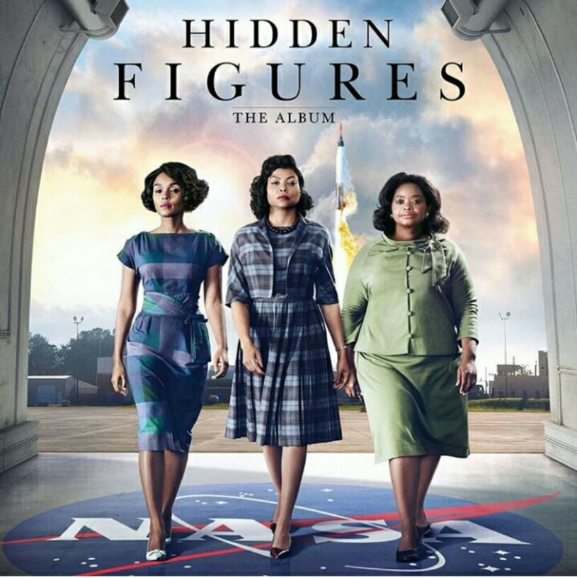
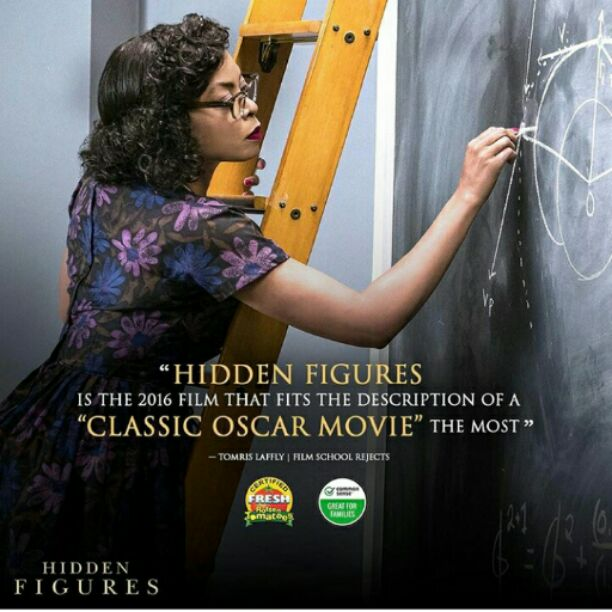
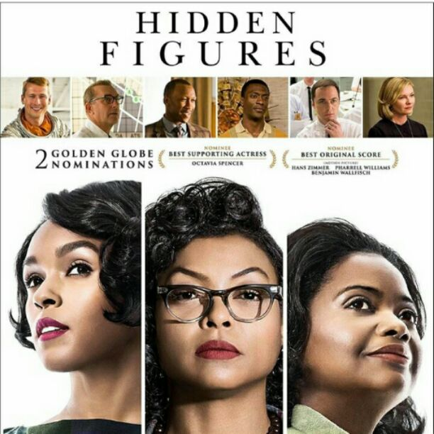

# My Number one Lesson From Hidden Figures (Movie)

[Uncategorized](https://estheradeniyi.com/category/uncategorized/)
# My Number one Lesson From Hidden Figures (Movie)

by [Esther Adeniyi](https://estheradeniyi.com/author/esther-adeniyi/)on [March 10, 2017April 27, 2018](https://estheradeniyi.com/my-number-one-lesson-from-hidden/)[9 Comments on My Number one Lesson From Hidden Figures (Movie)](https://estheradeniyi.com/my-number-one-lesson-from-hidden/#comments)

Sharing is caring!

- [0](https://www.facebook.com/sharer/sharer.php?u=https%3A%2F%2Festheradeniyi.com%2Fmy-number-one-lesson-from-hidden%2F&amp;t=My%20Number%20one%20Lesson%20From%20Hidden%20Figures%20%28Movie%29)
- [0](https://twitter.com/intent/tweet?text=My%20Number%20one%20Lesson%20From%20Hidden%20Figures%20%28Movie%29&amp;url=https%3A%2F%2Festheradeniyi.com%2Fmy-number-one-lesson-from-hidden%2F)
- [0](#)

0shares

 Thank you [Maureen](http://www.maureenalikor.com/), because of you I have been able to reignite what the essence of my womanhood really means. I won&#x2019;t stop because I feel like it; I will continue because I must, even if I end up an &#x2018;hidden figure&#x2019;.&#xA0;Hidden Figures is a powerful movie and I strongly recommend that every single blog reader watch it: male or female.&#xA0;

&#x201C;Hidden Figures&#xA0;is a 2016 American&#xA0;biographical&#xA0;drama film&#xA0;directed by&#xA0;Theodore Melfi&#xA0;and written by Melfi and&#xA0;Allison Schroeder, based on the&#xA0;non-fiction book of the same name&#xA0;by&#xA0;Margot Lee Shetterly&#xA0;about&#xA0;African American&#xA0;female mathematicians who worked at the&#xA0;National Aeronautics and Space Administration&#xA0;(NASA) during the&#xA0;Space Race. The film stars&#xA0;Taraji P. Henson&#xA0;as&#xA0;Katherine Johnson, a mathematician who calculated flight trajectories for&#xA0;Project Mercury&#xA0;and other missions.&#x201D;&#x2014;[Wikipedia](https://en.wikipedia.org/wiki/Hidden_Figures)

## My Number One Lesson

 There is nothing as formidable as a confident woman.&#xA0;

 Take it or leave it, this fact remains.&#xA0;

Years ago, we would equate &#x2018;confident woman&#x2019; to &#x2018;proud&#x2019;, &#x2018;uncouth&#x2019;, &#x2018;egoistic&#x2019; and oh well, everything negative. These days, the awakening is &#x2018;rude&#x2019; and intense and all-round positive.&#xA0;

Right within us, we have many of the things we need to survive and prosper, to impact and cause a revolution but we withdraw into ourselves for fear of failure and other people&#x2019;s opinions. Damn all of that and be the best Engineer, the best Cook, the best Seamstress. Be the best Writer! Be the best &#x2018;anything you find yourself doing at any point in time.&#x2019;

 Develop yourself, learn aggressively, pursue your dreams with all of your passion and your might. Unapologetic-ally&#xA0;own your dreams. Strive for excellence and remember that you can do more, that you can be more and that it is never enough. A confident woman is never afraid to be the first. Yes, there will be that tiny little voice to warn that you are a peanut sized instrument in the midst of men and experts in vast, insurmountable fields but you can once and for all shuuush it and move on like it&#x2019;s your last leg to gold.

I really would like that you watch this movie. Hidden Figures is for every woman in every corner and still in the spirit of the International Women&#x2019;s Day I dare you to [#beboldforchange](https://www.estheradeniyi.com/beboldforchange-ruby-bridges-1954).&#xA0;

Related: [Geostorm movie review](https://www.estheradeniyi.com/geostorm-2017-movie-review-5-profound)

Sharing is caring!

- [0](https://www.facebook.com/sharer/sharer.php?u=https%3A%2F%2Festheradeniyi.com%2Fmy-number-one-lesson-from-hidden%2F&amp;t=My%20Number%20one%20Lesson%20From%20Hidden%20Figures%20%28Movie%29)
- [0](https://twitter.com/intent/tweet?text=My%20Number%20one%20Lesson%20From%20Hidden%20Figures%20%28Movie%29&amp;url=https%3A%2F%2Festheradeniyi.com%2Fmy-number-one-lesson-from-hidden%2F)
- [0](#)

0shares

Tags:[Celebrating Women](https://estheradeniyi.com/tag/celebrating-women/)[Movies](https://estheradeniyi.com/tag/movies/)