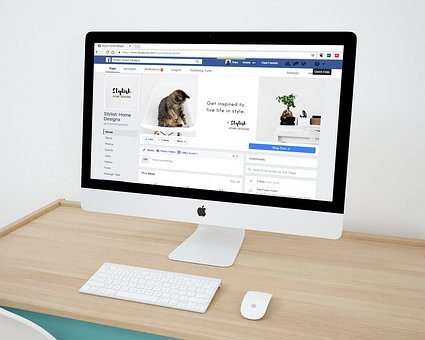

# Myths About Starting an Online Business

[Uncategorized](https://estheradeniyi.com/category/uncategorized/)
# Myths About Starting an Online Business

by [Esther Adeniyi](https://estheradeniyi.com/author/esther-adeniyi/)on [April 12, 2017April 27, 2018](https://estheradeniyi.com/myths-about-starting-online-business_12/)[6 Comments on Myths About Starting an Online Business](https://estheradeniyi.com/myths-about-starting-online-business_12/#comments)

Sharing is caring!

- [0](https://www.facebook.com/sharer/sharer.php?u=https%3A%2F%2Festheradeniyi.com%2Fmyths-about-starting-online-business_12%2F&amp;t=Myths%20About%20Starting%20an%20Online%20Business)
- [0](https://twitter.com/intent/tweet?text=Myths%20About%20Starting%20an%20Online%20Business&amp;url=https%3A%2F%2Festheradeniyi.com%2Fmyths-about-starting-online-business_12%2F)
- [0](#)

0shares

 Online businesses have been misunderstood by propsects and even advocators severally. The misconceptions about online businesses have not only misled newbies but misguided them on the path to success online.

I was going through my Instagram feed when I found this (via @entrepreneursnook) and to me, this is an exact summary of what I would advise anyone that is launching a business online or has been with it and is struggling.

Read below:
 ____
 &#x201C;1. You can&#x2019;t start your online for free.99 all day, every day and expect stellar results. The free options can only take you so far, at some point you&#x2019;d need to invest in tools to uplevel your business. While you might be able to get a website for free, it is not likely to come across as a professional website. There is some cost associated with starting your online business.

Think domain name, website, hosting and possibly getting a web designer. We haven&#x2019;t talked about some of the productivity or tech tools that you would need. These days tools are subscription based that are billed either monthly or annually.
 ____

2. Yes, passion is great and that&#x2019;s a good way to get started but in addition to passion, you need the right strategies to get started. You need a plan for your business, you need to know what works and what doesn&#x2019;t. You&#x2019;ve got to acquire some business acumen. Passion can turn to profit when combined with the proper knowledge of your industry.

Don&#x2019;t run your business on passion alone, be business savvy too!

____

3. While I believe that creating efficiency in your business is key I strongly disagree that your business can successfully run on autopilot ( any fact checkers to correct me?). I believe in automation and using it for repetitive tasks HOWEVER, your business needs YOU.

You are the &#x2018;IT&#x2019; factor, therefore canned responses and autoresponders should be used as a way to acknowledge a customer&#x2019;s inquiry but not as a communication tool.

Automating majority of your business activities right from day one doesn&#x2019;t give you the opportunity to be hands-on in your business. Grow with your business, automate as you grow.&#x201D;

What are the misconceptions you have always had about launching an online business? What is your online business about? Tell me &#x2019;bout it.

Sharing is caring!

- [0](https://www.facebook.com/sharer/sharer.php?u=https%3A%2F%2Festheradeniyi.com%2Fmyths-about-starting-online-business_12%2F&amp;t=Myths%20About%20Starting%20an%20Online%20Business)
- [0](https://twitter.com/intent/tweet?text=Myths%20About%20Starting%20an%20Online%20Business&amp;url=https%3A%2F%2Festheradeniyi.com%2Fmyths-about-starting-online-business_12%2F)
- [0](#)

0shares

Tags:[career](https://estheradeniyi.com/tag/career/)