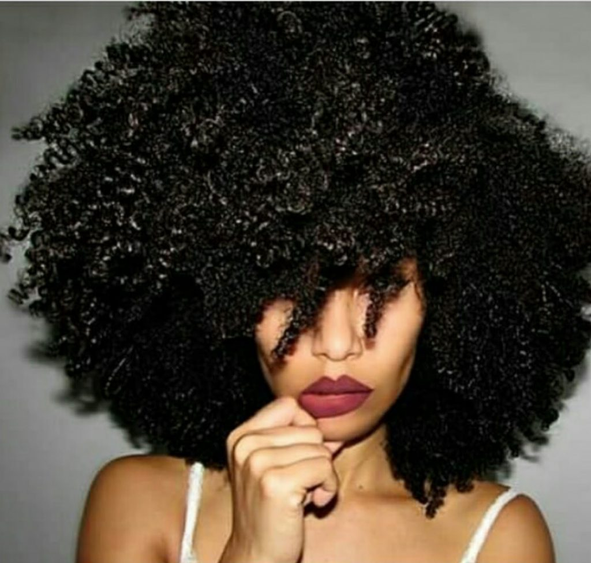

# Natural Hair : Causes of Hair Breakage and How to Fix That Instantly

[Natural Hair](https://estheradeniyi.com/category/natural-hair/)
# Natural Hair : Causes of Hair Breakage and How to Fix That Instantly

by [Esther Adeniyi](https://estheradeniyi.com/author/esther-adeniyi/)on [July 25, 2016May 25, 2018](https://estheradeniyi.com/natural-hair-causes-of-hair-breakage/)[1 Comment on Natural Hair : Causes of Hair Breakage and How to Fix That Instantly](https://estheradeniyi.com/natural-hair-causes-of-hair-breakage/#comments)

Sharing is caring!

- [0](https://www.facebook.com/sharer/sharer.php?u=https%3A%2F%2Festheradeniyi.com%2Fnatural-hair-causes-of-hair-breakage%2F&amp;t=Natural%20Hair%20%3A%20Causes%20of%20Hair%20Breakage%20and%20How%20to%20Fix%20That%20Instantly)
- [0](https://twitter.com/intent/tweet?text=Natural%20Hair%20%3A%20Causes%20of%20Hair%20Breakage%20and%20How%20to%20Fix%20That%20Instantly&amp;url=https%3A%2F%2Festheradeniyi.com%2Fnatural-hair-causes-of-hair-breakage%2F)
- [0](#)

0shares

Photo via @curlbox
Natural Hair can be very strong and determined but if poorly managed and improperly handled can begin to break. No Naturalista wants that efforts put into her hair will result into hair breakage. If you however experience hair breakage and don&#x2019;t exactly know what causes it, &#xA0;this blog post will help you determine the cause and give you practical solutions on how to fix it.

Good news is that for Natural hair, &#xA0;you can easily determine the cause of hair breakage and move on to treat it until it stops. It is unlike the permed or chemically treated hair where you have to make guesses and if the guess is narrowed down to the hair relaxer, &#xA0;it might mean stopping application which might in turn mean going natural. Yaaaaaaaaay, &#xA0;doesn&#x2019;t natural hair totally rock?

So, &#xA0;here we go, &#xA0;some of the causes and how to fix them instantly :

Tangled Hair

It is not uncommon for Natural hair to easily tangle but leaving it like that or attempting to comb through forcefully will cause hair breakage. This is logical enough if I must say. So, &#xA0;before washing your hair, &#xA0;try to finger detangle. Work your fingers in between your hair and separate until you can easily comb your hair with your fingers. You can also use detangling or wide tooth combs to detangle. Make sure that you also exercise patience while detangling. Do it carefully too for in detangling you can damage your hair.

Leaving Hair Unprotected

Sleeping on cotton pillows or leaving your hair uncovered all through the night with a better material like satin can cause a lot of physical stress. You can avoid hair breakage as a result of this. Better still, &#xA0;it&#x2019;s okay to knot your hair before sleeping. You can also use satin pillows. Apply products with sunscreen on your hair when going out into the hot sun. Harsh weather can affect your natural hair negatively and cause hair breakage. During harmattan and extremely dry weather, &#xA0;do protective hair styles like cornrows, &#xA0;braids, &#xA0;kinky, &#xA0;crochet braids etc.

Sulfate Shampoos

Washing your hair too frequently can cause it to be stripped of its natural oils. This in turn weakens your roots and eventually causes hair breakage. There is no worse nightmare than having your hair break at the root itself. That&#x2019;s so sad. You should limit the use of shampoos especially those that contain sulfates. Another option is to co-wash when you are tempted to use your shampoo for the second time in a week. Co-washing is washing with only conditioner.

Dandruff

This is many ladies&#x2019; worst nightmare. Dandruff! It is another common cause of natural hair breakage. Use anti-dandruff shampoos and conditioners. There are many anti-dandruff creams in the market. Try out some and stick with what works best for you.

Combing hair when wet

Many of us were once guilty of this act. We thought that combing through our natural hair when wet is the only way to avoid the pain of combing through dry, &#xA0;crispy hair. Let your hair dry naturally and then, &#xA0;apply leave-in conditioner to soften it or any type of oil or even cream. Carefully detangle or finger comb and you are done.

Natural Hair breakage is something that you can totally avoid. I hope this article helps you.

Sharing is caring!

- [0](https://www.facebook.com/sharer/sharer.php?u=https%3A%2F%2Festheradeniyi.com%2Fnatural-hair-causes-of-hair-breakage%2F&amp;t=Natural%20Hair%20%3A%20Causes%20of%20Hair%20Breakage%20and%20How%20to%20Fix%20That%20Instantly)
- [0](https://twitter.com/intent/tweet?text=Natural%20Hair%20%3A%20Causes%20of%20Hair%20Breakage%20and%20How%20to%20Fix%20That%20Instantly&amp;url=https%3A%2F%2Festheradeniyi.com%2Fnatural-hair-causes-of-hair-breakage%2F)
- [0](#)

0shares

Tags:[Natural Hair](https://estheradeniyi.com/tag/natural-hair/)