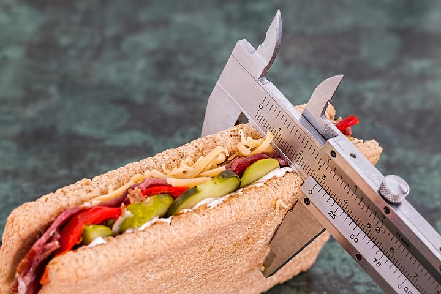

# Natural ways to lose belly fat

[Uncategorized](https://estheradeniyi.com/category/uncategorized/)
# Natural ways to lose belly fat

by [Esther Adeniyi](https://estheradeniyi.com/author/esther-adeniyi/)on [June 8, 2017April 27, 2018](https://estheradeniyi.com/natural-ways-to-lose-belly-fa/)[Leave a Comment on Natural ways to lose belly fat](https://estheradeniyi.com/natural-ways-to-lose-belly-fa/#respond)

Sharing is caring!

- [0](https://www.facebook.com/sharer/sharer.php?u=https%3A%2F%2Festheradeniyi.com%2Fnatural-ways-to-lose-belly-fa%2F&amp;t=Natural%20ways%20to%20lose%20belly%20fat)
- [0](https://twitter.com/intent/tweet?text=Natural%20ways%20to%20lose%20belly%20fat&amp;url=https%3A%2F%2Festheradeniyi.com%2Fnatural-ways-to-lose-belly-fa%2F)
- [0](#)

0shares

 Chioma had a&#xA0;protruded belly.

 It was never a&#xA0;problem to her&#xA0;until she got&#xA0;into&#xA0;the University.&#xA0;She saw a lot&#xA0;of&#xA0;other young&#xA0;girls with this wall like tummy. Some&#xA0;of her&#xA0;course mates would even mock her and some&#xA0;would&#xA0;say she&#xA0;was&#xA0;pregnant even&#xA0;though she had countered&#xA0;the&#xA0;suspicion countless times.

 But there&#xA0;were&#xA0;still few nice ones. &#xA0;They&#xA0;were&#xA0;ready&#xA0;to lend her a helping hand. &#xA0;They&#xA0;told her some basic&#xA0;things&#xA0;she&#xA0;needed&#xA0;to&#xA0;do to lose her belly fat. In a&#xA0;month&#x2019;s time, &#xA0;there were&#xA0;visible&#xA0;signs&#xA0;that&#xA0;she&#xA0;was&#xA0;losing it. &#xA0;In&#xA0;less than&#xA0;six months,&#xA0;Chioma too had a flat tummy.&#xA0;

 Let&#x2019;s see&#xA0;what helped Chioma.&#xA0;

 THINGS&#xA0;TO KNOW&#xA0;ABOUT&#xA0;BELLY FAT

 Apart&#xA0;from&#xA0;the fact&#xA0;that it&#x2019;s not a beautiful &#xA0;sight at all and plus it tampers&#xA0;with our&#xA0;body shape, &#xA0;belly&#xA0;fat is&#xA0;also&#xA0;risky to our health.

 Belly fat, also&#xA0;known as&#xA0;visceral fat has&#xA0;been traced&#xA0;to a&#xA0;higher&#xA0;risk&#xA0;of&#xA0;developing&#xA0;diseases&#xA0;such as diabetes, heart&#xA0;disease&#xA0;and&#xA0;some&#xA0;type of cancer.&#xA0;

 REMEDIES&#xA0;

- Eat&#xA0;your last meal at&#xA0;least&#xA0;two&#xA0;hours&#xA0;before sleep. Our&#xA0;bodies&#xA0;are&#xA0;inactive at&#xA0;night&#xA0;and&#xA0;it&#xA0;tends&#xA0;to store up&#xA0;calories&#xA0;eating at&#xA0;night as fat&#xA0;instead&#xA0;of&#xA0;burning it up as energy.&#xA0;
- Eat&#xA0;small but often.&#xA0;Research&#xA0;has it that eating six&#xA0;small&#xA0;meals instead of the regular three meals daily helps in&#xA0;regulating&#xA0;blood&#xA0;sugar level.&#xA0;
- Avoid sugar.&#xA0;Sugar has&#xA0;plenty&#xA0;calories&#xA0;and also leads&#xA0;to an&#xA0;increase&#xA0;in&#xA0;insulin&#xA0;level&#xA0;which&#xA0;results&#xA0;in a lower&#xA0;production&#xA0;of&#xA0;glucagon (the&#xA0;hormone that allows glucose to be burned as energy)
- Avoid intake&#xA0;of&#xA0;alcoholic beverages.&#xA0;Alcohol&#xA0;contains&#xA0;lots&#xA0;of&#xA0;calories&#xA0;which can&#xA0;be&#xA0;stored up&#xA0;in&#xA0;the&#xA0;body as fat
- Drink&#xA0;plenty water. Water helps&#xA0;to&#xA0;flush&#xA0;out toxins.&#xA0;
- Increase&#xA0;potassium&#xA0;and&#xA0;reduce&#xA0;sodium intake.&#xA0;Potassium reduces water&#xA0;retention&#xA0;while&#xA0;sodium causes it.&#xA0;When water is stored up, it causes&#xA0;protruded belly.&#xA0;Examples&#xA0;of&#xA0;potassium&#xA0;foods are banana,&#xA0;white beans, mushroom,&#xA0;avocado&#xA0;yogurt etc.&#xA0;
- Each&#xA0;small meal taken&#xA0;daily&#xA0;should&#xA0;contain lean protein, fiber,&#xA0;little&#xA0;healthy fat,&#xA0;and a&#xA0;fruit or vegetable.&#xA0;

 Following&#xA0;this few&#xA0;natural not-too-stressful tips can&#xA0;help us get flat tummy&#xA0;before we know it. &#xA0;We must also&#xA0;be&#xA0;consistent in&#xA0;order&#xA0;to&#xA0;get results.&#xA0;

 Stay beautiful!!!
P.S- Have you subscribed to this blog yet? Please check below (mobile) or the side bar (desktop) to subscribe to weekly newsletters. Thank you for being a part of this web space.

Sharing is caring!

- [0](https://www.facebook.com/sharer/sharer.php?u=https%3A%2F%2Festheradeniyi.com%2Fnatural-ways-to-lose-belly-fa%2F&amp;t=Natural%20ways%20to%20lose%20belly%20fat)
- [0](https://twitter.com/intent/tweet?text=Natural%20ways%20to%20lose%20belly%20fat&amp;url=https%3A%2F%2Festheradeniyi.com%2Fnatural-ways-to-lose-belly-fa%2F)
- [0](#)

0shares

Tags:[Health and fitness](https://estheradeniyi.com/tag/health-and-fitness/)