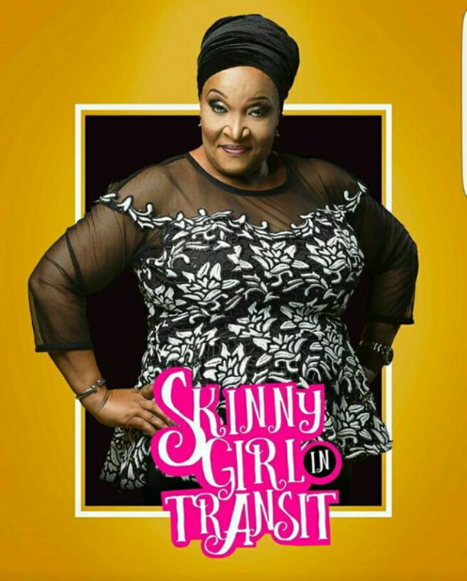

# Ndani TV’s Skinny Girl in Transit : my Favorite Characters

[Uncategorized](https://estheradeniyi.com/category/uncategorized/)
# Ndani TV&#x2019;s Skinny Girl in Transit : my Favorite Characters

by [Esther Adeniyi](https://estheradeniyi.com/author/esther-adeniyi/)on [March 1, 2017April 27, 2018](https://estheradeniyi.com/ndanis-tv-skinny-girl-in-transit-my/)[6 Comments on Ndani TV&#x2019;s Skinny Girl in Transit : my Favorite Characters](https://estheradeniyi.com/ndanis-tv-skinny-girl-in-transit-my/#comments)

Sharing is caring!

- [0](https://www.facebook.com/sharer/sharer.php?u=https%3A%2F%2Festheradeniyi.com%2Fndanis-tv-skinny-girl-in-transit-my%2F&amp;t=Ndani%20TV%27s%20Skinny%20Girl%20in%20Transit%20%3A%20my%20Favorite%20Characters)
- [0](https://twitter.com/intent/tweet?text=Ndani%20TV%27s%20Skinny%20Girl%20in%20Transit%20%3A%20my%20Favorite%20Characters&amp;url=https%3A%2F%2Festheradeniyi.com%2Fndanis-tv-skinny-girl-in-transit-my%2F)
- [0](#)

0shares

 Hey, have you been watching[Skinny Girl in Transit](https://www.youtube.com/channel/UCx2qMIoQIchX9o5x38hf1Bw)? Omg, it&#x2019;s one of my favorite web series. Okay, let me lend you a little helping hand. Click below to start with Season 1, episode 1 and tell me you are not stuck. Hehehe&#x2026;

 One of the reasons I love Skinny Girl in Transit is that many young ladies can put themselves in Tiwa&#x2019;s shoes. Her fitness journey and love life are easy to relate to as the struggle is real for many 21st century girls. I also love the sibling intermittent rivalry and love. Anyone would agree with me that there are some days you resent your sibling for a sick talk or stupid idea. The next minute you guys are talking about a trendy footwear or about another skinny girl in transit.

In this blog, I want to tell you guys my most favorite characters and why they are:

Contents

- [1 Number one is Mama Tiwa](#Number_one_is_Mama_Tiwa)
- [2 Number two, Hadiza](#Number_two_Hadiza)
- [3 And then, Salewa](#And_then_Salewa)

##  Number one is Mama Tiwa

 Omg, she is the typical Nigerian mother! She is commending you one minute and screaming at you the next. There is this scene where she was &#x2018;gossiping&#x2019; about church members with her friend and I laughed so hard. Ngozi Nwosu deserves an award for her role in this web series. Some of her praying scenes drove me into uncontrollable laughter. And there was one where she was trying to get fit. I don&#x2019;t think she went two rounds for her push up, she was about to just &#x2018;diiiiiiiiiiie&#x2019;.

The worry of Nigerian mothers about their children&#x2019;s marital life was a little bit exaggerated but valid. Mama Tiwa would go any length to get suitors for her children.

##  Number two, Hadiza

 Hadiza, the office bitch! I looooooooove her acting. It was perfect and smooth. She had the accurate facial expression for every shallow attitude. I also see her character as one who would go any length to get attention. She was bad but not bad. She just wanted it all, the love, the attention, the authority. Inidima Okojie was the bomb.

## 
And then, Salewa

 I like her innocence and naive wickedness. I don&#x2019;t know if there is anything like that but you gotta believe me, that&#x2019;s how best I can describe her in two words. Salewa is Tiwa&#x2019;s sister, the one who would get on Tiwa&#x2019;s nerves and pretend she wasn&#x2019;t doing anything bad. When Salewa got into an affair with a married man, I was at first mad at her but later, I got to see through her folly. I loved that part where Tiwa went to act like big sister when she was financially grounded.

I liked Tiwa as a character but I don&#x2019;t like the acting. Yeah yeah, I do not. I like accurate facial expressions, In my own opinion, Abimbola Craig wasn&#x2019;t pinpoint smooth in delivery.

[Banana Island Ghost movie review here](https://www.estheradeniyi.com/banana-island-ghost-movie-review-by)

I also prepared a list of some of the cast, you may want to know the names of your favorite actors:

Tiwa- Abimbola Craig
 Shalewa &#xA0;-Sharon Ooja
 Tiwa&#x2019;s mum &#x2013; Ngozi Nwosu
 Mide &#x2013; Ayoola Ayolola
 Hadiza &#x2013; Inidima Okojie
 Didi- Abisola Aiyeola
 Wosilat- Chioma Okolie

Are you watching [Skinny Girl in Transit](https://en.wikipedia.org/wiki/Skinny_Girl_in_Transit)? Do you like it?

Sharing is caring!

- [0](https://www.facebook.com/sharer/sharer.php?u=https%3A%2F%2Festheradeniyi.com%2Fndanis-tv-skinny-girl-in-transit-my%2F&amp;t=Ndani%20TV%27s%20Skinny%20Girl%20in%20Transit%20%3A%20my%20Favorite%20Characters)
- [0](https://twitter.com/intent/tweet?text=Ndani%20TV%27s%20Skinny%20Girl%20in%20Transit%20%3A%20my%20Favorite%20Characters&amp;url=https%3A%2F%2Festheradeniyi.com%2Fndanis-tv-skinny-girl-in-transit-my%2F)
- [0](#)

0shares

Tags:[Movies](https://estheradeniyi.com/tag/movies/)