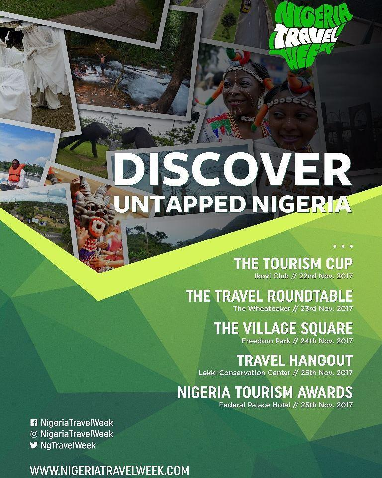
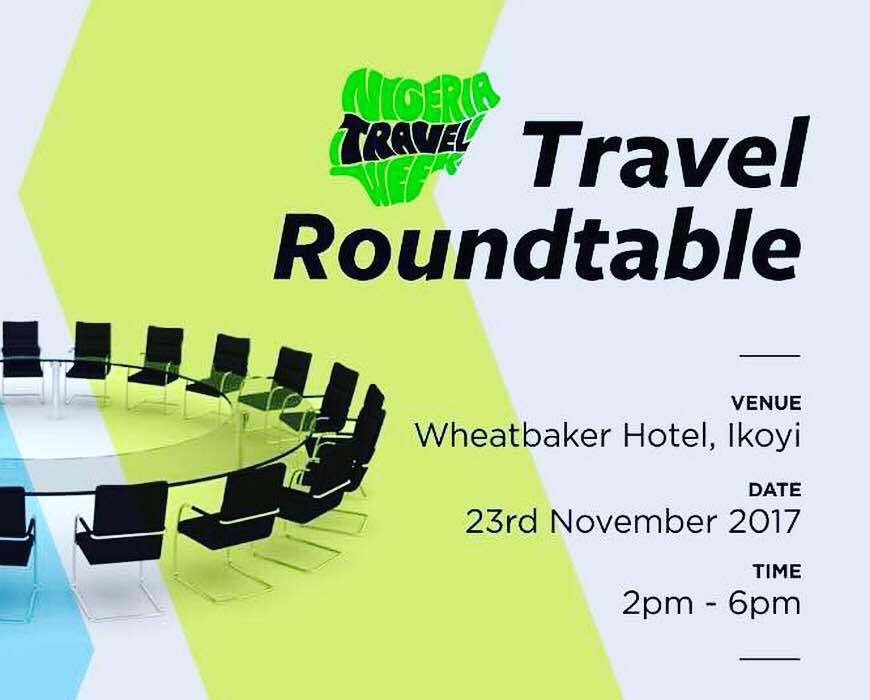
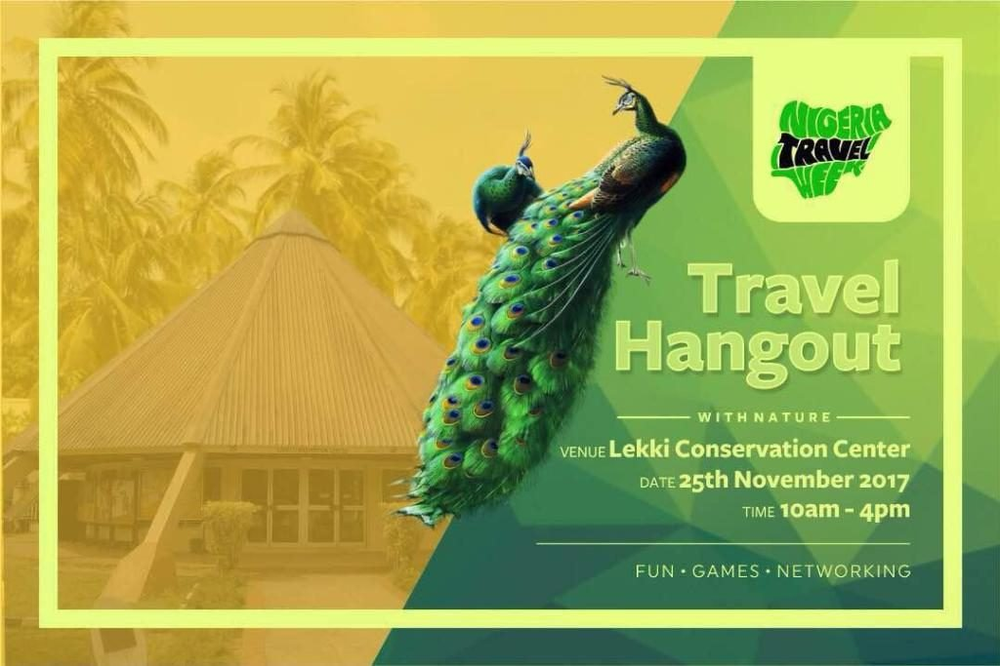
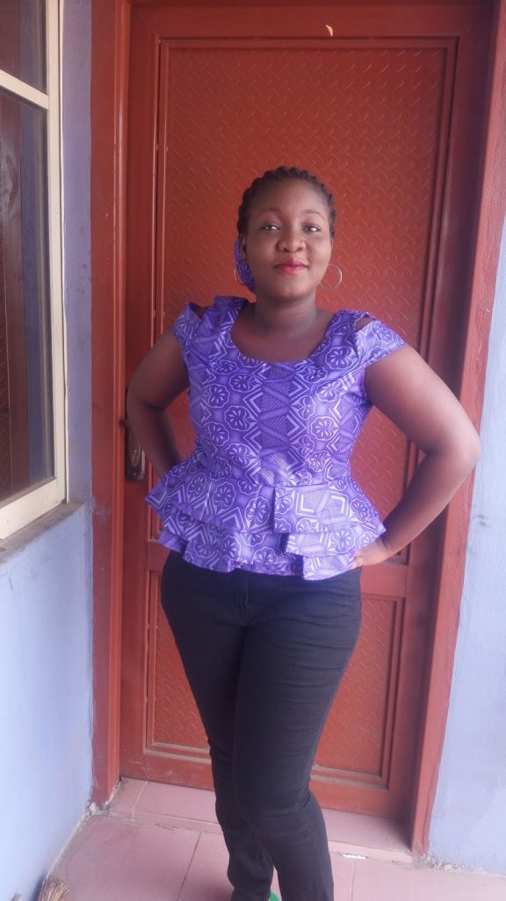
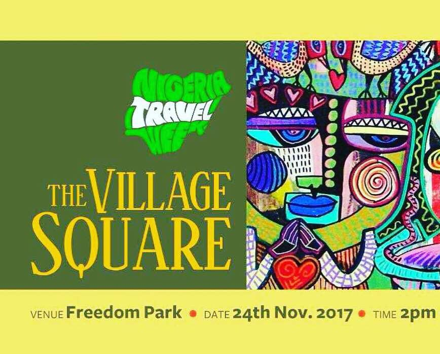

# Nigeria Travel Week : The Travel Roundtable (Day 4)

[Travel](https://estheradeniyi.com/category/travel/)
# Nigeria Travel Week : The Travel Roundtable (Day 4)

by [Esther Adeniyi](https://estheradeniyi.com/author/esther-adeniyi/)on [November 24, 2017May 25, 2018](https://estheradeniyi.com/nigeria-travel-week-travel-roundtable/)[Leave a Comment on Nigeria Travel Week : The Travel Roundtable (Day 4)](https://estheradeniyi.com/nigeria-travel-week-travel-roundtable/#respond)

Sharing is caring!

- [0](https://www.facebook.com/sharer/sharer.php?u=https%3A%2F%2Festheradeniyi.com%2Fnigeria-travel-week-travel-roundtable%2F&amp;t=Nigeria%20Travel%20Week%20%3A%20The%20Travel%20Roundtable%20%28Day%204%29)
- [0](https://twitter.com/intent/tweet?text=Nigeria%20Travel%20Week%20%3A%20The%20Travel%20Roundtable%20%28Day%204%29&amp;url=https%3A%2F%2Festheradeniyi.com%2Fnigeria-travel-week-travel-roundtable%2F)
- [0](#)

0shares

I attended my first event of Nigeria [Travel](https://www.estheradeniyi.com/search/label/Travel?m=1) Week yesterday and it was awesome. Conversations at The Travel Roundtable were both interesting and intelligent. I am so glad I did not miss that.

Even if I had attended or will attend the other events in the Nigeria Travel Week, I want to bet that the Travel Roundtable would have been the highlight. I am not sure I will be attending the rest of the events tho&#x2019;. I however took so much from yesterday&#x2019;s event.

There were two sessions and a lot of issues were raised. Tourism professionals and stakeholders discussed the development of [tourism in Nigeria](http://nigerianfinder.com/history-of-tourism-in-nigeria/). [Travel Bloggers](https://www.estheradeniyi.com/how-to-become-travel-blogger) and enthusiasts were also in attendance.

The first panel discussion was what I could more easily relate to as it centered around &#x201C;Leveraging Tourism for a Vibrant and Sustainable Economy&#x201D;&#xA0;. The Moderator was Mr Oluwaseyi Adegoke-Adeyemo who is the Publisher of Inside Watch Africa (IWA)

Contents

- [1 Some of the panelists for this session were:&#xA0;](#Some_of_the_panelists_for_this_session_were)
- [2 Panelists for the second session were:&#xA0;](#Panelists_for_the_second_session_were)
- [3 Lessons and Discussions at the Travel Roundtable (Nigeria Travel Week, Day 4)](#Lessons_and_Discussions_at_the_Travel_Roundtable_Nigeria_Travel_Week_Day_4)
- [4 What is the way forward? How can we leverage Nigerian tourism for a sustainable Nigerian economy?](#What_is_the_way_forward_How_can_we_leverage_Nigerian_tourism_for_a_sustainable_Nigerian_economy)

## Some of the panelists for this session were:&#xA0;

Waturi Wa Matu (Public-Private Sector Dialogue strategist and Director, Business Environment)

Didier Bayeye (Marketing Manager, Africa and Indian Oceans, Sun international)

Efetobo Awhana (Managing Director of Avantgarde Tours Limited and CEO of Nigeria Travel Week)

The second which was more of airline, aircraft, national carriers talk was even though interesting not my thing. Theme was- National Carrier & Tourism Development: Costs versus Benefits. I haven&#x2019;t experienced such luxury yet. Road travel has always been my only option. It was therefore really difficult to connect. I would like to [travel to USA](https://www.estheradeniyi.com/traveling-to-usa-5-important-tips-for?m=1) for a start and then I come back to contribute to aviation matters.

## Panelists for the second session were:&#xA0;

Professor Wolfgang Thome (eTN, Africa correspondent)

Bukky Akomolafe (Commercial Manager at [Travelstart](http://www.travelstart.com/), Africa&#x2019;s largest online travel agency)

Alex Nwuba (CEO, smile Air)

Toni Ukachukwu (CEO at Afrotourism, a travel media and destination marketing company)

Gbenga Olowo (President, Aviation Safety Round Table Initiative (ASRTI) )

Dikko Nwachukwu (CEO, JetWest Airways)

Ehm, I really don&#x2019;t know how to get all of my thoughts and lessons to synergize. This is because I took down my takeaway lessons and critical questions as they dropped from the panel discussions so I am just going to highlight them with bullet points. Yeah.

## Lessons and Discussions at the Travel Roundtable (Nigeria Travel Week, Day 4)

-Luxury is not about bling bling. It is about comfort. A hotel in the bush can cost more than one in the city per night. What qualifies as luxury is the comfort and not the show of affluence.

&#x2013;[Domestic tourism](https://www.thisdaylive.com/index.php/2017/05/06/six-reasons-why-domestic-tourism-must-thrive/) should be encouraged. How do we get indigenes interested in us? China closed their borders for many years and the economy soared. Why can&#x2019;t we develop what we have in here?

-What are you doing to make your space inviting and comfortable? Travel isn&#x2019;t the only component of tourism. There are many others. We are not taking advantage of the income from tourism. It&#x2019;s part of what we call free income.

-We should not be too in love with something so foreign that we are not proud of what we have here.

-How can we leverage on Nigerian music and Nollywood ([Nigerian Movies](https://www.estheradeniyi.com/search/label/Movies))? We can use these industries to showcase our environment. We need to be interested.

-The only narrative we have are the bombings and other negative stories, what about the other beautiful parts and experiences? We need to learn to tell our stories. We cannot leave this in the hands of &#x2018;CNN&#x2019;.

-How many of us will wear our traditional outfits everyday? Until you are probably successful, you are not allowed to wear traditional like you want, &#x2018;white collar&#x2019; is that stiff. Dangote will wear traditional everyday if he wants to and you will still do business with him. We should be proud of our heritage and culture, we need to preserve it. This is how we sustain the economy, promoting our own.
What I wore to Nigeria Travel Week ; Travel Roundtable
&#xA0;

## What is the way forward? How can we leverage Nigerian tourism for a sustainable Nigerian economy?

-We need to engage the locals
 -&#x200E;We need to learn how to tell stories.
 -&#x200E;We need to package our products
 -&#x200E;We need to be interested and intentional about this process.

Today is Day 5 of Nigeria Travel Week and there is going to be The Village Square. Day 6 will hold at Lekki Conservation Center and it will be the Travel Hangout. Nigeria Tourism Awards comes afterwards, it is strictly by invitation.

Related : [Getaway essentials for a beach vacation](https://www.estheradeniyi.com/getaway-essentials-for-beach-vacation)

&#xA0;

Sharing is caring!

- [0](https://www.facebook.com/sharer/sharer.php?u=https%3A%2F%2Festheradeniyi.com%2Fnigeria-travel-week-travel-roundtable%2F&amp;t=Nigeria%20Travel%20Week%20%3A%20The%20Travel%20Roundtable%20%28Day%204%29)
- [0](https://twitter.com/intent/tweet?text=Nigeria%20Travel%20Week%20%3A%20The%20Travel%20Roundtable%20%28Day%204%29&amp;url=https%3A%2F%2Festheradeniyi.com%2Fnigeria-travel-week-travel-roundtable%2F)
- [0](#)

0shares

Tags:[Events](https://estheradeniyi.com/tag/events/)[Travel](https://estheradeniyi.com/tag/travel/)