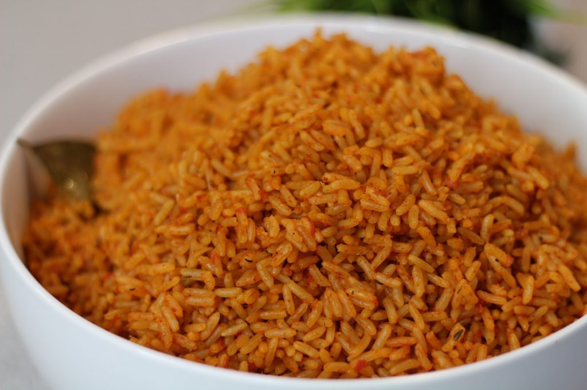

# Nigerian Party Jollof Rice: step by step tutorial

[Food](https://estheradeniyi.com/category/food/)
# Nigerian Party Jollof Rice: step by step tutorial

by [Esther Adeniyi](https://estheradeniyi.com/author/esther-adeniyi/)on [October 4, 2017May 25, 2018](https://estheradeniyi.com/nigerian-party-jollof-rice-step-by-step/)[Leave a Comment on Nigerian Party Jollof Rice: step by step tutorial](https://estheradeniyi.com/nigerian-party-jollof-rice-step-by-step/#respond)

Sharing is caring!

- [0](https://www.facebook.com/sharer/sharer.php?u=https%3A%2F%2Festheradeniyi.com%2Fnigerian-party-jollof-rice-step-by-step%2F&amp;t=Nigerian%20Party%20Jollof%20Rice%3A%20step%20by%20step%20tutorial)
- [0](https://twitter.com/intent/tweet?text=Nigerian%20Party%20Jollof%20Rice%3A%20step%20by%20step%20tutorial&amp;url=https%3A%2F%2Festheradeniyi.com%2Fnigerian-party-jollof-rice-step-by-step%2F)
- [0](#)

0shares

&#xA0;

Contents

- [1 How to cook the Nigerian party jollof rice](#How_to_cook_the_Nigerian_party_jollof_rice)
- [2 Ingredients for party jollof rice](#Ingredients_for_party_jollof_rice)
- [3 Preparation of Nigerian party jollof rice](#Preparation_of_Nigerian_party_jollof_rice)
- [4 See recipes of other variations of jollof rice:](#See_recipes_of_other_variations_of_jollof_rice)

## How to cook the Nigerian party jollof rice

At the mention of **Nigerian&#xA0;party jollof rice**, every mouth shall water. We all love to eat the Nigerian jollof rice (except of course you want to stay on the [Ghana jollof rice](http://www.africanfoodmap.com/recipes/recipe-3/) lane), but most people do not get it right when cooking it, it just doesn&#x2019;t taste like the real jollof rice they want when they cook it.

There have been different versions of jollof rice over the years. In fact, it looks like jollof rice has come to evolve as there are now different jollof rice cooking innovative styles.

Follow me as I take you through the steps of cooking Nigerian jollof rice with the right recipe.

## Ingredients for party jollof rice

1. Uncooked rice (Raw)
 2. Tatashe or bawa, pepper, tomatoes and onions
 3. Groundnut oil
 4. Beef/Chicken/Turkey
 5. Groundnut oil
 6. Salt and Seasoning including Curry and thyme
 7. Sachet/Tin tomato (tomato paste)
 8. Dried scent leaf (optional)

[You might like to read how to prepare irresistible fried rice](https://www.estheradeniyi.com/your-tasty-fried-rice-will-last-longer)

## Preparation of Nigerian party jollof rice

1. Wash meat, season and cook adding enough water that will serve more purpose in cooking your jollof rice
 2. When meat is done, &#xA0;remove from pot and fry till the colour turns golden brown
 3. Wash and blend tatashe or bawa, &#xA0;pepper, &#xA0;tomatoes and onions together. You can leave some tomatoes and onions without blending it if you wouldn&#x2019;t mind seeing it in your rice.
 4. Boil the mixture till it becomes thick and has already formed a paste or almost, &#xA0;just make sure it&#x2019;s not watery.
 5. Put the pot you want to use to [cook your rice](http://www.knorr.ng/recipes/detail/14240/1/jollof-rice) on the cooking stove and make sure it&#x2019;s dry
 6. Pour groundnut oil
 7. Add your satchet /tin tomato paste and stir fry (stir while frying to avoid burning)
 8. Pour the blended and boiled mixture and fry for about 5-6 minutes
 9. Pour stock (the water you used in cooking your meat)
 10. Stir and check for salt and seasoning. You can add curry and thyme if you&#x2019;ve not added it to the meat while cooking, &#xA0;or add more if it&#x2019;s not enough in the stock
 11. Cover and allow to get boiled
 12. Wash and drain rice
 13. Pour into the boiling mixture and allow to get cooked.
 14. Wash and slice the left over onions and tomatoes
 15. Check the rice and level of water, add more water if the water is not enough
 16. When the rice is almost done, add the sliced onions and tomatoes and allow to steam. I don&#x2019;t cover my jollof at this stage because I realize the slice tomato plus the heat brings more water to the rice and makes the jollof rice softer This might make the jollof rice get over soft and appear over watered
 17. When there is no more water in your jollof, add your rinsed/washed scent leaf and stir . There you have your jollof rice

[You might also like to read how to prepare the ofada stew here](https://www.estheradeniyi.com/olori-ofada-ofada-stew-recipe)

N:B

1. It is better to add water little by little if you are not sure of the quantity of water to use instead of reducing the water if it&#x2019;s too much while cooking. It reduces and wastes your ingredients and might not make your jollof rice to be rich up to your standard.
 2. If you are [parboiling your rice](http://www.nigerianfoodtv.com/2012/09/how-to-parboil-rice-for-nigerian-rice-recipes.html). Parboil and drain water from rice. Then follow the same steps for the final cooking from the above steps. Make sure you are not adding too much water and your rice and water are almost at the same level during the Final cooking.
 3. Allow jollof rice to cool off completely before storage
 4. I mostly do not parboil my Nigerian Jollof rice as I usually cook large quantity, &#xA0;but if you want to parboil it&#x2019;s still fine.
 5. Bawa/Tatashe makes the water of the jollof rice get thicken easily and it adds to the reddish colour the tin/sachet tomato is adding or already added to the jollof rice.

## See recipes of other variations of jollof rice:

[Coconut jollof rice](http://dooneyskitchen.com/coconut-jollof-rice/)
[Concoction jollof rice](http://www.allnigerianrecipes.com/rice/concoction-rice.html)
[Native jollof rice](http://www.sisiyemmie.com/2016/08/native-jollof-rice-recipe.html)
[Basmati jollof rice](http://www.9jafoodie.com/jollof-rice-with-basmati-rice/)

Photo credit: [Ivonneajayi](http://www.ivonneajayi.co.uk/2016/12/nigerian-jollof-rice-video-recipe.html)

Sharing is caring!

- [0](https://www.facebook.com/sharer/sharer.php?u=https%3A%2F%2Festheradeniyi.com%2Fnigerian-party-jollof-rice-step-by-step%2F&amp;t=Nigerian%20Party%20Jollof%20Rice%3A%20step%20by%20step%20tutorial)
- [0](https://twitter.com/intent/tweet?text=Nigerian%20Party%20Jollof%20Rice%3A%20step%20by%20step%20tutorial&amp;url=https%3A%2F%2Festheradeniyi.com%2Fnigerian-party-jollof-rice-step-by-step%2F)
- [0](#)

0shares

Tags:[Food](https://estheradeniyi.com/tag/food/)[jollof rice](https://estheradeniyi.com/tag/jollof-rice/)[party jollof rice](https://estheradeniyi.com/tag/party-jollof-rice/)[Recipes](https://estheradeniyi.com/tag/recipes/)