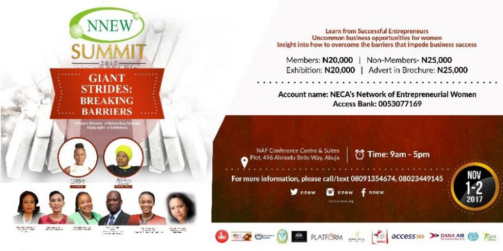

# NNEW Nigerian Women Entrepreneurship Summit Opens in Abuja

[News](https://estheradeniyi.com/category/news/)
# NNEW Nigerian Women Entrepreneurship Summit Opens in Abuja

by [Esther Adeniyi](https://estheradeniyi.com/author/esther-adeniyi/)on [September 15, 2017May 25, 2018](https://estheradeniyi.com/nnew-nigerian-women-entrepreneurship/)[Leave a Comment on NNEW Nigerian Women Entrepreneurship Summit Opens in Abuja](https://estheradeniyi.com/nnew-nigerian-women-entrepreneurship/#respond)

Sharing is caring!

- [0](https://www.facebook.com/sharer/sharer.php?u=https%3A%2F%2Festheradeniyi.com%2Fnnew-nigerian-women-entrepreneurship%2F&amp;t=NNEW%20Nigerian%20Women%20Entrepreneurship%20Summit%20Opens%20in%20Abuja)
- [0](https://twitter.com/intent/tweet?text=NNEW%20Nigerian%20Women%20Entrepreneurship%20Summit%20Opens%20in%20Abuja&amp;url=https%3A%2F%2Festheradeniyi.com%2Fnnew-nigerian-women-entrepreneurship%2F)
- [0](#)

0shares

According to [Signal](http://www.signalng.com/nnew-summit-promote-women-entrepreneurship-nigeria-opens-abuja-november-1st/), the NNEW
 National President, Mrs Modupe Oyekunle, told newsmen in Abuja today that the
 annual summit, which was holding for the first time in Abuja would open new
 opportunities in the effort to nurture outstanding entrepreneurs among women.

She
 explained that NNEW was established in 2005 by the Nigerian Employers
 Consultative Association (NECA) to promote women entrepreneurship.

Oyekunle
 said that NNEW had been working over the years to support women to overcome
 challenges in their business endeavours and to forge strategic alliances for
 growth.

The
 president said that a summit with the theme &#x201C;GIANT STRIDES: BREAKING BARRIERS&#x201D;
 has been slated for November 1-2, 2017 at the prestigious NAF Conference Centre
 in Abuja to enlighten women on uncommon business opportunities, innovative ways
 to overcome the barriers that impede business success and to learn from other
 successful entrepreneurs.

&#x201C;Conference
 speakers will enlighten participants on how to make Giant Strides, tremendous
 leaps and overcome challenges in their businesses,&#x2019;&#x2019; she stated.

Oyekunle
 disclosed that the Minister of State for Industry, Trade and Investment, Hajiya
 Aisha Abubakar, was expected to preside as guest of honour at the conference.

Other
 facilitators of the event include the Mrs Tara Fela-Durotoye, CEO/Creative
 Director, House of Tara International; Mrs. Onouju Irukwu, Managing Director,
 Chapel Hill Denham Management Limited; Mr. Peter Bamkole, Director, Enterprise
 Development (EDC) of the Pan-Atlantic University; Princess (Dr) Vicky Haastrup,
 Executive Vice-Chairman ENL Consortium; Mrs. Adenike Ogunlesi, Chief Executive
 Officer, Ruff n Tumble.

Plenary
 Sessions, Networking Sessions and Exhibitions, have also been lined up as part
 of activities during the summit.

Source: [Signal](http://www.signalng.com/nnew-summit-promote-women-entrepreneurship-nigeria-opens-abuja-november-1st/)

&#xA0;

Sharing is caring!

- [0](https://www.facebook.com/sharer/sharer.php?u=https%3A%2F%2Festheradeniyi.com%2Fnnew-nigerian-women-entrepreneurship%2F&amp;t=NNEW%20Nigerian%20Women%20Entrepreneurship%20Summit%20Opens%20in%20Abuja)
- [0](https://twitter.com/intent/tweet?text=NNEW%20Nigerian%20Women%20Entrepreneurship%20Summit%20Opens%20in%20Abuja&amp;url=https%3A%2F%2Festheradeniyi.com%2Fnnew-nigerian-women-entrepreneurship%2F)
- [0](#)

0shares

Tags:[News](https://estheradeniyi.com/tag/news/)