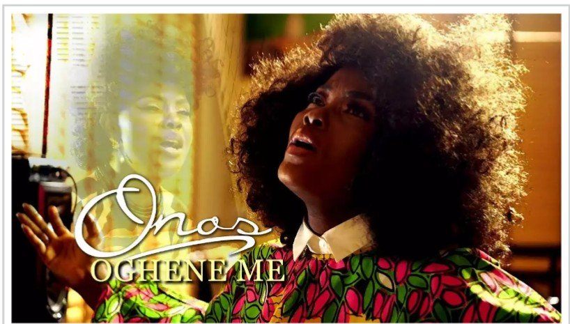

# Oghene Me (My God) by Onos Ariyo

[Music](https://estheradeniyi.com/category/music/)
# Oghene Me (My God) by Onos Ariyo

by [Esther Adeniyi](https://estheradeniyi.com/author/esther-adeniyi/)on [December 15, 2017May 25, 2018](https://estheradeniyi.com/oghene-me-my-god-by-onos-ariyo/)[Leave a Comment on Oghene Me (My God) by Onos Ariyo](https://estheradeniyi.com/oghene-me-my-god-by-onos-ariyo/#respond)

Sharing is caring!

- [0](https://www.facebook.com/sharer/sharer.php?u=https%3A%2F%2Festheradeniyi.com%2Foghene-me-my-god-by-onos-ariyo%2F&amp;t=Oghene%20Me%20%28My%20God%29%20by%20Onos%20Ariyo)
- [0](https://twitter.com/intent/tweet?text=Oghene%20Me%20%28My%20God%29%20by%20Onos%20Ariyo&amp;url=https%3A%2F%2Festheradeniyi.com%2Foghene-me-my-god-by-onos-ariyo%2F)
- [0](#)

0shares

Oghene Me was first released in 2015. I was apparently on the moon then. I missed it! The official video was released about 2 days ago and that was when I got to learn about the song.

Now, it hasn&#x2019;t earned a space in my most played play list yet but that is what&#x2019;s currently on repeat. I want to shamelessly admit that the song is not one of my favorites, the visuals are. I like the video. I like the ankara she was putting on and the hair she was wearing. She somehow was striking a resemblance with [Omawumi](https://www.estheradeniyi.com/butterflies-by-omawumi-lyrics-mp3).

O petty me. I really want to talk about how anointed the song is or how blessed I am but really, what&#x2019;s attracted me to Oghene Me is the recently released official video. You can [download the video here](https://en.savefrom.net/#url=http://youtube.com/watch?v=o9uFzdP-Gag&amp;app=desktop&amp;utm_source=youtube.com&amp;utm_medium=short_domains&amp;utm_campaign=ssyoutube.com). I would also like to know from what movie or movies the excerpts were from. If you do know, would you kindly let me know in the comments section?

#### Watch the Video of Oghene Me by Onos Below:

#### Lyrics to Oghene me By Onos Ariyo

Verse 1

Mountain high, valley low
 I have never seen the righteous forsaken
 Through the night
 Through the storm
 I&#x2019;ll lift my voice and call you God

Chorus

Oghene me
 Oghene me
 Oghene me
 I worship you

Oghene me
 Oghene me
 Oghene me
 I worship you

Verse 2

Seasons come and seasons go
 I&#x2019;ll still lift my hands and call You God
 Through the test and through the trials
 I&#x2019;ll lift my hands and call you my God

Chorus

Oghene me
 Oghene me
 Oghene me
 I worship you

Oghene me
 Oghene me
 Oghene me
 I worship you

Oghene me
 Oghene me
 Oghene me
 I worship you

Oghene me
 Oghene me
 Oghene me
 I worship you

(I worship you )
 I worship you

(I worship you, Jesus )
 I worship you

(I worship you )
 I worship you

(We worship Your Name)
 I worship you

I worship you

(I worship you )
 I worship you

(I Lift up my Voice and call You, God )
 I worship you

Outro

Mighty God, Who can do the things You do?
 Nobody Like You
 Nobody Like You Jesus
 My Healer
 Provider
 Sustainer
 Protector
 Lord, I worship You

Lyrics Source : [Gospel Songs](https://gospelsongs.com.ng/oghene-me-lyrics-onos-ariyo/)

[Mp3 Download of Oghene Me by Onos](http://tooxclusive.com/download-mp3/onos-oghene-me-my-god/)

So guys, what do you think about Oghene Me? Please share your thoughts with me in the comments section.

Related : [Forever You are God by Onos](https://www.estheradeniyi.com/forever-you-are-god-by-onos-lyrics-mp3)

Sharing is caring!

- [0](https://www.facebook.com/sharer/sharer.php?u=https%3A%2F%2Festheradeniyi.com%2Foghene-me-my-god-by-onos-ariyo%2F&amp;t=Oghene%20Me%20%28My%20God%29%20by%20Onos%20Ariyo)
- [0](https://twitter.com/intent/tweet?text=Oghene%20Me%20%28My%20God%29%20by%20Onos%20Ariyo&amp;url=https%3A%2F%2Festheradeniyi.com%2Foghene-me-my-god-by-onos-ariyo%2F)
- [0](#)

0shares

Tags:[#CurrentlyOnRepeat](https://estheradeniyi.com/tag/currentlyonrepeat/)[Gospel lyrics](https://estheradeniyi.com/tag/gospel-lyrics/)[Gospel music](https://estheradeniyi.com/tag/gospel-music/)[Lyrics](https://estheradeniyi.com/tag/lyrics/)[Music](https://estheradeniyi.com/tag/music/)