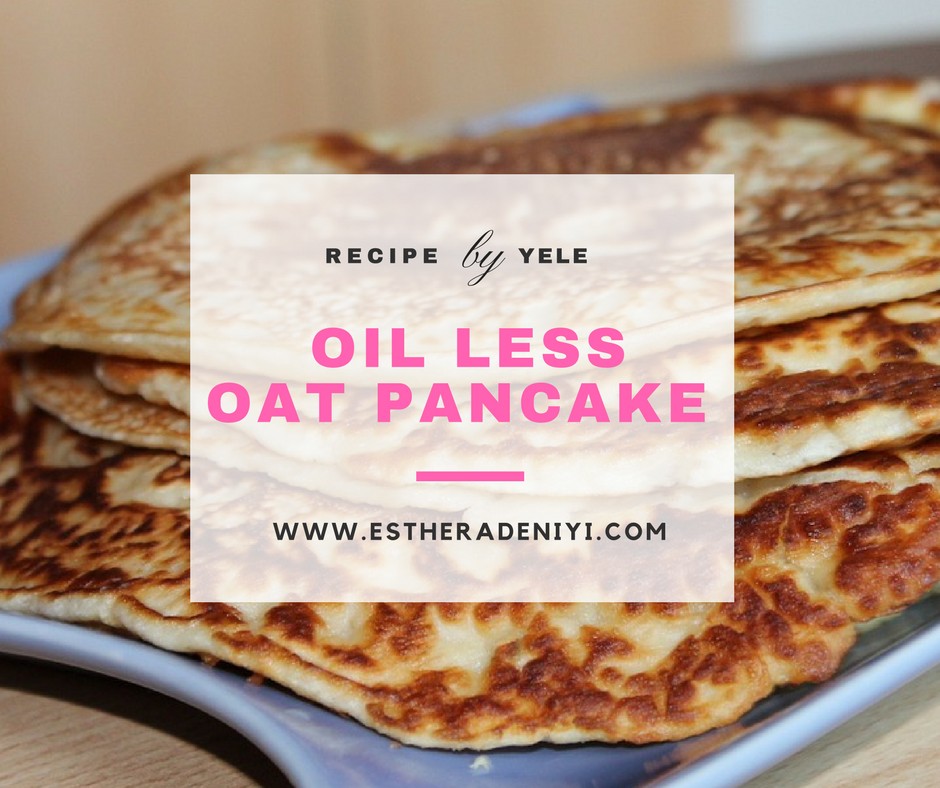
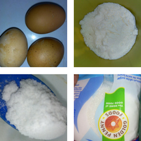

# Oil less Oat Pancake in 10 Minutes

[Uncategorized](https://estheradeniyi.com/category/uncategorized/)
# Oil less Oat Pancake in 10 Minutes

by [Esther Adeniyi](https://estheradeniyi.com/author/esther-adeniyi/)on [May 22, 2017April 27, 2018](https://estheradeniyi.com/oil-less-oat-pancake-in-10-minutes/)[Leave a Comment on Oil less Oat Pancake in 10 Minutes](https://estheradeniyi.com/oil-less-oat-pancake-in-10-minutes/#respond)

Sharing is caring!

- [0](https://www.facebook.com/sharer/sharer.php?u=https%3A%2F%2Festheradeniyi.com%2Foil-less-oat-pancake-in-10-minutes%2F&amp;t=Oil%20less%20Oat%20Pancake%20in%2010%20Minutes)
- [0](https://twitter.com/intent/tweet?text=Oil%20less%20Oat%20Pancake%20in%2010%20Minutes&amp;url=https%3A%2F%2Festheradeniyi.com%2Foil-less-oat-pancake-in-10-minutes%2F)
- [0](#)

0shares

 So, Yele made pancake but this time without oil. &#x2018;In the abroad&#x2019; this is very common but &#x2018;in the Naija&#x2018; if we don&#x2019;t heat oil we won&#x2019;t fry pancake o and it&#x2019;s understandable because let us say it outright, what makes the difference is just the type of fry pan you use.

You can fry all you fry with no oil with a non stick fry pan. This pan is a little bit costlier than the regular pans but I tell you that scrambled eggs also tastes so good with it.

Yele also used oats in place of the regular flour. That was just to remove the flawa consumption guilt, shebi we all know o. Anyway, whichever way we can substitute to make healthy meals, we should.

Margarine is also oily, the less oil comes in that we are not frying with oil using the regular frying pan.
some of the ingredients
 So, to the oil less oat pancake, the ingredients are sugar, butter, milk, salt, eggs and oats. Very simple, innit?

Method :

1. Whisk butter, sugar, milk, salt together

2. Mix egg in a separate bowl

3. Add to the mixture from 1

4. Make a hollow in the middle of the bowl containing your oat. Add the mixture into the amount of oat you want to use. Make sure the texture is creamy.

5. Mix until it&#x2019;s fine

6. Heat your nonstick pan

7. Introduce batter

8. Flip like your pancake when you have achieved the brownness you want at the side /edges of the pancake. Flip over.

9. Oil less oat pancake is ready.

So tell us, do you like Yele&#x2019;s recipe and substitute? Will you try this anytime soon?

Sharing is caring!

- [0](https://www.facebook.com/sharer/sharer.php?u=https%3A%2F%2Festheradeniyi.com%2Foil-less-oat-pancake-in-10-minutes%2F&amp;t=Oil%20less%20Oat%20Pancake%20in%2010%20Minutes)
- [0](https://twitter.com/intent/tweet?text=Oil%20less%20Oat%20Pancake%20in%2010%20Minutes&amp;url=https%3A%2F%2Festheradeniyi.com%2Foil-less-oat-pancake-in-10-minutes%2F)
- [0](#)

0shares

Tags:[Food](https://estheradeniyi.com/tag/food/)