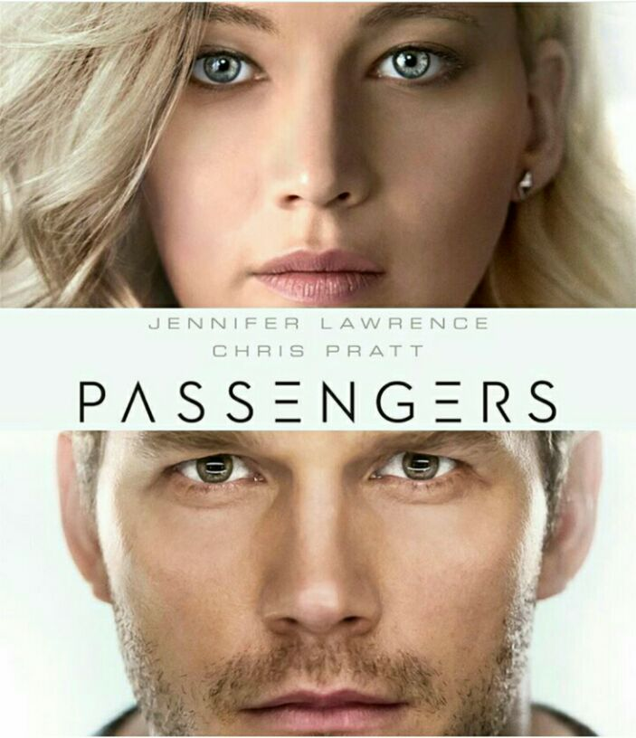
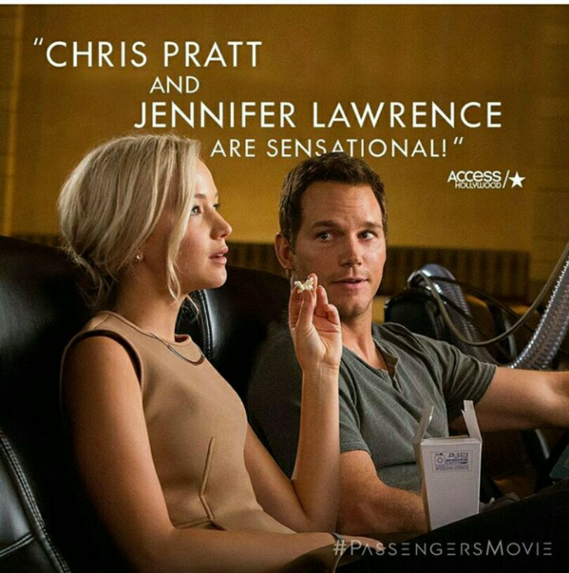
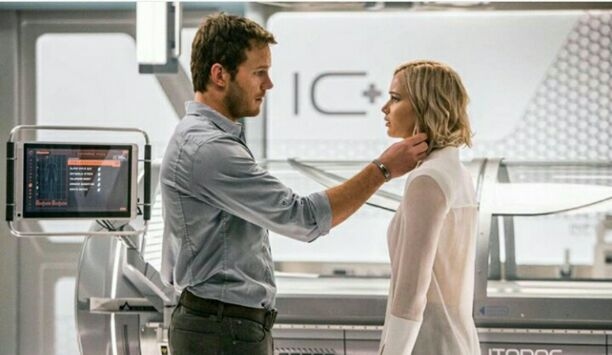

# Passengers (2016 Movie) : 10 Lessons I Picked

[Uncategorized](https://estheradeniyi.com/category/uncategorized/)
# Passengers (2016 Movie) : 10 Lessons I Picked

by [Esther Adeniyi](https://estheradeniyi.com/author/esther-adeniyi/)on [December 30, 2016April 27, 2018](https://estheradeniyi.com/passengers-2016-movie-10-lessons-i/)[6 Comments on Passengers (2016 Movie) : 10 Lessons I Picked](https://estheradeniyi.com/passengers-2016-movie-10-lessons-i/#comments)

Sharing is caring!

- [0](https://www.facebook.com/sharer/sharer.php?u=https%3A%2F%2Festheradeniyi.com%2Fpassengers-2016-movie-10-lessons-i%2F&amp;t=Passengers%20%282016%20Movie%29%20%3A%2010%20Lessons%20I%20Picked)
- [0](https://twitter.com/intent/tweet?text=Passengers%20%282016%20Movie%29%20%3A%2010%20Lessons%20I%20Picked&amp;url=https%3A%2F%2Festheradeniyi.com%2Fpassengers-2016-movie-10-lessons-i%2F)
- [0](#)

0shares

 Passengers is a fantasy/science fiction movie of 2016.

I was at the movies on Wednesday to see The Wedding Party. I was unfortunately not able to because the tickets were sold out. Just a blessed hint: be sure to book The Wedding Party tickets way before show time.
 Passengers was even though a random pick, &#xA0;a beautiful movie. I enjoyed every bit of Passengers from beginning to the end. And oh well, &#xA0;I began jotting &#xA0;lessons right from the theatre on my Techno Camon.

Plot Summary

&#x201C;On a routine journey through space to a new home, two passengers, sleeping in suspended animation, are awakened 90 years too early when their ship malfunctions. As Jim (Chris Pratt) and Aurora (Jennifer Lawrence) face living the rest of their lives on board, with every luxury they could ever ask for, they begin to fall for each other, unable to deny their intense attraction&#x2026;until they discover the ship in grave danger. With the lives of 5000 sleeping passengers at stake, only Jim and Aurora can save them all.&#x201D; (Movie Insider).

Lessons

1. Loneliness is a destructive bitch. It is capable of inflicting frustration and maybe later, &#xA0;desperation.

2. Life can take a turn different from what we planned. Adapting and moving on quickly makes the difference.

3. Forgiveness is the first step to healing. Healing is the first step to liberation.

4. What matters most isn&#x2019;t having a life full of medals. An extraordinary life is a life with a difference.

5. To fix a massive disaster, you have to get to the root of the problem. Other surface fixes will still point back to the root.

6. Find fun anywhere you find yourself. You alone are capable of turning unpleasant situations around.

7.To be easily comforted is a gift. Life isn&#x2019;t an easy journey. We are passengers who will have discomfort.

8. Your dreams and life passions can be reinvented every step of your life&#x2019;s journey. Never be stuck with hard and fast rules you make for yourself.

9. Love bridges the gap between offense and forgiveness. True love doesn&#x2019;t keep score of wrongs on a long term.

10. intimacy is inevitable where there is constant communication.

Would you like to see Passengers?

Sharing is caring!

- [0](https://www.facebook.com/sharer/sharer.php?u=https%3A%2F%2Festheradeniyi.com%2Fpassengers-2016-movie-10-lessons-i%2F&amp;t=Passengers%20%282016%20Movie%29%20%3A%2010%20Lessons%20I%20Picked)
- [0](https://twitter.com/intent/tweet?text=Passengers%20%282016%20Movie%29%20%3A%2010%20Lessons%20I%20Picked&amp;url=https%3A%2F%2Festheradeniyi.com%2Fpassengers-2016-movie-10-lessons-i%2F)
- [0](#)

0shares

Tags:[Movies](https://estheradeniyi.com/tag/movies/)