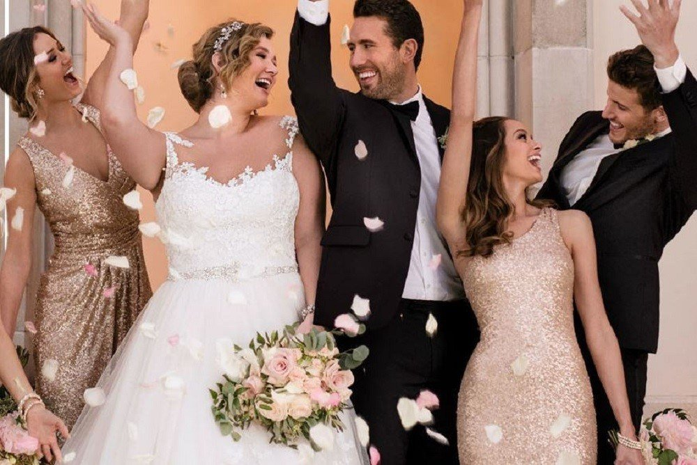
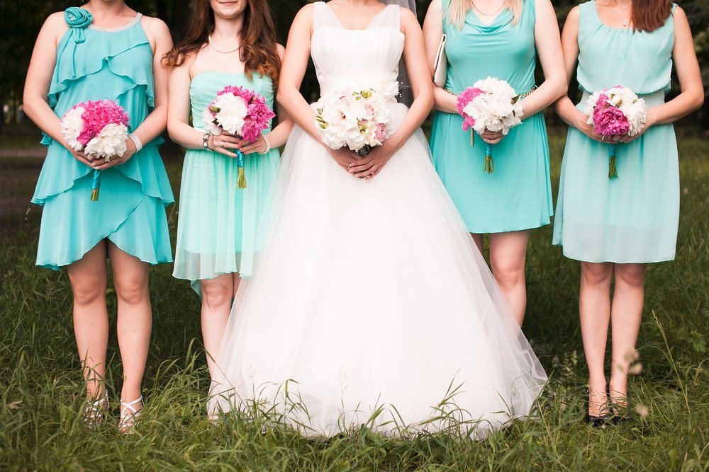
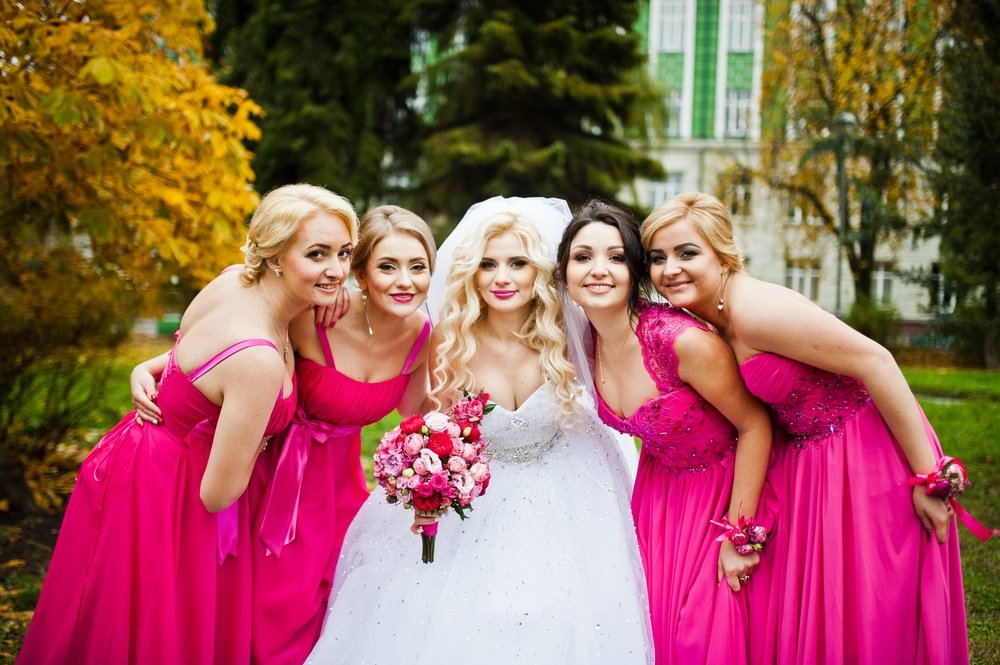

# Plus Size Wedding Dresses – Professional Tips To Consider

[Guest Posts](https://estheradeniyi.com/category/guest-posts/)
# Plus Size Wedding Dresses &#x2013; Professional Tips To Consider

by [Esther Adeniyi](https://estheradeniyi.com/author/esther-adeniyi/)on [April 6, 2018May 25, 2018](https://estheradeniyi.com/plus-size-wedding-dresses/)[Leave a Comment on Plus Size Wedding Dresses &#x2013; Professional Tips To Consider](https://estheradeniyi.com/plus-size-wedding-dresses/#respond)

Sharing is caring!

- [0](https://www.facebook.com/sharer/sharer.php?u=https%3A%2F%2Festheradeniyi.com%2Fplus-size-wedding-dresses%2F&amp;t=Plus%20Size%20Wedding%20Dresses%20-%20Professional%20Tips%20To%20Consider)
- [0](https://twitter.com/intent/tweet?text=Plus%20Size%20Wedding%20Dresses%20-%20Professional%20Tips%20To%20Consider&amp;url=https%3A%2F%2Festheradeniyi.com%2Fplus-size-wedding-dresses%2F)
- [0](#)

0shares

Wedding dress shopping can bring about a wave of mixed emotions- from excitement of finding the perfect dress, to stress about the dress not fitting perfectly or being the right colour, to even trauma of not being able to wear your favourite dress for some reason. However, wedding dress shopping for plus size brides can be even more stressful.

If you are a bride to be then looking perfect on your wedding day is the basic concern on your mind. You wish to find the perfect dress for your big day. Given below are a few tips on how to find the [perfect plus size wedding dresses for your wedding day.](https://www.viviennalorikeet.com.au/product-category/plus-size/) These tips will turn your shopping experience to be lovely and not stressful.

Contents

- [1 Find the Best Seamstress:](#Find_the_Best_Seamstress)
- [2 Take a Little Help:](#Take_a_Little_Help)
- [3 Don&#x2019;t Pay Attention to Numbers:](#Dont_Pay_Attention_to_Numbers)
- [4 Choose a Size Which Fits Well Over the Largest Part of Your Body:](#Choose_a_Size_Which_Fits_Well_Over_the_Largest_Part_of_Your_Body)

## Find the Best Seamstress:

You might have stumbled upon the perfect wedding dress in the ideal cut and colour that you have always dreamed of; but it is just fitting a little loose on the sides, maybe; or the straps need a little more sparkle just to fit in with your personality. Well, all you need to do for the perfect plus size wedding dresses is to find the best seamstress. While the colour and cut of the perfect wedding dress might not need a change, a little tailoring in the right places can make your wedding dress fit perfectly and look even more gorgeous on you.

## Take a Little Help:

Not everybody is the same, and this is especially true when you are searching for plus size wedding dresses. Talk to the expert at the store and find out which feature is the most prominent on your body, what would you like to show off, and where do you need extra coverage. Now, the expert will be able to suggest styles and cuts of wedding dresses which perfectly cater to your body; accentuating the right places and pulling focus away from the from the problem areas. It is best to opt for a wedding dress that compliments your personal style and body, instead of opting for something you might have seen online without trying.

## Don&#x2019;t Pay Attention to Numbers:

Every company follows their own numbering system for dresses. So you might be a size 6 in one bridal store, and a size 8 in another. This is nothing to get distressed about. It is best to ignore the numbers when shopping for plus size wedding dresses and simply try on each outfit turn by turn to see how each style compliments you. It is common to find plus size brides often getting stressed out over the sizes of their wedding gowns. However, if you can avoid letting this affect you, you might just find your perfect wedding dress after all.

## Choose a Size Which Fits Well Over the Largest Part of Your Body:

An age old tradition which most brides will follow is to buy a wedding dress which is one size smaller than their current size. It apparently motivates them to shed the excess weight and fit into their wedding dress perfectly in time. However, when shopping for plus size wedding dresses you must remember that you are looking to buy a wedding dress which will fit you, and not the other way around.

When choosing the size of your wedding dress, pick the one which fits best over the largest part of your body- be it your hips, your bust or your stomach. This way, the rest of the dress can be tailored to accommodate your body and fit you perfectly.

Choosing the best plus sized wedding dresses does not need to be an overwhelming task.&#xA0; These simple tips should help you feel better about yourself and opt for the wedding dress which makes you look and feel like a diva; after all, it is your big day.

Sharing is caring!

- [0](https://www.facebook.com/sharer/sharer.php?u=https%3A%2F%2Festheradeniyi.com%2Fplus-size-wedding-dresses%2F&amp;t=Plus%20Size%20Wedding%20Dresses%20-%20Professional%20Tips%20To%20Consider)
- [0](https://twitter.com/intent/tweet?text=Plus%20Size%20Wedding%20Dresses%20-%20Professional%20Tips%20To%20Consider&amp;url=https%3A%2F%2Festheradeniyi.com%2Fplus-size-wedding-dresses%2F)
- [0](#)

0shares

Tags:[Guest post](https://estheradeniyi.com/tag/guest-post/)[Weddings](https://estheradeniyi.com/tag/weddings/)