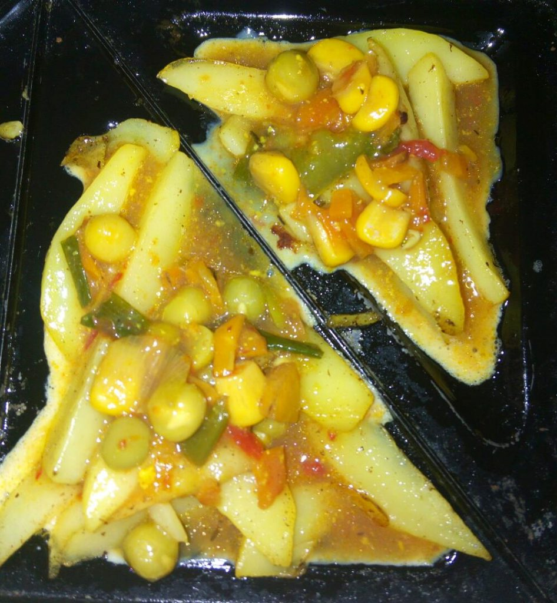
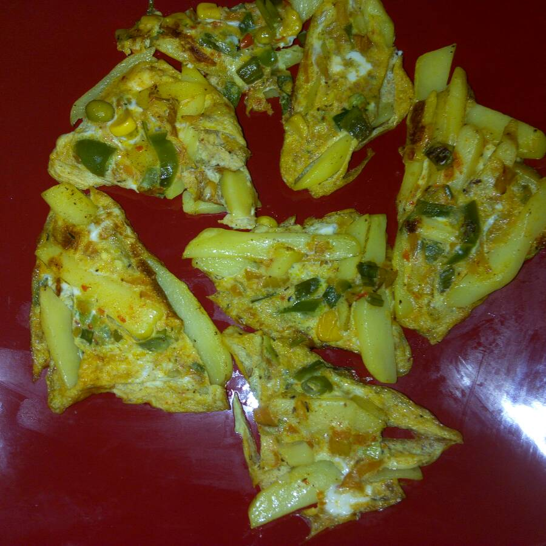
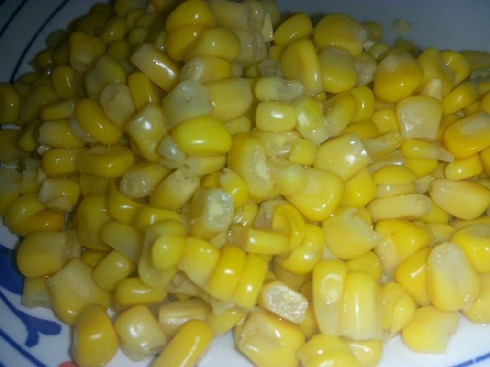
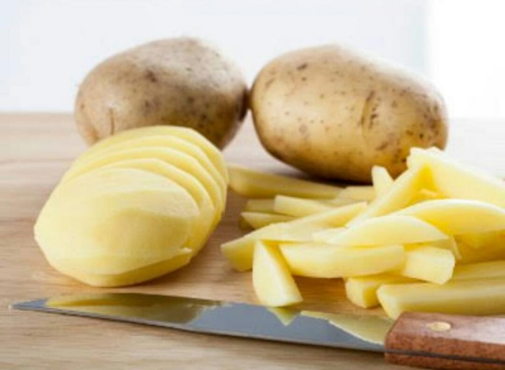
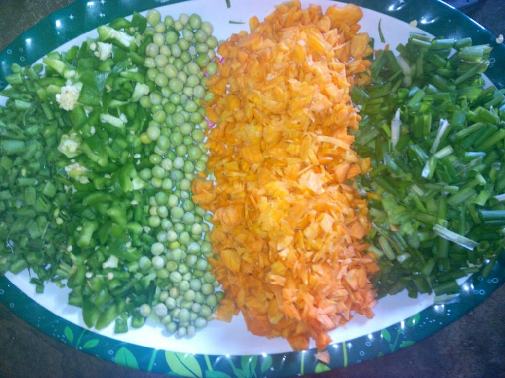
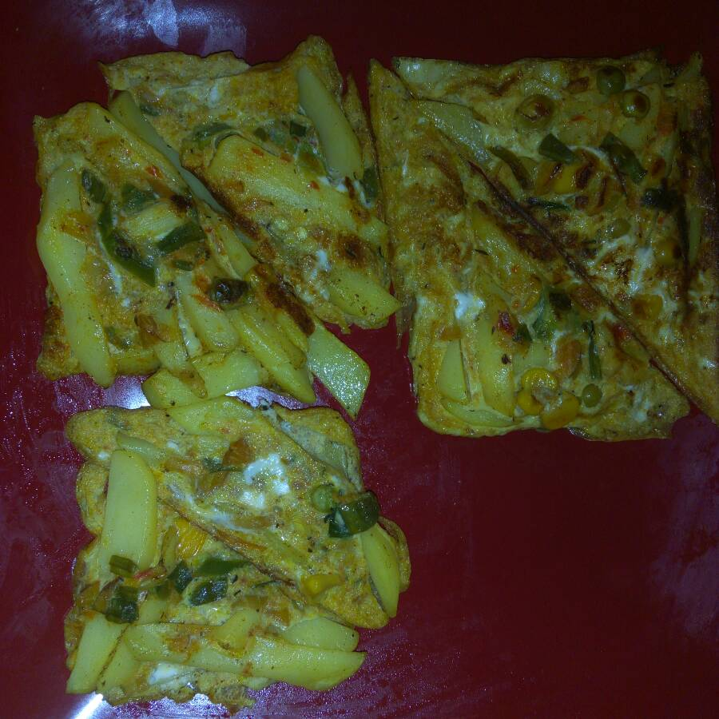

# Prepare Potato Toast in Easy steps

[Uncategorized](https://estheradeniyi.com/category/uncategorized/)
# Prepare Potato Toast in Easy steps

by [Esther Adeniyi](https://estheradeniyi.com/author/esther-adeniyi/)on [June 9, 2017April 27, 2018](https://estheradeniyi.com/prepare-potato-toast-in-easy-steps/)[Leave a Comment on Prepare Potato Toast in Easy steps](https://estheradeniyi.com/prepare-potato-toast-in-easy-steps/#respond)

Sharing is caring!

- [0](https://www.facebook.com/sharer/sharer.php?u=https%3A%2F%2Festheradeniyi.com%2Fprepare-potato-toast-in-easy-steps%2F&amp;t=Prepare%20Potato%20Toast%20in%20Easy%20steps)
- [0](https://twitter.com/intent/tweet?text=Prepare%20Potato%20Toast%20in%20Easy%20steps&amp;url=https%3A%2F%2Festheradeniyi.com%2Fprepare-potato-toast-in-easy-steps%2F)
- [0](#)

0shares

 Hello cookies and foodies like myself. Once again, a twist to the conventional chips and fried egg.
 Yeah.
 All you nothing out of the ordinary in creating this.
 You&#x2019;ll be needing a sandwich toaster (toaster abi toasting machine ?) for this.

Ingredients:

- Irish potatoes
- Oil/margarine
- Seasoning
- Vegetables (carrot, peas, green pepper, spring onions&#x2026;)
- Eggs

Procedure:

1. Peel and slice or dice potatoes to your desired cut o shape.
2. Season as desired and bring to boil halfway through.
3. Mix in with margarine or oil as desired.
4. Set it aside.
5. Dice your vegetables season and steam till desired tenderness.&#xA0;
6. Set it aside to cool.
7. Beat your eggs
8. Introduce the vegetables to the egg.
9. Place prepared potato in toaster. There will be no need to grease the machine as the potatoes were already mixed in oil.
10. Fill up with the egg.
11. Allow to cook for 3 minutes or more (depending on how cooked the potatoes and veggies were)
12. Toast is ready.

 This can be served with any drink of your choice.

 Try out and let us see.
P.S.
 You can try this with plantain, yam or sweet potatoes too.

P.S.S- Have you subscribed to this blog yet? Please check below (mobile) or the side bar (desktop) to subscribe to weekly newsletters. Thank you.

Sharing is caring!

- [0](https://www.facebook.com/sharer/sharer.php?u=https%3A%2F%2Festheradeniyi.com%2Fprepare-potato-toast-in-easy-steps%2F&amp;t=Prepare%20Potato%20Toast%20in%20Easy%20steps)
- [0](https://twitter.com/intent/tweet?text=Prepare%20Potato%20Toast%20in%20Easy%20steps&amp;url=https%3A%2F%2Festheradeniyi.com%2Fprepare-potato-toast-in-easy-steps%2F)
- [0](#)

0shares

Tags:[Food](https://estheradeniyi.com/tag/food/)