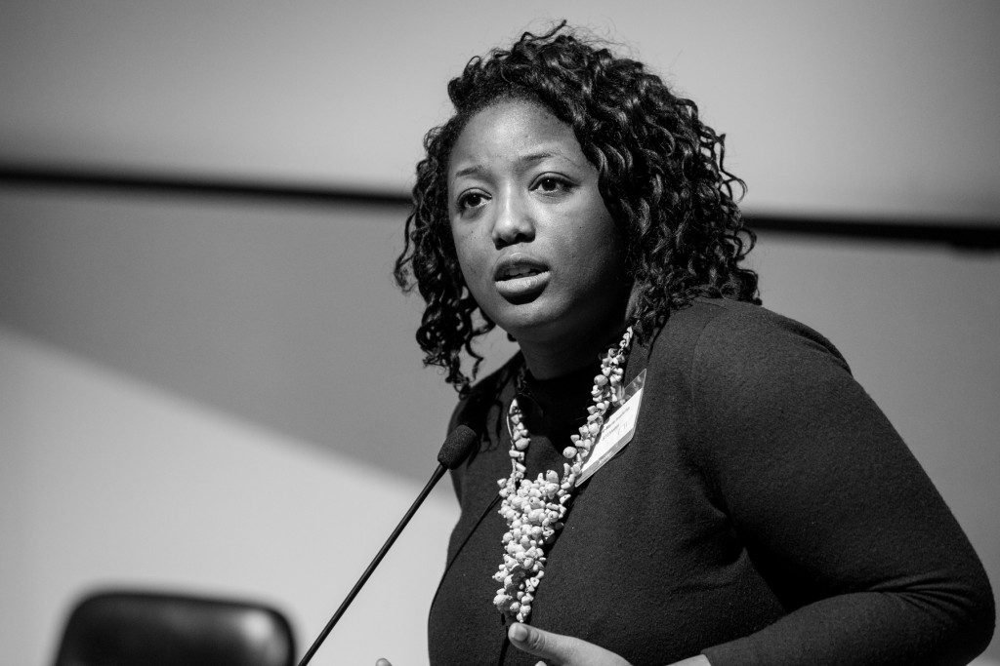

# QUEEN ELIZABETH HONOURS 27-YEAR-OLD NIGERIAN, ANNE-MARIE IMAFIDON

[Uncategorized](https://estheradeniyi.com/category/uncategorized/)
# QUEEN ELIZABETH HONOURS 27-YEAR-OLD NIGERIAN, ANNE-MARIE IMAFIDON

by [Esther Adeniyi](https://estheradeniyi.com/author/esther-adeniyi/)on [June 20, 2017April 27, 2018](https://estheradeniyi.com/queen-elizabeth-honours-27-year-old/)[Leave a Comment on QUEEN ELIZABETH HONOURS 27-YEAR-OLD NIGERIAN, ANNE-MARIE IMAFIDON](https://estheradeniyi.com/queen-elizabeth-honours-27-year-old/#respond)

Sharing is caring!

- [0](https://www.facebook.com/sharer/sharer.php?u=https%3A%2F%2Festheradeniyi.com%2Fqueen-elizabeth-honours-27-year-old%2F&amp;t=QUEEN%20ELIZABETH%20HONOURS%2027-YEAR-OLD%20NIGERIAN%2C%20ANNE-MARIE%20IMAFIDON)
- [0](https://twitter.com/intent/tweet?text=QUEEN%20ELIZABETH%20HONOURS%2027-YEAR-OLD%20NIGERIAN%2C%20ANNE-MARIE%20IMAFIDON&amp;url=https%3A%2F%2Festheradeniyi.com%2Fqueen-elizabeth-honours-27-year-old%2F)
- [0](#)

0shares

 Last Friday, Queen Elizabeth II, awarded Nigeria&#x2019;s Anne-Marie Imafidon an MBE, Member of the Order of the&#xA0;British Empire, for her work inspiring the next generation of women in Science, Technology, Engineering and Mathematics (STEM). According to reports, at 27, Imafidon is the youngest scientist to get a royal recognition since 1890.

[Twitter Ads info and privacy](https://support.twitter.com/articles/20175256)

 The eldest of&#xA0;[Britain&#x2019;s Brainiest Family](http://www.africaresource.com/arts-a-culture/newsworthy/723-britains-brainiest-family-is-from-nigeria), Imafidon has always been interested in Mathematics, Business and Technology. And has a unique streak of achievements including passing two GCSEs in Mathematics and ICT at the age of 10, being the youngest girl to pass A-level computing at age 11, receiving a British Scholarship to study Mathematics at&#xA0;John Hopkins University&#xA0;at the age of 13, and being one of the youngest to be awarded a Masters&#x2019; degree in Mathematics and Computer Science by the University of Oxford at age 20.

 Imafidon is the CEO and co-founder of Stemettes, an award-winning social enterprise for young girls interested in STEM. She&#xA0;[launched the organisation](http://stemettes.org/blog/2013/02/17/pancakes-paper-and-prizes-the-stemettes-launch/)&#xA0;in February 2013 to bridge the gender gap in STEM after she realised the meagre number of women in the industry. For Imafidon, STEM subjects are not just about solving problems, &#x201C;they can also be used to change people&#x2019;s lives for the better. Tech has been a great leveller and a global tool for good,&#x201D; she stated in an interview with&#xA0;*Parent Info*.

> [19 May](https://twitter.com/RoyalFamily/status/865565216578433024)
> 
> [The Royal Family&#xA0;](https://twitter.com/RoyalFamily)
> [
>  &#x2714;&#xA0;@RoyalFamily](https://twitter.com/RoyalFamily)
> 
> 
> 
> 
>  Anne-Marie Imafidon,&#xA0;[@stemettes](https://twitter.com/Stemettes)&#xA0;founder, has been awarded an&#xA0;[#MBE](https://twitter.com/hashtag/MBE?src=hash)&#xA0;for her work inspiring the next generation of women into STEM subjects.&#xA0;[pic.twitter.com/l198QZtUWj](https://t.co/l198QZtUWj)

> [https://twitter.com/mebertyboo](https://twitter.com/mebertyboo)
> [
>  &#xA0;Follow](https://twitter.com/mebertyboo)
> 
> 
> [Lisa Thomas&#xA0;@mebertyboo](https://twitter.com/mebertyboo)
> 
> 
> 
> [@RoyalFamily](https://twitter.com/RoyalFamily)&#xA0;[@Stemettes](https://twitter.com/Stemettes)&#xA0;[@aimafidon](https://twitter.com/aimafidon)&#xA0;My daughter has been completely inspired.wants to be an engineer , has had that dream since 13. doing a levels , hoping to get to imperial
> 
>  10:12 PM &#x2013; 19 May 201
> 
> - [https://twitter.com/intent/tweet?in_reply_to=865676629858799617](https://twitter.com/intent/tweet?in_reply_to=865676629858799617)
> [https://twitter.com/intent/tweet?in_reply_to=865676629858799617](https://twitter.com/intent/tweet?in_reply_to=865676629858799617)
> 
> 
> &#xA0;
> - [https://twitter.com/intent/retweet?tweet_id=865676629858799617](https://twitter.com/intent/retweet?tweet_id=865676629858799617)
> [&#xA0;88 Retweets](https://twitter.com/intent/retweet?tweet_id=865676629858799617)
> 
> 
> &#xA0;
> - [https://twitter.com/intent/like?tweet_id=865676629858799617](https://twitter.com/intent/like?tweet_id=865676629858799617)
> [&#xA0;4747 likes](https://twitter.com/intent/like?tweet_id=865676629858799617)

[Twitter Ads info and privacy](https://support.twitter.com/articles/20175256)

 More than anything, Imafidon serves as a role model to young girls who would otherwise have been unable to see a female figure excelling in the industry. Her organisation has tutored and mentored about 15,000 girls across the UK, Ireland and Europe; proof that she is deserving of the honour of an MBE.

 &#x201C;It&#x2019;s a well done and thank you to my team, our volunteers and those who have taken us seriously over the last four years. This is humbling and a sign of what is to come. Inclusivity in the sector and across society is important for all of us, it&#x2019;s an honour in itself to do the work we do,&#x201D; she said.

 Source: [Ventures Africa](http://venturesafrica.com/queen-elizabeth-honors-27-year-old-nigerian-anne-marie-imafidon/)

Sharing is caring!

- [0](https://www.facebook.com/sharer/sharer.php?u=https%3A%2F%2Festheradeniyi.com%2Fqueen-elizabeth-honours-27-year-old%2F&amp;t=QUEEN%20ELIZABETH%20HONOURS%2027-YEAR-OLD%20NIGERIAN%2C%20ANNE-MARIE%20IMAFIDON)
- [0](https://twitter.com/intent/tweet?text=QUEEN%20ELIZABETH%20HONOURS%2027-YEAR-OLD%20NIGERIAN%2C%20ANNE-MARIE%20IMAFIDON&amp;url=https%3A%2F%2Festheradeniyi.com%2Fqueen-elizabeth-honours-27-year-old%2F)
- [0](#)

0shares

Tags:[career](https://estheradeniyi.com/tag/career/)[News](https://estheradeniyi.com/tag/news/)