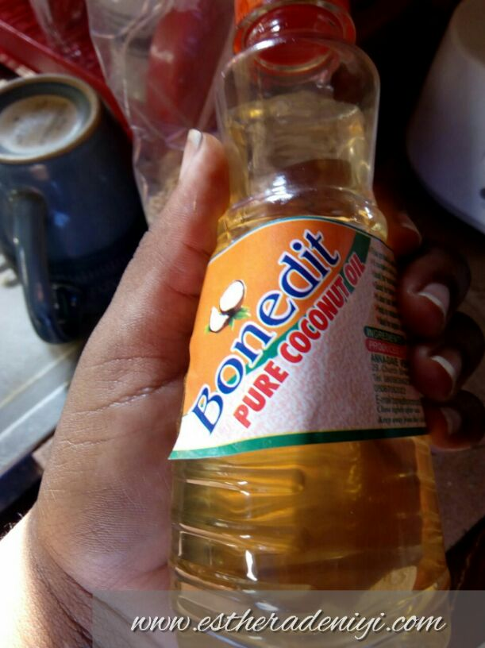
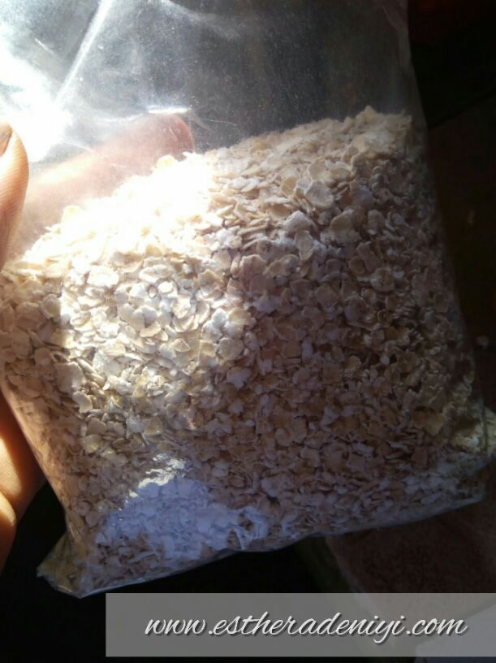
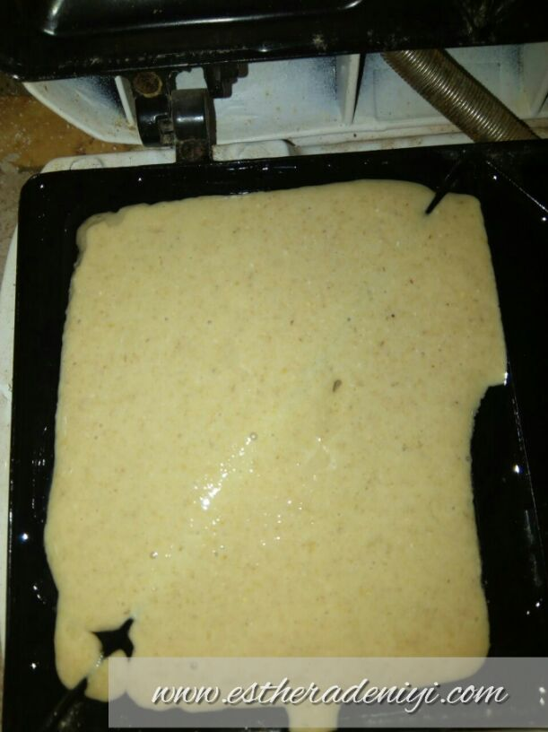

# Quick, Healthy Breakfast Recipe – Yele’s Oatmeal Bread

[Uncategorized](https://estheradeniyi.com/category/uncategorized/)
# Quick, Healthy Breakfast Recipe &#x2013; Yele&#x2019;s Oatmeal Bread

by [Esther Adeniyi](https://estheradeniyi.com/author/esther-adeniyi/)on [January 27, 2017April 27, 2018](https://estheradeniyi.com/quick-healthy-breakfast-recipe-yeles/)[8 Comments on Quick, Healthy Breakfast Recipe &#x2013; Yele&#x2019;s Oatmeal Bread](https://estheradeniyi.com/quick-healthy-breakfast-recipe-yeles/#comments)

Sharing is caring!

- [0](https://www.facebook.com/sharer/sharer.php?u=https%3A%2F%2Festheradeniyi.com%2Fquick-healthy-breakfast-recipe-yeles%2F&amp;t=Quick%2C%20Healthy%20Breakfast%20Recipe%20-%20Yele%E2%80%99s%20Oatmeal%20Bread)
- [0](https://twitter.com/intent/tweet?text=Quick%2C%20Healthy%20Breakfast%20Recipe%20-%20Yele%E2%80%99s%20Oatmeal%20Bread&amp;url=https%3A%2F%2Festheradeniyi.com%2Fquick-healthy-breakfast-recipe-yeles%2F)
- [0](#)

0shares

 Here is another super nutritious breakfast recipe by Yele. This one too is quick and easy. We are bringing to you fast food that are at the same time, nutritious. Yaaaaaaay, that&#x2019;s all we ever want- healthy quickies we can have as breakfast.

Ingredients:

Oat meal
 Baking soda
 Salt
 Milk
 Eggs
 Coconut oil
 Honey

Method:

Step &#xA0;1- measure out your oat meal (Quaker oat, good morning oat, etc.)

Step 2- Pour it in a miller or blender. Add your baking soda to it and blend till it&#x2019;s fine.

 Step 3 &#x2013;Add salt to the mixture and mill again.

Step 4- Break in the eggs in a separate bowl. Add milk and honey.

Step 5- Add the whisked mixture into the dry ingredients in a blender.

Step 6- Blend until you have a batter.

Step 7- Grease the toaster or sandwich maker with coconut oil. Olive oil is also a good substitute.

Step 8- Fill in each pit of the toaster with the batter and let it cook for about 2 minutes

Step 9- We have our Oatmeal bread. Serve with something healthy e.g fruit juice.

 Notes- Yele used oat meal instead of flour and honey instead of sugar because we&#x2019;re opting in for healthier choices.

What do you think of this recipe? Will you try this sometime soon?

Sharing is caring!

- [0](https://www.facebook.com/sharer/sharer.php?u=https%3A%2F%2Festheradeniyi.com%2Fquick-healthy-breakfast-recipe-yeles%2F&amp;t=Quick%2C%20Healthy%20Breakfast%20Recipe%20-%20Yele%E2%80%99s%20Oatmeal%20Bread)
- [0](https://twitter.com/intent/tweet?text=Quick%2C%20Healthy%20Breakfast%20Recipe%20-%20Yele%E2%80%99s%20Oatmeal%20Bread&amp;url=https%3A%2F%2Festheradeniyi.com%2Fquick-healthy-breakfast-recipe-yeles%2F)
- [0](#)

0shares

Tags:[Food](https://estheradeniyi.com/tag/food/)