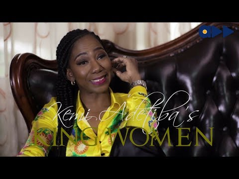

# Remi Fagbohun talks on having inner strength as a woman

[Uncategorized](https://estheradeniyi.com/category/uncategorized/)
# Remi Fagbohun talks on having inner strength as a woman

by [Esther Adeniyi](https://estheradeniyi.com/author/esther-adeniyi/)on [June 16, 2017April 27, 2018](https://estheradeniyi.com/remi-fagbohun-talks-on-having-inner/)[Leave a Comment on Remi Fagbohun talks on having inner strength as a woman](https://estheradeniyi.com/remi-fagbohun-talks-on-having-inner/#respond)

Sharing is caring!

- [0](https://www.facebook.com/sharer/sharer.php?u=https%3A%2F%2Festheradeniyi.com%2Fremi-fagbohun-talks-on-having-inner%2F&amp;t=Remi%20Fagbohun%20talks%20on%20having%20inner%20strength%20as%20a%20woman)
- [0](https://twitter.com/intent/tweet?text=Remi%20Fagbohun%20talks%20on%20having%20inner%20strength%20as%20a%20woman&amp;url=https%3A%2F%2Festheradeniyi.com%2Fremi-fagbohun-talks-on-having-inner%2F)
- [0](#)

0shares

 King Women (Episode 10) was such an enlightening session. [Remi Fagbohun](http://onobello.com/must-watch-personal-stylist-remi-fagbohun-shares-her-inspiring-story-on-kemi-adetibas-king-women/) emphasizes on building and [investing in yourself](https://www.estheradeniyi.com/5-surefire-ways-to-invest-in-yourself). She talks about women having inner strength. She discusses women playing down the obsession to be approved at all costs.
Watch the video below:

What other lessons did you pick from Remi Fagbohun&#x2019;s session on [King Women](https://www.bellanaija.com/2017/05/accelerate-tv-watch-kemi-adetibas-king-women-interview-chigul-bn/)?

Sharing is caring!

- [0](https://www.facebook.com/sharer/sharer.php?u=https%3A%2F%2Festheradeniyi.com%2Fremi-fagbohun-talks-on-having-inner%2F&amp;t=Remi%20Fagbohun%20talks%20on%20having%20inner%20strength%20as%20a%20woman)
- [0](https://twitter.com/intent/tweet?text=Remi%20Fagbohun%20talks%20on%20having%20inner%20strength%20as%20a%20woman&amp;url=https%3A%2F%2Festheradeniyi.com%2Fremi-fagbohun-talks-on-having-inner%2F)
- [0](#)

0shares

Tags:[Celebrating Women](https://estheradeniyi.com/tag/celebrating-women/)