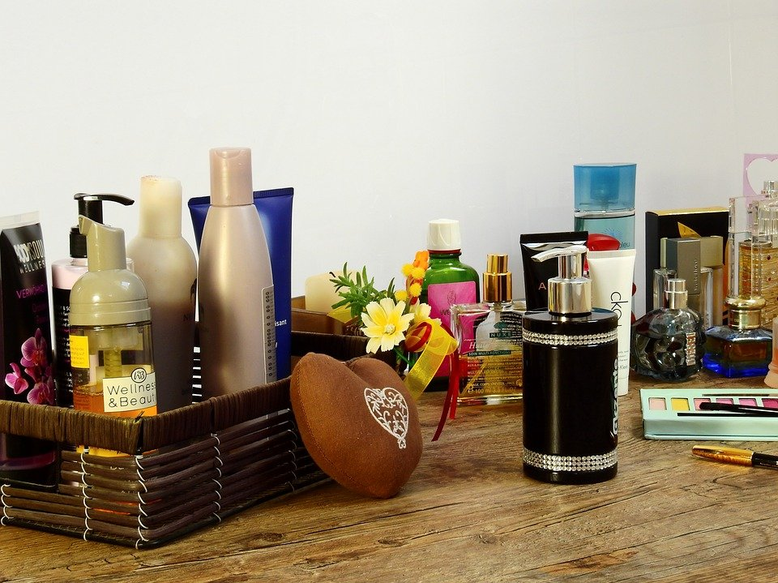

# Should you apply cream to your boobs after bath?

[Uncategorized](https://estheradeniyi.com/category/uncategorized/)
# Should you apply cream to your boobs after bath?

by [Esther Adeniyi](https://estheradeniyi.com/author/esther-adeniyi/)on [June 30, 2017April 27, 2018](https://estheradeniyi.com/should-you-apply-cream-to-your-boobs/)[2 Comments on Should you apply cream to your boobs after bath?](https://estheradeniyi.com/should-you-apply-cream-to-your-boobs/#comments)

Sharing is caring!

- [0](https://www.facebook.com/sharer/sharer.php?u=https%3A%2F%2Festheradeniyi.com%2Fshould-you-apply-cream-to-your-boobs%2F&amp;t=Should%20you%20apply%20cream%20to%20your%20boobs%20after%20bath%3F)
- [0](https://twitter.com/intent/tweet?text=Should%20you%20apply%20cream%20to%20your%20boobs%20after%20bath%3F&amp;url=https%3A%2F%2Festheradeniyi.com%2Fshould-you-apply-cream-to-your-boobs%2F)
- [0](#)

0shares

 Some weeks ago we conducted an opinion poll on one very controversial topic around one of the most sensitive feminine body parts &#x2013; the boobs. We asked folks on [Facebook](https://www.facebook.com/adeniyi.esther.583) what they think about applying cream to their boobs after having their bath like they do to other parts of the bodies.

It was a very interactive thread. It was so lively and interesting as at the mention of boobs, people, male and female were drawn.

Contents

- [1 Is it good to rub body cream on your breasts after bath? Read comments](#Is_it_good_to_rub_body_cream_on_your_breasts_after_bath_Read_comments)
- [2 Other comments on the thread:](#Other_comments_on_the_thread)
- [3 Hilarious comments:](#Hilarious_comments)

##  Is it good to rub body cream on your breasts after bath? Read comments

Some people felt that the discussion was just not warranted in the first place because they had never heard of people not applying cream on their boobs after having their boobs.

Esther said, &#x201C;is this supposed to be an intentional thing? It&#x2019;s normal na&#x201D;

Mobi said &#x201C;isn&#x2019;t that normal? Why the segregation?&#x201D;

Eketi said, &#x201C;How is this even a debate? I&#x2019;m honestly baffled.&#x201D;

We also had a fair share of informative and enlightening comments of advice and what to do as regards this:

Jennifer said, &#x201C;those who use bleaching cream, gel, whitening creams should not even think of applying a drop of it on their boobs&#x2026; It is very harmful.&#x201D;

Damilola said, &#xA0;&#x201C;it&#x2019;s like most of these babes prefer skin cancer to breast cancer. Going organic is the answer folks. I won&#x2019;t be afraid to rub [shea butter](https://www.estheradeniyi.com/natural-hair-3-benefits-of-shea-butter) or [coconut oil](https://www.estheradeniyi.com/5-steps-to-deep-condition-your-hair) on my skin or boobs even during breastfeeding. Your whole body is as important as the boobs. Esther Adeniyi, educating peeps since 21st century.&#x201D;

Naomi said, &#xA0;&#x201C;boobs skin is sensitive and [need moisture and protection from harmful UV](https://www.self.com/story/the-best-time-to-moisturize) rays of the sun. It is very important, especially for ladies who love to flaunt cleavage. Keep that skin glowing and sumptuous.

Patience said, &#x201C;Yes you should. Sometimes the skin at that area suffers from dryness and you notice itching not necessarily because you have an infection but due to lack of moisture there. Agreed it has fatty tissues but still do the needful.&#x201D;

Chioma said, &#x201C;I will advice you go for organic products, you can simply use olive oil. Olive oil helps in making the boobs firm. I frown at applying all these over the counter body creams and lotions. So many of them are not safe. Take good care of yourself and prevent breast Cancer.&#x201D;

Adefemi said, &#x201C;I think some of these so call creams leads to some skin infection later to complex skin disorder and finally to cancer.&#x201D;

##  Other comments on the thread:

 Victoria said, &#x201C;Eeeish! I don&#x2019;t rub cream on my boobs&#x2026;.you could get a [different cream from the body cream](https://www.estheradeniyi.com/how-natural-hair-products-saved-my-face) you use and use on the boobs as a moisturizer.&#x201D;

Mercy said, &#x201C;I don&#x2019;t cream my boobs o,except when I subconsciously cream my chest from the remains of the one I used on my body.&#x201D;

Esther said, &#x201C;I&#x2019;ve never creamed my boobs even my thigh. I don&#x2019;t cream my chest region to my thigh.&#x201D;

Miranda said, &#x201C;Thinking of it now, I only apply lotion to my limbs. I do believe every part of the body needs to be moisturized but I don&#x2019;t consciously apply it to my torso. Weird.&#x201D;

Abisola said, &#x201C;I dont really think it&#x2019;s safe to rub on the boobs, it&#x2019;s a very sensitive part of the body and we should be careful what we apply there, It would shock you that some [breast cancers could start from creams](https://www.estheradeniyi.com/female-nigerian-student-discovers-new) been applied on the boob&#x2019;s. I personally don&#x2019;t apply cream on my breast, if I would apply at all, it&#x2019;s Shea butter or olive oil ,and my breast is soft and succulent, no dryness at all &#x263A;
 I don&#x2019;t really know if it&#x2019;s wrong but I don&#x2019;t find it convenient.&#x201D;

Tolulope said, &#x201C;It&#x2019;s safer not too especially with nursing mothers. Some creams should not be ingested by the baby.&#x201D;

Arinola said, &#x201C;Yes oo! The boobs needs pamper too. ???? But I don&#x2019;t when breastfeeding ?&#x201D;

Nwanyi said, &#x201D; I use shea butter mixed with coconut and almond oil, and I rub it everywhere&#x201D;

Monique siad, &#x201C;I don&#x2019;t apply anything on my breast but I can apply on other part of my body.&#x201D;

Bukola said, &#x201C;i don&#x2019;t. i intentionally don&#x2019;t.&#x201D;

Rianat says, &#x201C;I dont attimes. That part is very sensitive. &#xA0;I don&#x2019;t even rub all my body most times. Just face, hands and legs. Cream Don cost&#x201D;

##  Hilarious comments:

 Anoty said, &#x201C;Somebody wee wantu suck boobs e wee now be tasting Caro white ???????.
 Pls stoppit&#x201D;

Chibueze said, &#x201C;It can amount to food poisoning especially at nights o! A friend asked me to say so o heheeeee&#x201D;

David said, &#x201C;Nope. Some of these lotions are toxic when licked or ingested and we don&#x2019;t who might die of its poison. We need to be considerate.&#x201D;

Over to you guys, what do you think? Should you [apply cream to your boobs after bath](https://www.skincare.com/article/the-best-time-to-apply-body-lotion)?

Sharing is caring!

- [0](https://www.facebook.com/sharer/sharer.php?u=https%3A%2F%2Festheradeniyi.com%2Fshould-you-apply-cream-to-your-boobs%2F&amp;t=Should%20you%20apply%20cream%20to%20your%20boobs%20after%20bath%3F)
- [0](https://twitter.com/intent/tweet?text=Should%20you%20apply%20cream%20to%20your%20boobs%20after%20bath%3F&amp;url=https%3A%2F%2Festheradeniyi.com%2Fshould-you-apply-cream-to-your-boobs%2F)
- [0](#)

0shares

Tags:[Vox pop](https://estheradeniyi.com/tag/vox-pop/)