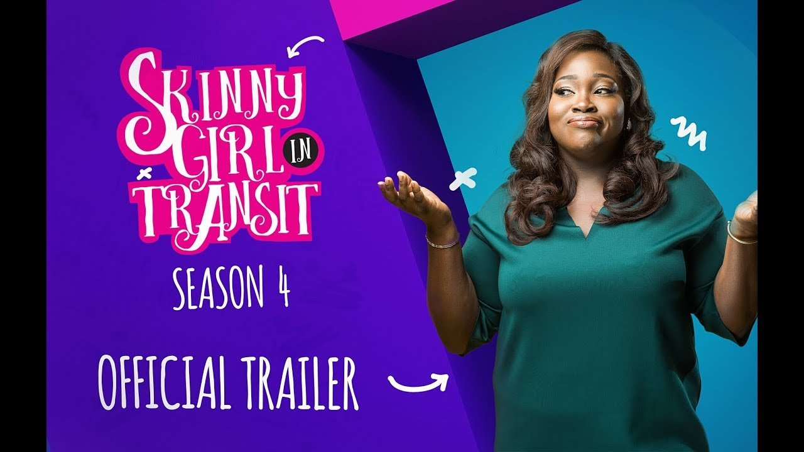

# Skinny Girl in Transit Season 4: My Best Characters so far

[Movies](https://estheradeniyi.com/category/movies/)
# Skinny Girl in Transit Season 4: My Best Characters so far

by [Esther Adeniyi](https://estheradeniyi.com/author/esther-adeniyi/)on [October 27, 2017May 25, 2018](https://estheradeniyi.com/skinny-girl-in-transit-season-4-my-bes/)[5 Comments on Skinny Girl in Transit Season 4: My Best Characters so far](https://estheradeniyi.com/skinny-girl-in-transit-season-4-my-bes/#comments)

Sharing is caring!

- [0](https://www.facebook.com/sharer/sharer.php?u=https%3A%2F%2Festheradeniyi.com%2Fskinny-girl-in-transit-season-4-my-bes%2F&amp;t=Skinny%20Girl%20in%20Transit%20Season%204%3A%20My%20Best%20Characters%20so%20far)
- [0](https://twitter.com/intent/tweet?text=Skinny%20Girl%20in%20Transit%20Season%204%3A%20My%20Best%20Characters%20so%20far&amp;url=https%3A%2F%2Festheradeniyi.com%2Fskinny-girl-in-transit-season-4-my-bes%2F)
- [0](#)

0shares

&#xA0;

Have you been watching Ndani TV&#x2019;s Skinny Girl in Transit Season 4?
 After the last episode of Season 3 where Mide and Tiwa officially became
 lovers, I gave up on the continuity of the series. You should see the look on
 my face when I got to learn that there was going to be Skinny Girl in Transit
 and it would be a season 4. Wawu! I know these guys know how to keep on making
 these stories last, I mean, look at [Jenifa&#x2019;s Diary](https://www.estheradeniyi.com/currently-watching-jenifas-diary).

Oh my, one time, you would think, this story might taper to
 an end now. Another time it&#x2019;s up and flowing and it&#x2019;s great as it is. Y&#x2019;all
 movie guys must be that creative, I give it to you.

One of my colleagues is a script writer and he talks about
 how things take different turns depending on how creative the writer is. Well
 done is all I can say. [So Skinny Girl in Transit](https://www.bellanaija.com/2017/09/ndani-tvs-hit-show-skinny-girl-transit-back-season-4-check-official-posters-trailer/). Well, if you have been
 reading the Movie segment in here, you won&#x2019;t find it difficult to realize that
 I am obsessed with this series. I meeeeeeeaaaaan&#x2026;.

I am beginning to form a bond with these characters and
 really, who wouldn&#x2019;t? You can&#x2019;t be following the series like I am and not be
 stayed on one or two of them. I want to tell you my best three of all of them.

3. Ngozi Nwosu (who is Tiwa&#x2019;s mother in SGIT) 

Nitori Oloun! Tiwa&#x2019;s mother is the typical example of an
 African mother, hia! From poking her nose into her children&#x2019;s relationships to
 scolding Shalewa like a toddler. One time she is acting all sweet and saintly,
 the next, she is ridiculously overbearing. I loved Ngozi&#x2019;s execution of her
 character. It was smooth and accurate. Her facial expressions are all I need to
 be rolling all over the floor.

2. Abisola Aiyeola (who is Didi in SGIT) 

You see, [Bisola](https://www.estheradeniyi.com/bella-naija-interviews-first-runner-up) has so many talents and acting is one
 prominent one. Her role as a friend to Tiwa has a lot of life lessons attached.
 Do you remember how much I gushed about [Toyo in Jenifa&#x2019;s Diary](https://www.estheradeniyi.com/jenifas-diary-season-5-lessons)? I love the
 essence of having a friend that understands, sees all of your flaws and loves
 you regardless. Oh, Bisola&#x2019;s acting in Skinny Girl in Transit was way awesome.
 She is funny and all alert.

1. Sharon Ooja (who is Shalewa in SGIT)

So so so! Shalewa is the beeeeeeeest of all of the
 characters in Skinny Girl in Transit especially in season 4. I had even gone to
 gush about her on Facebook and oh yes, my friends agreed.

Sharon Ooja was the perfect fit to fill in for the naughty
 sister role. It came so natural for her. She probably is the naughty little
 sister in reality. I loved to watch her act and be jealous. One life lesson I
 learned from her role in Skinny Girl in Transit season 4 is that you cannot
 afford to compare your life&#x2019;s journey with another person. It doesn&#x2019;t even
 matter if this other person is your sister.

If you are watching SGIT, you would remember how she began
 to put so much pressure on Mohammed because Tiwa and Mide (Ayoola Ayolola) did
 things together. (By the way Mide in Skinny Girl in Transit was good. He must
 be that romantic in real life, lol. Fine boy, hihihihihihi).

In essence, your relationship journey is unique. If you are
 unique, why won&#x2019;t your relationship be anyway? And to think that you are
 forging something with someone from an entirely different background, of
 course, you are going to produce something that is definitely not the same as
 what as anyone&#x2019;s

&#xA0;

Alright guys, what do you think about [Skinny Girl in Transit Season 4](http://www.pulse.ng/entertainment/movies/watch-skinny-girl-in-transit-season-4-trailer-id7358364.html)? Are you watching the series? Who are your favourite characters? Let&#x2019;s
 meet in the comments section.

Related:

[Skinny Girl in Transit Season 4 Trailer](https://www.estheradeniyi.com/ndani-tvs-skinny-girl-in-transit-season)

[Watch Skinny Girl in Transit Season 4 Episode 4](https://www.estheradeniyi.com/watch-skinny-girl-in-transit-season-4)

Sharing is caring!

- [0](https://www.facebook.com/sharer/sharer.php?u=https%3A%2F%2Festheradeniyi.com%2Fskinny-girl-in-transit-season-4-my-bes%2F&amp;t=Skinny%20Girl%20in%20Transit%20Season%204%3A%20My%20Best%20Characters%20so%20far)
- [0](https://twitter.com/intent/tweet?text=Skinny%20Girl%20in%20Transit%20Season%204%3A%20My%20Best%20Characters%20so%20far&amp;url=https%3A%2F%2Festheradeniyi.com%2Fskinny-girl-in-transit-season-4-my-bes%2F)
- [0](#)

0shares

Tags:[Movies](https://estheradeniyi.com/tag/movies/)[Skinny Girl In Transit](https://estheradeniyi.com/tag/skinny-girl-in-transit/)