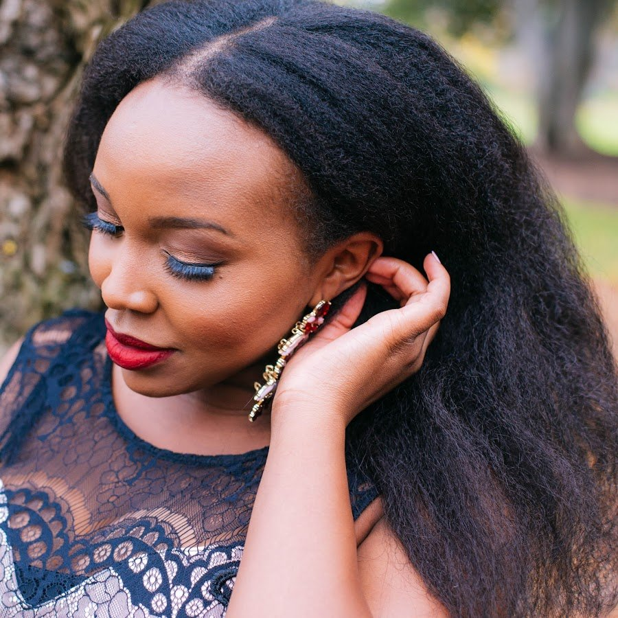

# Stretch Out Your Natural Hair Without Heat

[Natural Hair](https://estheradeniyi.com/category/natural-hair/)
# Stretch Out Your Natural Hair Without Heat

by [Esther Adeniyi](https://estheradeniyi.com/author/esther-adeniyi/)on [October 23, 2017May 25, 2018](https://estheradeniyi.com/stretch-out-your-natural-hair-withou/)[2 Comments on Stretch Out Your Natural Hair Without Heat](https://estheradeniyi.com/stretch-out-your-natural-hair-withou/#comments)

Sharing is caring!

- [0](https://www.facebook.com/sharer/sharer.php?u=https%3A%2F%2Festheradeniyi.com%2Fstretch-out-your-natural-hair-withou%2F&amp;t=Stretch%20Out%20Your%20Natural%20Hair%20Without%20Heat)
- [0](https://twitter.com/intent/tweet?text=Stretch%20Out%20Your%20Natural%20Hair%20Without%20Heat&amp;url=https%3A%2F%2Festheradeniyi.com%2Fstretch-out-your-natural-hair-withou%2F)
- [0](#)

0shares

Natural hair and the way it shrinks. I tell you, the shrinking game of Natural hair is real o. That&#x2019;s how someone will come and say, &#x2018;so your hair is not even that long&#x2019; and while you are fighting for words to describe natural hair shrinkage, you begin to stammer. Because, really, what the heck! My hair is freaking longer that what you see man.

Well, apart from its fake appearance, there are other reasons you want your natural hair stretched out. When your natural hair is stretched out, it makes it easy for you to style in different ways. It is also easier to manage than when it is all compressed.

A big issue however, is the heat that is involved. Too much heat can destroy your hair. It causes breakage and can stunt your hair growth. You honestly don&#x2019;t want this after all of the efforts you have put into making your natural hair shine

[Tomi Popoola](https://www.youtube.com/channel/UCh2UR_6CXFf_4Ld1tBt4-sQ)&#xA0;has a video on how to stretch your natural hair without heat. Watch it below:

What do you think? Is this something you are going to try?

Related:

[10 Big lies and myths about natural hair](https://www.estheradeniyi.com/top-10-big-lies-and-myths-about-natural)
[How to do finger coils on natural hair](https://www.estheradeniyi.com/finger-coils-on-your-natural-hair)
[How to avoid hair breakage](https://www.estheradeniyi.com/hair-breakage-easy-ways-to-avoid-this)

Photo credit: [Craving Yellow](http://www.cravingyellow.com/)

Sharing is caring!

- [0](https://www.facebook.com/sharer/sharer.php?u=https%3A%2F%2Festheradeniyi.com%2Fstretch-out-your-natural-hair-withou%2F&amp;t=Stretch%20Out%20Your%20Natural%20Hair%20Without%20Heat)
- [0](https://twitter.com/intent/tweet?text=Stretch%20Out%20Your%20Natural%20Hair%20Without%20Heat&amp;url=https%3A%2F%2Festheradeniyi.com%2Fstretch-out-your-natural-hair-withou%2F)
- [0](#)

0shares

Tags:[Hair](https://estheradeniyi.com/tag/hair/)[Natural Hair](https://estheradeniyi.com/tag/natural-hair/)[videos](https://estheradeniyi.com/tag/videos/)