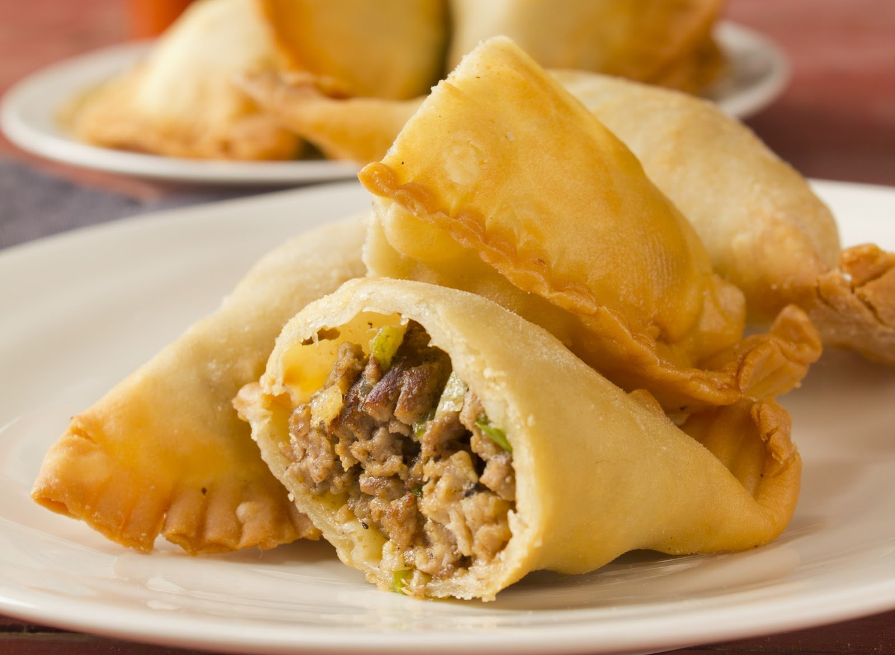
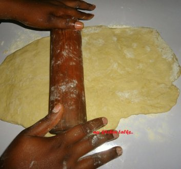
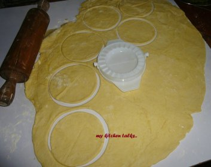
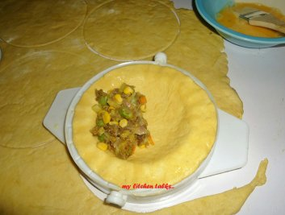

# Tasty Meat Pie Recipe and Preparation. Hmmmmm, Yummy!

[Food](https://estheradeniyi.com/category/food/)
# Tasty Meat Pie Recipe and Preparation. Hmmmmm, Yummy!

by [Esther Adeniyi](https://estheradeniyi.com/author/esther-adeniyi/)on [September 27, 2017May 25, 2018](https://estheradeniyi.com/tasty-meat-pie-recipe-and-preparation/)[4 Comments on Tasty Meat Pie Recipe and Preparation. Hmmmmm, Yummy!](https://estheradeniyi.com/tasty-meat-pie-recipe-and-preparation/#comments)

Sharing is caring!

- [0](https://www.facebook.com/sharer/sharer.php?u=https%3A%2F%2Festheradeniyi.com%2Ftasty-meat-pie-recipe-and-preparation%2F&amp;t=Tasty%20Meat%20Pie%20Recipe%20and%20Preparation.%20Hmmmmm%2C%20Yummy%21)
- [0](https://twitter.com/intent/tweet?text=Tasty%20Meat%20Pie%20Recipe%20and%20Preparation.%20Hmmmmm%2C%20Yummy%21&amp;url=https%3A%2F%2Festheradeniyi.com%2Ftasty-meat-pie-recipe-and-preparation%2F)
- [0](#)

0shares

&#xA0;

Procedures for making tasty meat pie

I&#x2019;ve barely seen anyone who does not like to eat meat pie. Meat pie is one of the best snacks you can make with little amount of money and in a short time. This is a simple recipe and procedure from my kitchen. It is easy to make . Happy reading.

Ingredients for the filling of meat pie

Irish potatoes
 Beef
 Carrots
 Onions
 Pepper (preferably white powdered pepper)
 Curry and thyme
 Seasoning (any of your choice)
 Salt

Ingredients for the dough of the meat pie

1.Flour

2. margarine

3.Baking powder

4.A pinch of salt

5.Water

6.Egg for brushing the meat pie top

Procedure for making the filling of your tasty meat pie

1.Wash, season, add onions &#xA0;and boil meat till tender

2. Remove meat from water, cut meat into small pieces or grind with a meat grinder. Set aside the stock (omi Eran)

3.Wash the sweet potato, peel out the skins, dice and pour in a clean water

4.Wash the carrots, scrape out the outer layer and pour in a clean water

5.Peel and dice onions too and pour in a clean water.

6.Pour the potatoes &#xA0;in the stock (omi Eran) and cook for about 7-10 minutes.

7.Add the carrots, onions, curry and thyme, white pepper and cook till its soft and the water is almost dry. &#xA0;Mash the cooked mixture with a wooden spatula (omo orogun)

8.Add the cut/grinded meat.

9.Allow the filling to completely cool off before using it.

10.If it appears you have cooked with too much water just sprinkle a little bit of flour at a time and allow to steam.[You might like to read how to prepare potato toast](https://www.estheradeniyi.com/prepare-potato-toast-in-easy-steps)

Procedure for making the dough of your meat pie

1.Pour the flour in a bowl, &#xA0;add baking powder and a pinch of salt and mix with your hand, &#xA0;add margarine and mix with your hand
 2.Pour water bit by bit and mix together till everything starts to become one and it no longer sticks to your hand.
 3.If it appears you have poured too much water in the mixture, &#xA0;sprinkle a little bit of flour little by little and mix together, &#xA0;till it no longer sticks together and has formed a dough
 4.Sprinkle some flour on your working surface and cut out some dough (little at a time) and roll out with a rolling pin.

5.Cut out a round shape with a meat pie cutter or any round object you have &#xA0;maybe a plate or pot cover.

6.Place the round shape cut out dough in the meat pie cutter and put the meat pie filling in one side of the dough

7.Press together by allowing the two sides/opening of the meat pie cutter to meat. There you have your meat pie.
 8.If you are using a round object, &#xA0;put the filling at one side of the cut out, allow the two sides of the dough to meet and press together with a fork.
 9. Repeat step 4-7 till you no longer have any dough left
 10. Brush your baking tray with some margarine and sprinkle a little bit of butter round it.
 11. Arrange your meat pie and make sure there are enough space and one meat pie is not touching the other.
 12. Remove the egg from shell and use to brush the meat pie top and sides with a small dough brush
 13. Put meat pie&#x2019;s in the oven and bake on a medium heat. You can check every 10 minutes, &#xA0;till it is done.

[Read how to prepare chicken pie here](http://www.allnigerianrecipes.com/snacks/chicken-pie.html)

N:B

1. &#xA0;If you are using a local oven, &#xA0;make sure heat is set your oven at least 10 minutes before you bake your meat pie.
 2. If you are using an electric oven, &#xA0;make sure heat is set in your oven at least 7-5 minutes.
 3. Whatever name you call your pie depends on the filling you are using. For example if you are using chicken or turkey or fish, &#xA0;then it&#x2019;s either chicken pie, &#xA0;turkey pie and fish pie.
 4. If you are frying instead of baking meat pie, &#xA0;add some amount of sugar to the dough while mixing.

Photo credit: My kitchen talks

Home page photo credit: [Emerils](http://emerils.com/128002/natchitoches-meat-pies)

Sharing is caring!

- [0](https://www.facebook.com/sharer/sharer.php?u=https%3A%2F%2Festheradeniyi.com%2Ftasty-meat-pie-recipe-and-preparation%2F&amp;t=Tasty%20Meat%20Pie%20Recipe%20and%20Preparation.%20Hmmmmm%2C%20Yummy%21)
- [0](https://twitter.com/intent/tweet?text=Tasty%20Meat%20Pie%20Recipe%20and%20Preparation.%20Hmmmmm%2C%20Yummy%21&amp;url=https%3A%2F%2Festheradeniyi.com%2Ftasty-meat-pie-recipe-and-preparation%2F)
- [0](#)

0shares

Tags:[Food](https://estheradeniyi.com/tag/food/)[meat pie](https://estheradeniyi.com/tag/meat-pie/)[Recipes](https://estheradeniyi.com/tag/recipes/)[Snacks](https://estheradeniyi.com/tag/snacks/)