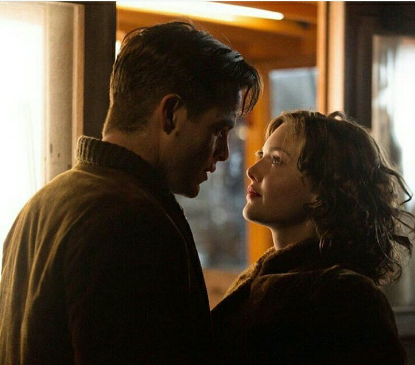

# The Finest Hours : Movie Review

[Movies](https://estheradeniyi.com/category/movies/)
# The Finest Hours : Movie Review

by [Esther Adeniyi](https://estheradeniyi.com/author/esther-adeniyi/)on [June 1, 2016May 25, 2018](https://estheradeniyi.com/the-finest-hours-movie/)[Leave a Comment on The Finest Hours : Movie Review](https://estheradeniyi.com/the-finest-hours-movie/#respond)

Sharing is caring!

- [0](https://www.facebook.com/sharer/sharer.php?u=https%3A%2F%2Festheradeniyi.com%2Fthe-finest-hours-movie%2F&amp;t=The%20Finest%20Hours%20%3A%20Movie%20Review)
- [0](https://twitter.com/intent/tweet?text=The%20Finest%20Hours%20%3A%20Movie%20Review&amp;url=https%3A%2F%2Festheradeniyi.com%2Fthe-finest-hours-movie%2F)
- [0](#)

0shares

I got this The Finest Hours from a classmate. He gave me some more interesting movies but he was particular about this one. I watched this movie and perfectly understood why he was very keen about it. The Finest Hours is a 1hr 57min long interesting movie and I am happy I got to partake of its sweetness.

The Finest Hours is the true story of a coast guard who saves victims of a ship getting wrecked by the storm with a boat. On Feb. 18, 1952, a massive storm splits a ship in two , trapping more than 30 sailors. Sybert, &#xA0;the sailor organizes a strategy to get people to safety. Word of the disaster reaches the Coast Guard in Chatham and a daring rescue mission with a lifeboat was embarked on. Despite the ferocious weather, &#xA0;Bernie Webber prepares a crew to save the survivors of the storm.

The suspense in The Finest Hours evoked the right effect. Don&#x2019;t worry, the movie has a happy ending, I am as worried about that for any movie too. Don&#x2019;t blame me, I don&#x2019;t have a large heart for tragedy. Many of the characters in The Finest Hours have attributes to learn from. I believe that the way people react under pressure and attack depends on how much they have invested in their souls .

Taking time to invest in virtue, &#xA0;courtesy and character can help dying situations. In a massive storm as what we see in the movie, anybody is bound to take careless decisions out of fear and frustration but I see some men who were patient and gentle in the most bizarre of conditions. The sailor was particularly driven to frustration but his reaction is proof that deep virtues surface in times of desperation.

And my favourite scene in The Finest Hours! Girl proposes to boy. What boldness and confidence. Miriam knew what she wanted. She was convincing and the most mind blowing part was that she wanted to marry at a date she already chose. I find stark opposites in the couples. I believe that opposites attract to complement each other. &#xA0;Bernie&#x2019;s shyness was balanced out by Miriam&#x2019;s boldness. She was daring and firm. I like women who can take charge when their partners are weak.

The Finest Hours is a movie you should see if you haven&#x2019;t. Let me know what you think.

Sharing is caring!

- [0](https://www.facebook.com/sharer/sharer.php?u=https%3A%2F%2Festheradeniyi.com%2Fthe-finest-hours-movie%2F&amp;t=The%20Finest%20Hours%20%3A%20Movie%20Review)
- [0](https://twitter.com/intent/tweet?text=The%20Finest%20Hours%20%3A%20Movie%20Review&amp;url=https%3A%2F%2Festheradeniyi.com%2Fthe-finest-hours-movie%2F)
- [0](#)

0shares

Tags:[Movies](https://estheradeniyi.com/tag/movies/)