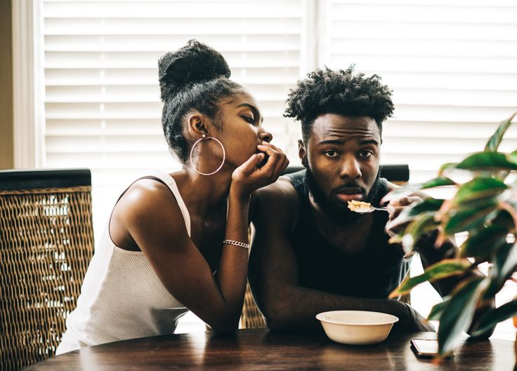

# The 4 Temperaments in Relationships : what type of lover are you?

[Uncategorized](https://estheradeniyi.com/category/uncategorized/)
# The 4 Temperaments in Relationships : what type of lover are you?

by [Esther Adeniyi](https://estheradeniyi.com/author/esther-adeniyi/)on [June 28, 2017April 27, 2018](https://estheradeniyi.com/the-four-temperaments-in-relationship/)[Leave a Comment on The 4 Temperaments in Relationships : what type of lover are you?](https://estheradeniyi.com/the-four-temperaments-in-relationship/#respond)

Sharing is caring!

- [0](https://www.facebook.com/sharer/sharer.php?u=https%3A%2F%2Festheradeniyi.com%2Fthe-four-temperaments-in-relationship%2F&amp;t=The%204%20Temperaments%20in%20Relationships%20%3A%20what%20type%20of%20lover%20are%20you%3F)
- [0](https://twitter.com/intent/tweet?text=The%204%20Temperaments%20in%20Relationships%20%3A%20what%20type%20of%20lover%20are%20you%3F&amp;url=https%3A%2F%2Festheradeniyi.com%2Fthe-four-temperaments-in-relationship%2F)
- [0](#)

0shares

Contents

- [1 What type of lover are you?](#What_type_of_lover_are_you)
- [2 The 4 Temperaments in Relationships](#The_4_Temperaments_in_Relationships)
- [3 The Sanguine:](#The_Sanguine)
- [4 The Choleric:](#The_Choleric)
- [5 The Phlegmatic:](#The_Phlegmatic)
- [6 The Melancholic](#The_Melancholic)

##  What type of lover are you?

 Ola has been dating Silvia for three months now, he is in love with her intelligence, her deep encouraging words, dress sense, her entrepreneurial spirit and how much of herself she gives just so every of her friends is comfortable but her loud life style bothers him.

Silvia loves that Ola loves her so much, she loves that he cares about her well being, she loves his calm nature but she just can&#x2019;t wrap her head around why he is such a boring partner. He doesn&#x2019;t fancy the usual outdoor paparazzi, he sees them as unnecessary. He&#x2019;s a good cook, he learnt cooking from his mum. He&#x2019;s cool headed, always wanting peace for himself and everyone around him.

Ola&#x2019;s usual daily routine does not go beyond, wake, pray, go to work, drive back home and rest all night if it&#x2019;s a weekday and his weekends are spent on his bed where he brainstorms and creates absolutely crazy ideas for his workplace.

He analyzes so well, sometimes Silvia accuses him of being a critic, why would he want every detail before he permits an owanbe, a spending, etc..

The different things we have been exposed to, such as our upbringing, education, associations, environment, etc are those things that have wired us to be as we are.

If you look critically, you&#x2019;ll see that some people are outspoken, enthusiastic, social and very active while on the other hand, there are people who are reserved, relaxed, peaceful, critical, etc.

These things/attributes are referred to as temperaments; and if there&#x2019;s no understanding of how these things work for people or why people are the way they are, relationships will always hit the rock and then we say they have broken up for irreconcilable differences.

So today, we will see how each temperament is seen/ exhibits their attributes in relationships; but first we must know that the temperament we have are Sanguine, Choleric, Melancholy and Phlegmatic. Study has shown that a person may have all four with one dominate one or all on an average if they really take time to work on balancing their lives.

##  The 4 Temperaments in Relationships

##  The Sanguine:

 This is the optimistic, positive, confident, cheerful, bright, bouyant lover. The sanguine in love is usually more compatible with their own kind. They are the playmate, always loving adventures. They see dating as entertainment and fun. They love to explore. A sanguine in love is never a boring person, they are exciting. Their extrovert nature has constant cravings for variety and never makes the relationship a boring affair. They are generous and are likely to give gifts early in relationships.

They want the partner to feel at ease so they have no desire to control you. They are good listeners and will always ask about their partner to engage you. During conversation, Sanguine tend to look you in the eyes, lean forward touching the hand and arm while listening intently.

##  The Choleric:

 For Choleric, dating is not fun like it is with sanguine people. Choleric lovers approach dating in the same manner they approach other issues in their lives, they analyze their hopes and needs, as well as the potential partners. People with this temperament are attracted by those who are good listeners, smart at handling conflicts and disagreements and have other recognized social skills. While they analyze and hide their own emotions, Choleric people look for someone who is emotionally expressive, flexible and even hesitant.

Choleric people usually are not interested in several relationships at once and have little dating experience when they are young. They may act awkwardly and if they don&#x2019;t envision future with you and are not interested in you, they may treat you with neglect and be very impatient. Between all four temperaments, this temperament falls in love less frequently.

They have only few serious relationships during their lives. However, if they have decided to build a relationship with that one special partner, they wouldn&#x2019;t leave it easily, even if it wasn&#x2019;t exactly what they wanted &#x2013; they are not the type of people that enjoy regularly changing their minds.

##  The Phlegmatic:

 They are the most sensitive of four temperaments. When they are with their potential partners, phlegmatic people seek for common intellectual and emotional ground, which will serve as a bridge from heart to heart. Dating for them is always seeking for marriage or long-term committed relationship and they have a tendency to look for bonding, nurturing and attachment with a potential partner or date. In fact, when dating, they truly give themselves and it has been known for them at times, to get so tired emotionally that they stop dating for a period of time. They will always avoid conflicts, they will do major adjustments and sacrifices all for the sake of this cherished bond.

Everything that happens within the relationship such as the odd phone call here and the email there is looked at as an important part of their relationship to the point where they actively enjoy analyzing their relationships and their partners&#x2019; thoughts and motives.

##  The Melancholic

 These people are quite pragmatic and down-to-earth. They see their love partners as assistants; their love preferences are based on common sense and compatibility. They should be predictable; adhering to the traditions and loyal to family. Melancholics take dating seriously. They keep the good manners. They will never be late. Melancholic men will open doors for women. Melancholic women will cook for their men. Moreover, they will always make concrete plans for what you will do in advance. They will be protective of you and, if they are really serious, they are likely to give important gifts. In short, these people enjoy the traditions associated with dating and a relationship.

Their conversation is detailed and factual, hating drama, and may appear unromantic to other types. This is the reason why they are usually attracted to their own type, especially when they are willing to settle down and start the family.

Now you should know where you belong, what kind of lover you are, &#xA0;What kind of lover you would attract, What kind of lover you would &#xA0;want for yourself, etc. This does not mean you can not be balanced and be the amazing partner your lover would appreciate doing the basics of a relationship and live happily ever after, of course you can!

Photo credit: [Pinterest](https://www.pinterest.com/explore/black-love-couples/)

 Adeoti Oluwafunmbi is a competent fish farmer and a tutor, the CEO of ThreeFold Resources Enterprise, she sells her fish live and smoked as ready to eat. She also trains people who have interest in starting their own catfish business.
Connect -08037989537

Threefoldresources@gmail.com

Sharing is caring!

- [0](https://www.facebook.com/sharer/sharer.php?u=https%3A%2F%2Festheradeniyi.com%2Fthe-four-temperaments-in-relationship%2F&amp;t=The%204%20Temperaments%20in%20Relationships%20%3A%20what%20type%20of%20lover%20are%20you%3F)
- [0](https://twitter.com/intent/tweet?text=The%204%20Temperaments%20in%20Relationships%20%3A%20what%20type%20of%20lover%20are%20you%3F&amp;url=https%3A%2F%2Festheradeniyi.com%2Fthe-four-temperaments-in-relationship%2F)
- [0](#)

0shares

Tags:[Relationships](https://estheradeniyi.com/tag/relationships/)