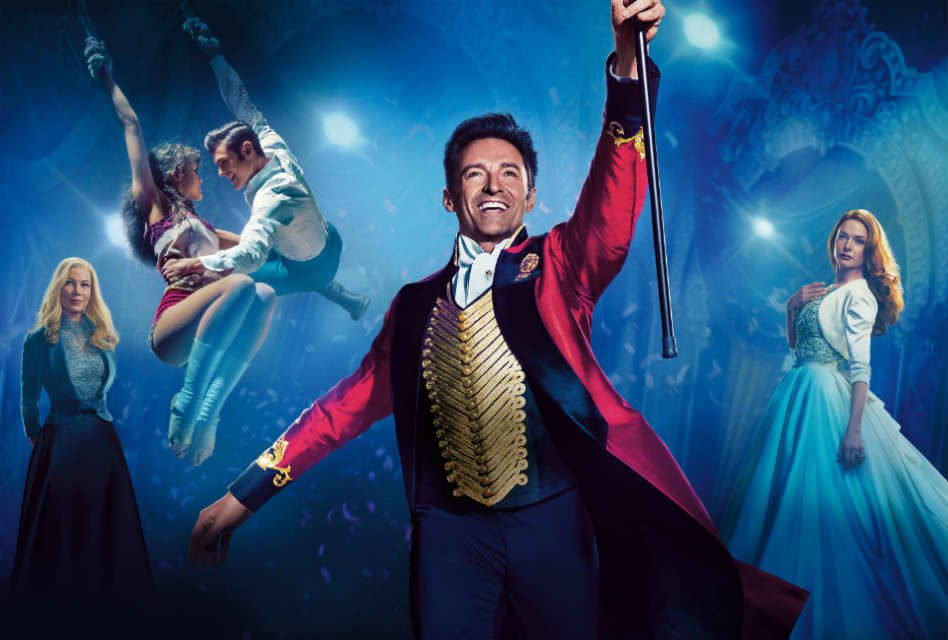
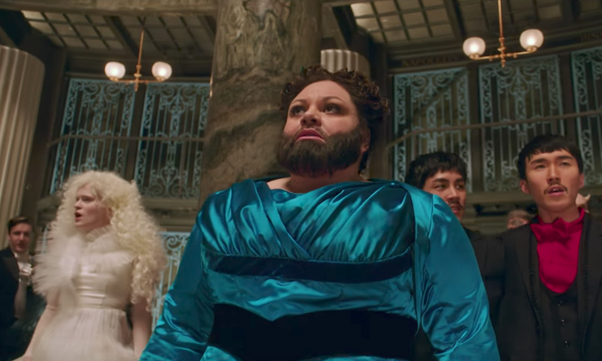
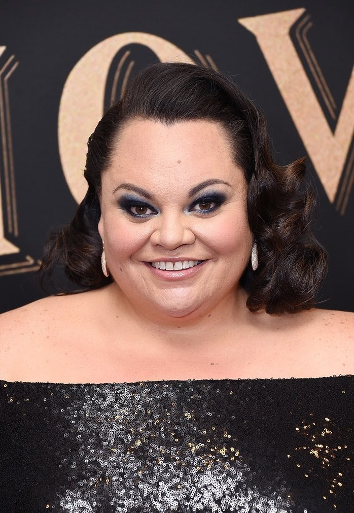
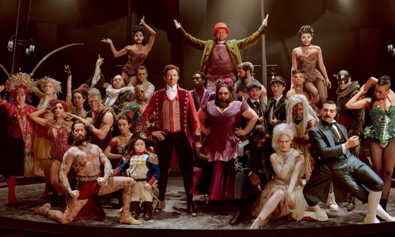

# The Greatest Showman Movie Review

[Movies](https://estheradeniyi.com/category/movies/)
# The Greatest Showman Movie Review

by [Esther Adeniyi](https://estheradeniyi.com/author/esther-adeniyi/)on [January 27, 2018May 25, 2018](https://estheradeniyi.com/the-greatest-showman-movie-review/)[5 Comments on The Greatest Showman Movie Review](https://estheradeniyi.com/the-greatest-showman-movie-review/#comments)

Sharing is caring!

- [0](https://www.facebook.com/sharer/sharer.php?u=https%3A%2F%2Festheradeniyi.com%2Fthe-greatest-showman-movie-review%2F&amp;t=The%20Greatest%20Showman%20Movie%20Review)
- [0](https://twitter.com/intent/tweet?text=The%20Greatest%20Showman%20Movie%20Review&amp;url=https%3A%2F%2Festheradeniyi.com%2Fthe-greatest-showman-movie-review%2F)
- [0](#)

0shares

I had a movie date with Tope Rants and I picked The Greatest Showman for us. I had seen movie trailers and reviews, seen the cast and crew and I only had one goal in mind, to see it, whichever way it happens. This was why we had to wait till 8:45pm to watch it.

Thank God I didn&#x2019;t go see a movie on my own, I would have probably picked [The Wedding Party 2](https://www.estheradeniyi.com/the-wedding-party-2-movie-trailer-and-i?m=1) despite the negative reviews. Every single one of my friends said it was meh. I don&#x2019;t know what those guys wanted to achieve with that movie. Glamour, maybe.

The Greatest Showman, from start to finish was enthralling. The most encaptivating of all the songs, &#x2018;This is Me&#x2019; was a total hit for us. All of the songs in The Greatest Showman was a hit back to back, even though I don&#x2019;t quite understand why the ratings were low. The percussion sounds, progression in notes and rhythm, dance accompaniment, steps, everything, was perfect!

The Greatest Showman soundtrack was just giving me goose pimples. Talk about an American music drama that was a truckload of fun, excitement, adrenaline and lessons.

### Here is a list of The Greatest Showman songs

&#xA0;

The Greatest Show
 A Million Dreams

This Is Me
 Rewrite The Stars
 Tightrope
 Never Enough (Reprise)
 From Now On
 A Million Dreams (Reprise)
 Come Alive
 The Other Side
 Never Enough[You may like to read my favorite quotes from Queen of Katwe (movie)](https://www.estheradeniyi.com/queen-of-katwe-my-top-7-favorite-life)

Indeed, you should see it. Lessons from the movie were immense. For one, I learned that you can be anything that you want to be. You call the shots. If you decide that you are going to cringe because of your flaws, background, nature, inadequacy, struggle, you are going to be exactly just that &#x2013; &#x2018;a cringer&#x2019;.
Lettie Lutz (Keala Settle),&#xA0;the actress who played the bearded lady
This is what The Greatest Showman bearded lady looks like in real life :
Keala Settle
If you decide that nothing is ever going to stop you, that your children won&#x2019;t have to face what you did, that your inability is just a motivation, that you can marry the daughter of a wealthy man, that you can host The Greatest Show from nothing, that&#x2019;s exactly what you will be.

If you decide that you are going to choose love over unreasonable status and mindless status quo, so be it. You&#x2019;ll later realize in this movie that who you want to be is up to you, it&#x2019;s not up to anyone, no matter how close they are to you.

Read : [when life gives you lemons](https://www.estheradeniyi.com/when-life-gives-you-lemons?m=1)

The Greatest Showman is a 2017 movie directed by Michael Gracey. It was written by Jenny Bicks and Bill Condon. Hugh Jackman, Zac Efron, Michelle Williams, Rebecca Ferguson, and Zendaya were remarkable in the movie.

### The Greatest Showman full cast

Hugh Jackman&#xA0;as P.T. Barnum

Michelle Williams as Charity Barnum

Zac Efron as Phillip Carlyle

Cameron Seely as Helen Barnum

Keala Settle as Lettie Lutz

Sam Humphrey as Tom Thumb

Zendaya as Anne Wheeler

Austyn Johnson as Caroline Barnum

Rebecca Ferguson as Jenny Lind

Should you watch the movie? Yes, you should. If you are not convinced still, let The Greatest Showman movie trailer blow your mind. Watch:

P. S : if you copy and paste my movie review, the one I worked so hard to compile, I will so find you and talk directly to regulators, that&#x2019;s all. It is a threat, actually

Related : [Geostorm, movie review](https://www.estheradeniyi.com/geostorm-2017-movie-review-5-profound)

Sharing is caring!

- [0](https://www.facebook.com/sharer/sharer.php?u=https%3A%2F%2Festheradeniyi.com%2Fthe-greatest-showman-movie-review%2F&amp;t=The%20Greatest%20Showman%20Movie%20Review)
- [0](https://twitter.com/intent/tweet?text=The%20Greatest%20Showman%20Movie%20Review&amp;url=https%3A%2F%2Festheradeniyi.com%2Fthe-greatest-showman-movie-review%2F)
- [0](#)

0shares

Tags:[Movies](https://estheradeniyi.com/tag/movies/)