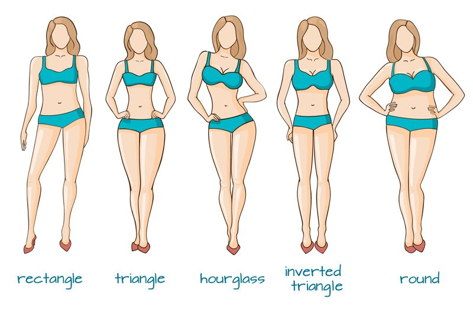

# The know your body shape series

[Fashion](https://estheradeniyi.com/category/fashion/)
# The know your body shape series

by [Esther Adeniyi](https://estheradeniyi.com/author/esther-adeniyi/)on [October 5, 2017May 25, 2018](https://estheradeniyi.com/the-know-your-body-shape-series/)[Leave a Comment on The know your body shape series](https://estheradeniyi.com/the-know-your-body-shape-series/#respond)

Sharing is caring!

- [0](https://www.facebook.com/sharer/sharer.php?u=https%3A%2F%2Festheradeniyi.com%2Fthe-know-your-body-shape-series%2F&amp;t=The%20know%20your%20body%20shape%20series)
- [0](https://twitter.com/intent/tweet?text=The%20know%20your%20body%20shape%20series&amp;url=https%3A%2F%2Festheradeniyi.com%2Fthe-know-your-body-shape-series%2F)
- [2](#)

2shares

Knowing your body shape helps you [dress well and look gorgeous](https://www.estheradeniyi.com/10-super-ways-to-look-fabulous-on-budget). More often than not we buy outfits that don&#x2019;t flatter our body shapes and that&#x2019;s because we do not know for sure what should flatter it. [Knowing your body shape](http://www.howtobechicandelegant.com/blog/the-importance-of-knowing-your-body-shape) will ensure that you buy clothes that make you look awesome.

Every woman is beautiful in her own right, uniqueness is what makes you as special as you are. No matter your body shape you are beautiful. What matters is that you know how to dress your body up to diminish, &#xA0;downplay your negatives and accentuate your positives.

We will be starting a series on the blog to help you know what exactly your body shape is (no more guessing) and also how to dress it well. While we wait for the series, I will like that you get familiar with terms that you will see often and get to know your accurate measurements. You can get a friend to help you with some of the measurements.

Shoulder width &#x2013; pass a tape from the tip of your first shoulder across the back of your neck to the tip of your second shoulder.

Bust circumference &#x2013; pass the tape round the fullest part of your bust. Make sure that the tape isn&#x2019;t too free and too tight as to cause a shrink.

Waist circumference -measure the tiniest part of your waist circumference

Hip circumference -measure the fullest part of your hips and around your buttocks.

Record the measurements and let&#x2019;s meet next week for the first body shape type and how to dress it.

Photo credit: [The Jeans Blog](https://thejeansblog.com/jeans-advice/find-the-perfect-pair-of-jeans-for-every-body-shape/)

Sharing is caring!

- [0](https://www.facebook.com/sharer/sharer.php?u=https%3A%2F%2Festheradeniyi.com%2Fthe-know-your-body-shape-series%2F&amp;t=The%20know%20your%20body%20shape%20series)
- [0](https://twitter.com/intent/tweet?text=The%20know%20your%20body%20shape%20series&amp;url=https%3A%2F%2Festheradeniyi.com%2Fthe-know-your-body-shape-series%2F)
- [2](#)

2shares

Tags:[body shape](https://estheradeniyi.com/tag/body-shape/)[Style](https://estheradeniyi.com/tag/style/)