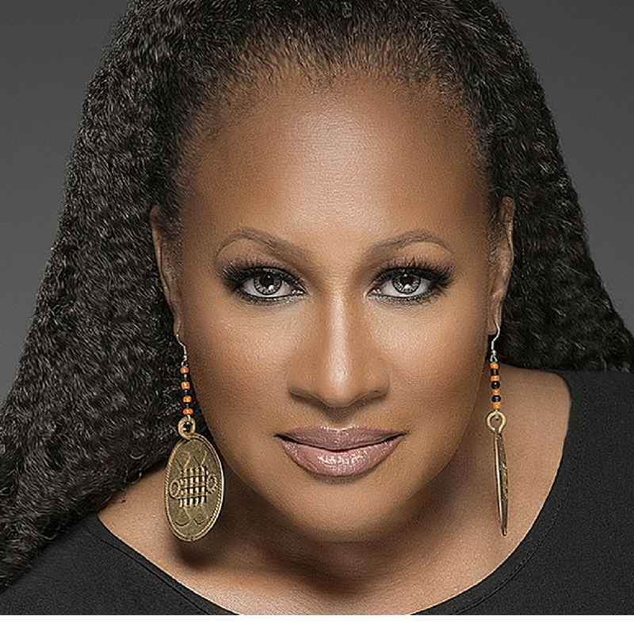
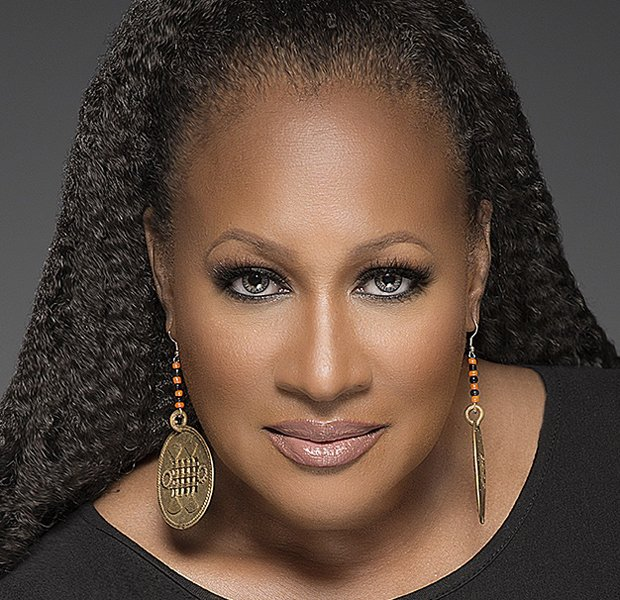
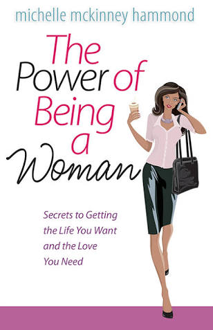

# The Power of Being a Woman by Michelle Hammond

[Books](https://estheradeniyi.com/category/books/)
# The Power of Being a Woman by Michelle Hammond

by [Esther Adeniyi](https://estheradeniyi.com/author/esther-adeniyi/)on [April 23, 2018May 4, 2018](https://estheradeniyi.com/the-power-of-being-woman-by-michelle/)[10 Comments on The Power of Being a Woman by Michelle Hammond](https://estheradeniyi.com/the-power-of-being-woman-by-michelle/#comments)

Sharing is caring!

- [1](https://www.facebook.com/sharer/sharer.php?u=https%3A%2F%2Festheradeniyi.com%2Fthe-power-of-being-woman-by-michelle%2F&amp;t=The%20Power%20of%20Being%20a%20Woman%20by%20Michelle%20Hammond)
- [0](https://twitter.com/intent/tweet?text=The%20Power%20of%20Being%20a%20Woman%20by%20Michelle%20Hammond&amp;url=https%3A%2F%2Festheradeniyi.com%2Fthe-power-of-being-woman-by-michelle%2F)
- [0](#)

1shares

I read The Power of Being a Woman in 2014. While I was going through my hard cover notes, I stumbled on the notes I took. I made them into a blog post and thought that you would like to read them. If you haven&#x2019;t gotten an opportunity to read this book, these notes will be just perfect for a rough grasp of the intent of Michelle on The power of Being a Woman.

## Find excerpts from The Power of Being a Woman below

&#x201C;Submission is not only a test of or [love for Him](https://www.estheradeniyi.com/I-love-you-messages-for-him), it is a test of our strength.

You cannot be completely feminine in this world unless you completely understand how covered by God&#x2019;s grace you are. Then you will no longer react to men but respond to his voice.

You need to understand fully how protective God is of women. So, relax and let him do the job.

You should be silent when you differ with a man in a public setting, or when your disagreement makes a man vulnerable to ruin before his peers and family.

Just remember when you walk in submission; the person who is your covering is held responsible for you. He should get wet, not you.

Men are like little boys just waiting for a word of appreciation. See how they respond when you openly acknowledge how much they saved the day.

Authority-submission is not a matter of superior versus inferior. It is simply a matter of order and function.

A woman has to be sensitive to the male ego.

The greatest leaders are those who have allowed themselves to be led.

When we lose ourselves as women and begin forcing ourselves to develop muscles we&#x2019;re not designed to have, our internal and relational system suffers.

Whereas a man is able to separate his sexuality from his emotions, a woman&#x2019;s emotions and sexuality are closely tied together.

And as women, we lose we lose what we ultimately want while skirmishing over the reward of recognition.
Here is the book cover
No man will ever embrace something with which he feels he is in competition.

God is never going to put your ministry or career before your care for your husband.

A woman has to understand that a great part of their purpose is to keep the men in their world centered on the purposes of God being played out to completion in their lives. Every woman is called to affect every man within her sphere of influence in this fashion.

[A man wants three things](https://www.estheradeniyi.com/3-things-you-should-never-say-to-your)&#x2013; to be well-fed, well-loved in the sexual sense, and well-appreciated.

Nothing affects a man deeply as an encounter with a woman who has womanly qualities.

I believe I can speak in a normal tone and still be heard.

While man has been given the mandate of authority, woman has been given the mantle of influence.

Masculine women cause men to dig in their heels and fight for their positions.

[Men should know that love inspires submission](https://www.estheradeniyi.com/what-every-woman-wants-her-man-to-know) and submission inspires more love.

It is much easier to submit to a person who gives sacrificially, a person you trust has your best interest at heart. Only a man submitted to Christ can do this. So submission within a marriage actually begins with the man being submitted to God.

Feminity is strength under control. Feminine women are string women because their influence is deeply felt.&#x201D;

Which of these points/excerpts rings a loud, deep bell the most?

Related blog post: [Sassy, Single and Satisfied by Michelle Hammond](https://www.estheradeniyi.com/sassy-single-and-satisfied)

Sharing is caring!

- [1](https://www.facebook.com/sharer/sharer.php?u=https%3A%2F%2Festheradeniyi.com%2Fthe-power-of-being-woman-by-michelle%2F&amp;t=The%20Power%20of%20Being%20a%20Woman%20by%20Michelle%20Hammond)
- [0](https://twitter.com/intent/tweet?text=The%20Power%20of%20Being%20a%20Woman%20by%20Michelle%20Hammond&amp;url=https%3A%2F%2Festheradeniyi.com%2Fthe-power-of-being-woman-by-michelle%2F)
- [0](#)

1shares

Tags:[Books](https://estheradeniyi.com/tag/books/)[Excerpts](https://estheradeniyi.com/tag/excerpts/)