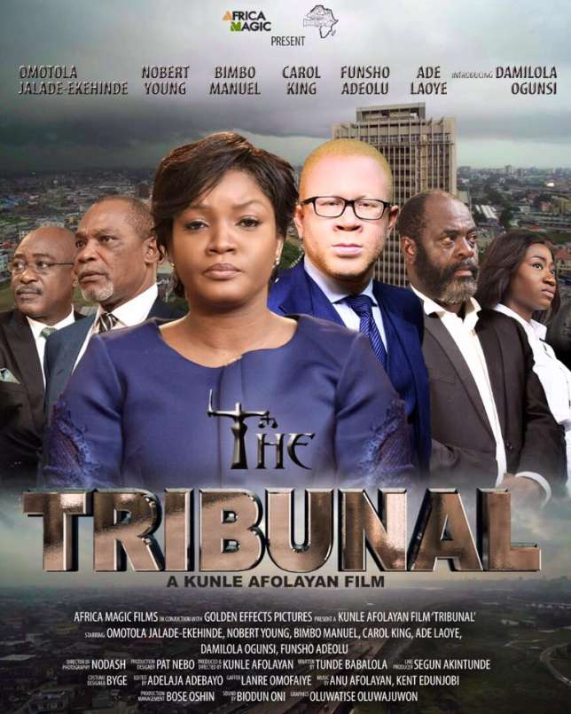

# The Tribunal, a Kunle Afolayan Movie Review + Trailer

[Movies](https://estheradeniyi.com/category/movies/)
# The Tribunal, a Kunle Afolayan Movie Review + Trailer

by [Esther Adeniyi](https://estheradeniyi.com/author/esther-adeniyi/)on [September 6, 2017May 25, 2018](https://estheradeniyi.com/the-tribunal-kunle-afolayan-movie/)[Leave a Comment on The Tribunal, a Kunle Afolayan Movie Review + Trailer](https://estheradeniyi.com/the-tribunal-kunle-afolayan-movie/#respond)

Sharing is caring!

- [0](https://www.facebook.com/sharer/sharer.php?u=https%3A%2F%2Festheradeniyi.com%2Fthe-tribunal-kunle-afolayan-movie%2F&amp;t=The%20Tribunal%2C%20a%20Kunle%20Afolayan%20Movie%20Review%20%2B%20Trailer)
- [0](https://twitter.com/intent/tweet?text=The%20Tribunal%2C%20a%20Kunle%20Afolayan%20Movie%20Review%20%2B%20Trailer&amp;url=https%3A%2F%2Festheradeniyi.com%2Fthe-tribunal-kunle-afolayan-movie%2F)
- [0](#)

0shares

Fate brings together an albino and a lawyer, the former who claims to have been unfairly dismissed as a result of discrimination and the latter, Jimi Disu, presented a second chance in life after an accident results in the loss of his family and a once illustrious legal career. It features Damilola Ogunsi, Funsho Adeolu, Ade Laoye, Carol King, Bimbo Manuel, Norbert Young, Omotola Jalade Ekeinde.

&#xA0;

## Watch The Tribunal Movie Trailer below:

[Watch Bobrisky&#x2019;s movie trailer here](https://www.estheradeniyi.com/ojuloge-obirin-ft-bobrisky-movie)

&#xA0;

## Adenike Adebayo reviews [The Tribunal](https://www.bellanaija.com/2017/09/adenike-adebayo-screening-room-reviews-kunle-afolayans-tribunal/) on a new episode of [The Screening room](https://www.youtube.com/watch?v=k1rfdSnL5BE).

&#xA0;

[Pulse](http://www.pulse.ng/entertainment/movies/the-tribunal-kunle-afolayans-new-movie-gets-a-release-date-id6937374.html) reports that&#xA0;&#x201C;Tribunal&#x201D; is one of the three films commissioned by MultiChoice. The other movies are titled&#xA0;**&#x201C;Omugwo&#x201D;&#xA0;**and**&#x201C;Roti.**

What do you think about The Tribunal? Share your thoughts with us in the comments section.

Sharing is caring!

- [0](https://www.facebook.com/sharer/sharer.php?u=https%3A%2F%2Festheradeniyi.com%2Fthe-tribunal-kunle-afolayan-movie%2F&amp;t=The%20Tribunal%2C%20a%20Kunle%20Afolayan%20Movie%20Review%20%2B%20Trailer)
- [0](https://twitter.com/intent/tweet?text=The%20Tribunal%2C%20a%20Kunle%20Afolayan%20Movie%20Review%20%2B%20Trailer&amp;url=https%3A%2F%2Festheradeniyi.com%2Fthe-tribunal-kunle-afolayan-movie%2F)
- [0](#)

0shares

Tags:[Movie review](https://estheradeniyi.com/tag/movie-review/)[Movies](https://estheradeniyi.com/tag/movies/)[Nollywood](https://estheradeniyi.com/tag/nollywood/)