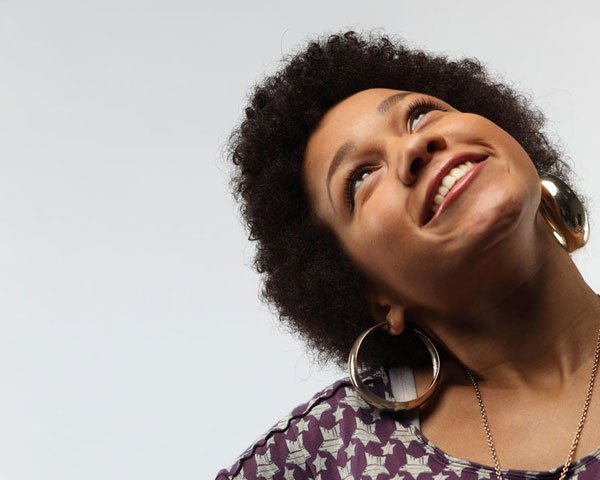

# The True Beauty of a Woman

[Guest Posts](https://estheradeniyi.com/category/guest-posts/)
# The True Beauty of a Woman

by [Esther Adeniyi](https://estheradeniyi.com/author/esther-adeniyi/)on [September 9, 2017May 25, 2018](https://estheradeniyi.com/the-true-beauty-of-woman/)[Leave a Comment on The True Beauty of a Woman](https://estheradeniyi.com/the-true-beauty-of-woman/#respond)

Sharing is caring!

- [0](https://www.facebook.com/sharer/sharer.php?u=https%3A%2F%2Festheradeniyi.com%2Fthe-true-beauty-of-woman%2F&amp;t=The%20True%20Beauty%20of%20a%20Woman)
- [0](https://twitter.com/intent/tweet?text=The%20True%20Beauty%20of%20a%20Woman&amp;url=https%3A%2F%2Festheradeniyi.com%2Fthe-true-beauty-of-woman%2F)
- [0](#)

0shares

In today&#x2019;s world beauty is overrated. It has been magnified to the extent that it seems unreachable for the ordinary woman.

Each day we wake up to scenes of nude bodies and filtered faces on our screens, magazines and social media trying to tell us what beauty is. Overtime due to the consistency of the media in making us believe these definitions of beauty some women begin to see themselves as not beautiful enough.

A woman&#x2019;s [beauty](https://www.estheradeniyi.com/search/label/Beauty) is not on how sexy, slim or the extra flesh in her body. Beauty goes beyond what the eyes can see. A woman&#x2019;s beauty is in her SOUL.

Let me quote Audrey Hepburn&#x2019;s definition of a woman&#x2019;s beauty.

&#x201D;The beauty of a woman is not in the clothes she wears, the figure that she carries or the way she combs her hair. The beauty of a woman is seen in her eyes because that is the doorway to her heart, the place where love resides. True beauty in a woman is reflected in her soul. It&#x2019;s the caring that she lovingly gives the passion that she shows and the beauty of a woman grows with passing years.&#x201D;

Such is the true definition of a woman&#x2019;s beauty.

It is seen in her home where she is the queen. She guards her children like the hen and she is ready to fight off any adversary with her claws.

Her beauty is not in the designer clothes she wears or the grade 3 okirika she puts on her back. But it is in the love she wraps around her children, relatives or any stranger that comes to her home.

Her kind heart is such that will take on the child of another woman and treat that child as her own.

It is not in the Mary Kay she covers her face with but in her smile that will melt a stony heart even though she is struggling to make ends meet.

A woman&#x2019;s beauty is in her confidence to take on the world, pursue her passion and be the best authentic version of who she is created to be.

The true beauty of a &#xA0;woman lies in her intelligence, uniqueness and experiences which comes together perfectly to make us who we are.

It lies in the understanding &#xA0;that as a woman you are enough.

Blog post by Adaeze Chianumba Okezie

Adaeze Chianumba Okezie is the Founder Kickstart Your Dream Network. She helps professionals and aspiring entrepreneurs maximize their talent, overcome fear self doubt and procrastination by creating a road map that will help them improve their performance and launch their dreams. You can find here here: www.adaezechianumba.com

Picture source: [Simply Happenstance](http://www.simplyhappenstance.com/what-is-beauty/)

Sharing is caring!

- [0](https://www.facebook.com/sharer/sharer.php?u=https%3A%2F%2Festheradeniyi.com%2Fthe-true-beauty-of-woman%2F&amp;t=The%20True%20Beauty%20of%20a%20Woman)
- [0](https://twitter.com/intent/tweet?text=The%20True%20Beauty%20of%20a%20Woman&amp;url=https%3A%2F%2Festheradeniyi.com%2Fthe-true-beauty-of-woman%2F)
- [0](#)

0shares

Tags:[Celebrating Women](https://estheradeniyi.com/tag/celebrating-women/)[Guest post](https://estheradeniyi.com/tag/guest-post/)[Life](https://estheradeniyi.com/tag/life/)[Women](https://estheradeniyi.com/tag/women/)