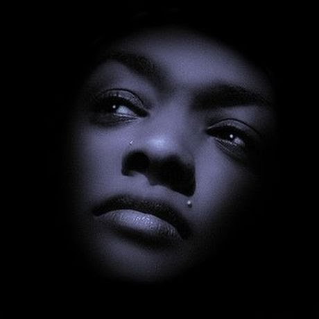

# The Unexplainable Complexity of Domestic violence

[Relationships](https://estheradeniyi.com/category/relationships/)[Uncategorized](https://estheradeniyi.com/category/uncategorized/)
# The Unexplainable Complexity of Domestic violence

by [Esther Adeniyi](https://estheradeniyi.com/author/esther-adeniyi/)on [October 14, 2017May 25, 2018](https://estheradeniyi.com/the-unexplainable-complexity-of/)[1 Comment on The Unexplainable Complexity of Domestic violence](https://estheradeniyi.com/the-unexplainable-complexity-of/#comments)

Sharing is caring!

- [0](https://www.facebook.com/sharer/sharer.php?u=https%3A%2F%2Festheradeniyi.com%2Fthe-unexplainable-complexity-of%2F&amp;t=The%20Unexplainable%20Complexity%20of%20Domestic%20violence)
- [0](https://twitter.com/intent/tweet?text=The%20Unexplainable%20Complexity%20of%20Domestic%20violence&amp;url=https%3A%2F%2Festheradeniyi.com%2Fthe-unexplainable-complexity-of%2F)
- [0](#)

0shares

This is a guest post by Blessing Okakwu

I have always wondered why people stay in relationships where they are treated as semi slaves. I read about people who have been beaten to death by their spouses and I just can&#x2019;t understand how they let themselves fall into such horror.

Sometimes I ask myself if it&#x2019;s lack of self-love or just plain inferiority complex that makes people stay in relationships where they are treated like slaves. You see some women who pay the bills in the home and still suffer different forms of domestic violence.

Growing up I knew of a family where the woman paid the bills and yet, her husband beat her, slept around and forced himself on her. He used to tell her that if he got any sickness, she would get it too. This woman stayed with the man until he died, of HIV of course, after infecting her that is. She did her wifely duty and stayed with a man who was treating her worse than slaves were treated. Even with the HIV he infected her with, she is still among the lucky ones.

Last year there was a very popular story of a GT bank staff who was murdered in her home by her husband and the husband locked her kids with her dead body and took off. When you follow the story some more you will see that the woman at some point was even scared her husband would kill her, yet, she stayed. She stayed with him. There is no way you can explain that to anyone, especially to the kids.

Those kids have been scarred for life. Their father killed their mum probably in front of them, and he locked them up with the body of their deceased mother. Those kids will live with that image for the rest of their lives. Their lives will never be normal again. This is one of the many domestic violence cases happening every day.

Up until this very moment people still stay with spouses that treat them like crap and their children have front row seats to these horrors. Some of these kids grow up with one form of complex or the other, some turn out to be bullies. Most times the parents have no clue how they are destroying the lives of their kids.

I see fully grown women who say that a man beating you is a sign of love. When you hear such statements you wonder the kind of complex that person is suffering from. You wonder what such people were taught when they were kids, you wonder how they grew up. Because the truth is that people who were raised by loving parents who respect each other hardly turn out with such crappy expectation from love.

You can&#x2019;t grow up watching your dad adore your mum and defend her every chance he gets and want to be with someone who treats you like crap. You can&#x2019;t watch your mum treat your dad with love and respect and still want to be with someone who treats you less than he treats his feet. You simply cannot grow up in a loving home and be okay with someone treating you less than a slave.

Sometimes I wish domestic violence victims can see how strong they really are, how much stronger they can be. I wish they can see themselves the way they really are, I wish they can know that they can LEAVE!!! I wish they can see that they don&#x2019;t need anybody&#x2019;s approval, I wish they can just say enough and walk away.

For everyone going through one form of domestic violence or the other, for those who confide in pastors that ask them to return to their homes and bear the cross, for those whose families tell them to endure even though they are fully aware of the danger they are in, I want to assure you that you too can LEAVE!! All you need to do is leave and never look back. Do it for yourself, do it for your children, born and unborn. Just Leave. You will be fine. It may not seem that way but you will be fine.

Sharing is caring!

- [0](https://www.facebook.com/sharer/sharer.php?u=https%3A%2F%2Festheradeniyi.com%2Fthe-unexplainable-complexity-of%2F&amp;t=The%20Unexplainable%20Complexity%20of%20Domestic%20violence)
- [0](https://twitter.com/intent/tweet?text=The%20Unexplainable%20Complexity%20of%20Domestic%20violence&amp;url=https%3A%2F%2Festheradeniyi.com%2Fthe-unexplainable-complexity-of%2F)
- [0](#)

0shares

Tags:[Guest post](https://estheradeniyi.com/tag/guest-post/)[Women Empowerment](https://estheradeniyi.com/tag/women-empowerment/)