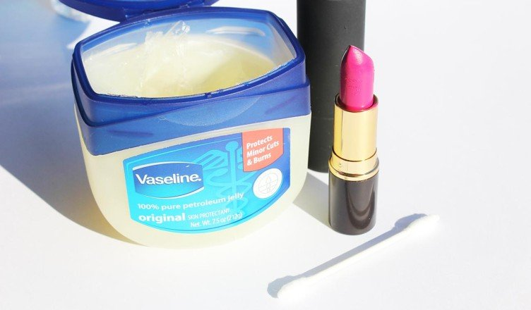

# These Vaseline beauty hacks will make you hoard Vaseline

[Beauty](https://estheradeniyi.com/category/beauty/)
# These Vaseline beauty hacks will make you hoard Vaseline

by [Esther Adeniyi](https://estheradeniyi.com/author/esther-adeniyi/)on [November 2, 2017May 25, 2018](https://estheradeniyi.com/these-vaseline-beauty-hacks-will-make/)[2 Comments on These Vaseline beauty hacks will make you hoard Vaseline](https://estheradeniyi.com/these-vaseline-beauty-hacks-will-make/#comments)

Sharing is caring!

- [0](https://www.facebook.com/sharer/sharer.php?u=https%3A%2F%2Festheradeniyi.com%2Fthese-vaseline-beauty-hacks-will-make%2F&amp;t=These%20Vaseline%20beauty%20hacks%20will%20make%20you%20hoard%20Vaseline)
- [0](https://twitter.com/intent/tweet?text=These%20Vaseline%20beauty%20hacks%20will%20make%20you%20hoard%20Vaseline&amp;url=https%3A%2F%2Festheradeniyi.com%2Fthese-vaseline-beauty-hacks-will-make%2F)
- [2](#)

2shares

Some months ago on Lagos Talks, Vaseline [beauty hacks](https://makeuptutorials.com/diy-beauty-hacks-tips-tricks/) was a subject. I enjoyed it, was even amazed at some of the hacks. Beauty hacks, when you know them save the day. And the fact that they can also extend the functionality of some of these common household items, wow.

Vaseline isn&#x2019;t usually something a regular person will intentionally buy and put in her makeup bag or kit. It&#x2019;s one of those household items you forget to buy over and over again. I have had to ask someone to buy Vaseline for me when I kept forgetting to buy. There was a time it was my body cream and for a while, I remembered to buy but that was all it was used for &#x2013; body cream.

I initially decided I was going to make a compilation of all the Vaseline beauty hacks I heard on the radio but then I thought, there would be, definitely be more beauty hacks for Vaseline. Off I dash to Google and oh, I am not disappointed.

I have compiled these hacks and brought them into our very own, we need to be able to adapt and not use big terms. Some of what I saw online were just unreasonable, so well, what is on this beauty hack list is reasonable. So let&#x2019;s go girls!

Contents

- [1 -Soften and smoothen cracked heels](#-Soften_and_smoothen_cracked_heels)
- [2 &#x2013; Use Vaseline as lip balm](#8211_Use_Vaseline_as_lip_balm)
- [3 -Open stuck nail polish covers](#-Open_stuck_nail_polish_covers)
- [4 -Make your perfume last longer](#-Make_your_perfume_last_longer)
- [5 -Hold down fly away hair](#-Hold_down_fly_away_hair)
- [6 -Apply to cuticles to make nail polish last longer](#-Apply_to_cuticles_to_make_nail_polish_last_longer)
- [7 -Make your eye-shadow shine](#-Make_your_eye-shadow_shine)
- [8 -Remove eye makeup](#-Remove_eye_makeup)
- [9 -Mix with broken eye-shadow as lipstick](#-Mix_with_broken_eye-shadow_as_lipstick)
- [10 -Apply to your eye lashes](#-Apply_to_your_eye_lashes)

## -Soften and smoothen cracked heels

Vaseline helps to mend your heel cracks and make your heels smooth. Just apply some on your heels, wear socks and then sleep overnight. You will wake up to smoother heels. After a while, they become softer than the day before.

## &#x2013; Use Vaseline as lip balm

Many of us know this already. It&#x2019;s a Vaseline beauty hack so it is worth mentioning. Moreover, we forget this and go all about looking for lip gloss when we have Vaseline within reach.

## -Open stuck nail polish covers

After a while of using, nail polish covers become stubborn because nail polish is dried up on them. You can apply Vaseline around the base of the covers to soften things up and make it easier to open.

[You may also like to read about other uses of baby wipes](https://www.estheradeniyi.com/baby-wipes-7-other-incredible-uses)

## -Make your perfume last longer

This Vaseline beauty hack is becoming very popular lately. This is what you do, apply Vaseline to areas where you spray your perfume. It stays on longer because of the petroleum jelly than if it was on your bare skin.

## -Hold down fly away hair

Baby wipes are so good at helping you keep your hair neat. You can check here for other incredible uses of baby wipes. Vaseline when applied and used to smoothen and press down the naughty hair strands works.

## -Apply to cuticles to make nail polish last longer

To make your nail polish last longer, you should avoid adding the polish to the bed of your nails. Apply a little Vaseline to your cuticle while using a nail polish. It will help trap the excess polish and stop it from getting to the base.

## -Make your eye-shadow shine

For eye shadows that are matte, Vaseline helps to make it glossy. Here is how to achieve that: apply a little Vaseline to your eye lids. That serves as your primer, then apply the eye shadow. It may become messy far into the day if you have an oily skin.

## -Remove eye makeup

Dip your cotton bud into Vaseline, apply to your lashes or mascara to make it come off easily and completely.

## -Mix with broken eye-shadow as lipstick

You can mix a fair amount to Vaseline and eye-shadow to make a lip colour. Mix them in the ratio of how deep you want your lipstick to be- greater eye shadow pigment or more Vaseline.

## -Apply to your eye lashes

Rub the entire length of your eye lashes or false lashes with Vaseline to give it a nice shine and glow. It gives your natural eye lashes a longer look, maybe not fuller but at least, longer.

Do you know of other Vaseline beauty hacks? Please share with me in the comments section.

Pic Credit: [Wonder Wardrobes](https://www.wonderwardrobes.com/beauty-benefits-of-vaseline/)

Sharing is caring!

- [0](https://www.facebook.com/sharer/sharer.php?u=https%3A%2F%2Festheradeniyi.com%2Fthese-vaseline-beauty-hacks-will-make%2F&amp;t=These%20Vaseline%20beauty%20hacks%20will%20make%20you%20hoard%20Vaseline)
- [0](https://twitter.com/intent/tweet?text=These%20Vaseline%20beauty%20hacks%20will%20make%20you%20hoard%20Vaseline&amp;url=https%3A%2F%2Festheradeniyi.com%2Fthese-vaseline-beauty-hacks-will-make%2F)
- [2](#)

2shares

Tags:[Beauty](https://estheradeniyi.com/tag/beauty/)