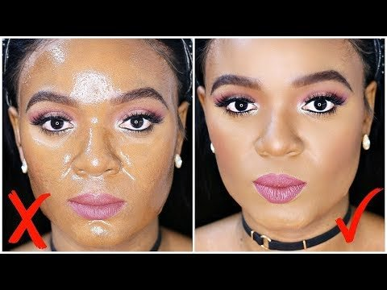

# This Will Help Your Makeup to Stay Longer on Your Oily Skin!

[Beauty](https://estheradeniyi.com/category/beauty/)
# This Will Help Your Makeup to Stay Longer on Your Oily Skin!

by [Esther Adeniyi](https://estheradeniyi.com/author/esther-adeniyi/)on [October 21, 2017May 25, 2018](https://estheradeniyi.com/this-will-help-your-makeup-to-stay/)[4 Comments on This Will Help Your Makeup to Stay Longer on Your Oily Skin!](https://estheradeniyi.com/this-will-help-your-makeup-to-stay/#comments)

Sharing is caring!

- [0](https://www.facebook.com/sharer/sharer.php?u=https%3A%2F%2Festheradeniyi.com%2Fthis-will-help-your-makeup-to-stay%2F&amp;t=This%20Will%20Help%20Your%20Makeup%20to%20Stay%20Longer%20on%20Your%20Oily%20Skin%21)
- [0](https://twitter.com/intent/tweet?text=This%20Will%20Help%20Your%20Makeup%20to%20Stay%20Longer%20on%20Your%20Oily%20Skin%21&amp;url=https%3A%2F%2Festheradeniyi.com%2Fthis-will-help-your-makeup-to-stay%2F)
- [2](#)

2shares

Just recently, I was complaining about how no primer seemed to work for my oily skin. I thought I was alone until I watched Omabelle on YouTube share her own struggles with her oily skin. I was comforted, to say the least and oh well, that there is a solution to making up on this massive oil producing face is such a relief.

I mean with all the different matifying primers, techniques and all of it, you still have oil coming out to ruin your makeup. Unfortunately [oily skin is just a type of skin](https://www.estheradeniyi.com/the-five-skin-types-and-how-to-care-for), you can&#x2019;t &#x2018;cure&#x2019; it. But then, you want your makeup to stay longer on your oily skin. What you can do is to put your oily skin under control.

So many strategies have been cooked up to help people like us with oily skin apply makeup without this much stress. Among these techniques is the [application of powder before foundation](https://www.estheradeniyi.com/applying-powder-before-foundation). You can click on that link to see how it is done if you have never heard of it.

[Omabelle TV](https://www.youtube.com/channel/UCFydN_LFZnwtKU88PjQt6kA) has something for y&#x2019;all. In her words,&#xA0; &#x201C;I&#x2019;ve tried literally every product out there that claims it helps with oily skin and not much has worked as claimed. So I recently figured out few steps & products that have helped my oily skin tremendously. Hope you all enjoy!&#x201D;

Let me give you a hint &#x2013; Milk of Magnesia! So, head on to watch how she has helped to overcome

Did you enjoy Omabelle&#x2019;s steps on how to make your makeup last longer on your oily skin? Let me hear your thoughts in the comments section below

Related:

[The complete guide to choosing the perfect foundation for your skin](https://www.estheradeniyi.com/a-complete-guide-to-choosing-right)

[How to make makeup last on oily skin](https://www.estheradeniyi.com/how-to-make-makeup-last-on-oily-skin)

Sharing is caring!

- [0](https://www.facebook.com/sharer/sharer.php?u=https%3A%2F%2Festheradeniyi.com%2Fthis-will-help-your-makeup-to-stay%2F&amp;t=This%20Will%20Help%20Your%20Makeup%20to%20Stay%20Longer%20on%20Your%20Oily%20Skin%21)
- [0](https://twitter.com/intent/tweet?text=This%20Will%20Help%20Your%20Makeup%20to%20Stay%20Longer%20on%20Your%20Oily%20Skin%21&amp;url=https%3A%2F%2Festheradeniyi.com%2Fthis-will-help-your-makeup-to-stay%2F)
- [2](#)

2shares

Tags:[Beauty](https://estheradeniyi.com/tag/beauty/)[makeup](https://estheradeniyi.com/tag/makeup/)