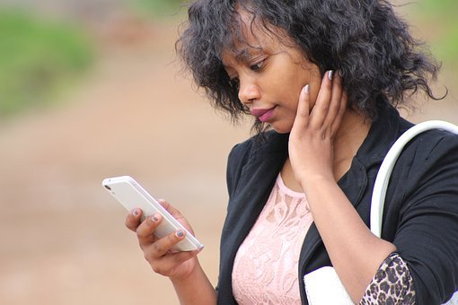

# Top Social Media Apps in Nigeria

[Social Media](https://estheradeniyi.com/category/social-media/)
# Top Social Media Apps in Nigeria

by [Esther Adeniyi](https://estheradeniyi.com/author/esther-adeniyi/)on [September 1, 2017April 27, 2018](https://estheradeniyi.com/top-social-media-apps-in-nigeria/)[Leave a Comment on Top Social Media Apps in Nigeria](https://estheradeniyi.com/top-social-media-apps-in-nigeria/#respond)

Sharing is caring!

- [0](https://www.facebook.com/sharer/sharer.php?u=https%3A%2F%2Festheradeniyi.com%2Ftop-social-media-apps-in-nigeria%2F&amp;t=Top%20Social%20Media%20Apps%20in%20Nigeria)
- [0](https://twitter.com/intent/tweet?text=Top%20Social%20Media%20Apps%20in%20Nigeria&amp;url=https%3A%2F%2Festheradeniyi.com%2Ftop-social-media-apps-in-nigeria%2F)
- [0](#)

0shares

There are was a time not long ago when a certain social media app was the rave. If you were not on it, you were a nobody. Men used it to attained status in the male society while ladies used it to get what they wanted. It was even made into a movie to show the level of status it had gained in the Nigerian life.

You can guess it? Yes! It was bbm! Now, it has been washed off the Nigerian brain and life.

There was another social media app that was trending for the teenagers and youths that wanted to connect. You create an identity, if not several and push to remain relevant in that social media society by staying online 24/7, you guessed right! 2go. It has died also.

Though those [social media apps](https://www.estheradeniyi.com/15-essential-appstools-for-small) listed above were the popular ones that have gone into hiding, there are still popular apps that are gaining more relevance in the social media world. Kudos to developers and programmers.

Here is a list of top five [social media apps in Nigeria](https://www.nigerianbulletin.com/threads/world%E2%80%99s-top-15-social-media-sites.114871/) and if possible Africa, and then, in the world.

Contents

- [1 &#x2022; Whatsapp](#_Whatsapp)
- [2 &#x2022; Facebook](#_Facebook)
- [3 &#x2022; Instagram](#_Instagram)
- [4 &#x2022; Twitter](#_Twitter)
- [5 &#x2022; LinkedIn](#_LinkedIn)

#### &#x2022; Whatsapp

WhatsApp had always been there but people disliked it because they couldn&#x2019;t streamline those who sent them messages to be their contact. To be a contact on WhatsApp, all you need to do is add up someone&#x2019;s number and WhatsApp automatically sync that data for you. So far, WhatsApp has been ensuring people stay connected and has even replaced normal text messages. But take note, if that message is that important, the person would send a normal text message.

#### &#x2022; Facebook

If you are not on Facebook, you only exist on planet earth. I call it the alter ego world. You can be anything on Facebook. A loner, a writer, an adviser with crashed marriages, a sly who is a business guru, anything. How you present yourself, comment on other people&#x2019;s posts is all that matters.

#### &#x2022; Instagram

I once read somewhere that [Instagram](https://www.estheradeniyi.com/how-to-build-cohesive-instagram-feed-by) was an app for those who lack the intelligence to stay on Twitter &#x2013; this was before 2015. I would say something happened miraculous happened because &#xA0;Instagram is the next best thing that happened to marketing and advertising to various audiences.

[Read 7 ways to build a strong Linkedin profile](https://www.vanguardngr.com/2017/06/7-ways-build-strong-linkedin-profile/).

#### &#x2022; Twitter

If you do not have the patience to grow followers, the intelligence to tweet wisely and the wittiness to reply tweets, please back out &#x2013; from me. Twitter is a world that knows no friend. You have 140 characters and you need to say what you need to, you have to hit the nail on the head!

Just like knowing there&#x2019;s no nice way of saying, &#x201C;sorry, I wasn&#x2019;t talking to you&#x201D;, so is it on Twitter. If you don&#x2019;t have the what it takes, patience, intelligence and wittiness, I don&#x2019;t know how to conclude this. You understand right?

#### &#x2022; LinkedIn

This last top app is one of the growing social network for businesses and individuals. You want to sell your career? Get a better job? Brand yourself?

Create a LinkedIn profile and set your connections rolling. Lots of testimonies have been said about the app. I got my first job after service year via LinkedIn!

Thanks a lot for reading and going through this list. Do tell me about your top social media apps, share with friends and also subscribe to this blog.

I look forward to sharing top apps women should have on their phones soon and whatever you want insight on. Let me know in the comments section.

Blog post written by [Margaret Adetimehin](https://www.estheradeniyi.com/top-6-restaurants-in-nigeria)

Sharing is caring!

- [0](https://www.facebook.com/sharer/sharer.php?u=https%3A%2F%2Festheradeniyi.com%2Ftop-social-media-apps-in-nigeria%2F&amp;t=Top%20Social%20Media%20Apps%20in%20Nigeria)
- [0](https://twitter.com/intent/tweet?text=Top%20Social%20Media%20Apps%20in%20Nigeria&amp;url=https%3A%2F%2Festheradeniyi.com%2Ftop-social-media-apps-in-nigeria%2F)
- [0](#)

0shares

Tags:[Business](https://estheradeniyi.com/tag/business/)[social media](https://estheradeniyi.com/tag/social-media/)[Top things](https://estheradeniyi.com/tag/top-things/)