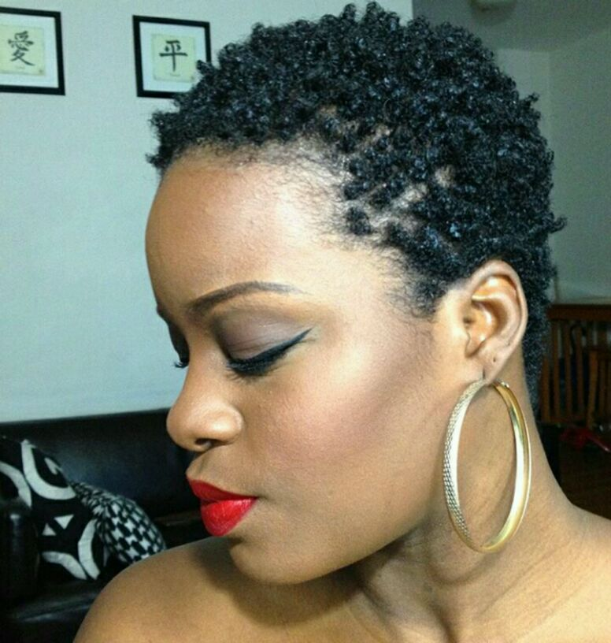

# TWA Styles : Brush Coils in 5 Minutes or Less!

[Uncategorized](https://estheradeniyi.com/category/uncategorized/)
# TWA Styles : Brush Coils in 5 Minutes or Less!

by [Esther Adeniyi](https://estheradeniyi.com/author/esther-adeniyi/)on [August 12, 2016April 27, 2018](https://estheradeniyi.com/twa-styles-brush-coils-in-5-minutes-or/)[Leave a Comment on TWA Styles : Brush Coils in 5 Minutes or Less!](https://estheradeniyi.com/twa-styles-brush-coils-in-5-minutes-or/#respond)

Sharing is caring!

- [0](https://www.facebook.com/sharer/sharer.php?u=https%3A%2F%2Festheradeniyi.com%2Ftwa-styles-brush-coils-in-5-minutes-or%2F&amp;t=TWA%20Styles%20%3A%20Brush%20Coils%20in%205%20Minutes%20or%20Less%21)
- [0](https://twitter.com/intent/tweet?text=TWA%20Styles%20%3A%20Brush%20Coils%20in%205%20Minutes%20or%20Less%21&amp;url=https%3A%2F%2Festheradeniyi.com%2Ftwa-styles-brush-coils-in-5-minutes-or%2F)
- [0](#)

0shares

Photo via @glammzmore
 When your natural hair is still at the TWA (Teeny Weeny Afro) stage, &#xA0;you might find styling it a little bit daunting. Brush Coils are one of the best styles you can do on your TWA. Doing this is a simple way to Style without fuss. It is also not as time consuming as finger coils.

STEP 1 &#x2013; Dampen Your Hair

You can freshly wash, &#xA0;co-wash or just dampen with your favorite water based spray. My own spray is a mixture of a protein conditioner, &#xA0;[coconut oil](https://www.estheradeniyi.com/5-steps-to-deep-condition-your-hair) and water.

STEP 2- Apply Leave-in Conditioner

You can use anyone that you like. Over time you will get comfortable with one or more conditioners. Just choose one that works best for you.

STEP 3- Seal With Oil

Apply oil to seal in the moisture of your hair. Castor oil, &#xA0;jojoba oil, olive oil, &#xA0;coconut oil, &#xA0;anyone you like best is fine. I really like[coconut oil](https://www.estheradeniyi.com/5-steps-to-deep-condition-your-hair)so I go for that.

STEP 3- Cream

Apply your favorite cream. I use shea butter. You can apply any type of cream as long as you are fine with it.

STEP 4- Gel

Apply Gel to firmly hold in coils. Eco Styler Gel is one of the best I have ever used. I currently use sport with a maximum hold of 10. There are different types you can choose from.

STEP 5- Create Coils

With a soft, &#xA0;bristle brush, &#xA0;begin to brush your hair in a circular motion to create brush coils. Go in only one direction. If you feel like parting another side into a different direction, &#xA0;go in the opposite direction.

STEP 6- Dry

You can let your hair dry naturally or you apply a little heat or use a diffuser to fasten the process. Let your hair dry complete before touching so that you keep the brush coils intact.

Yippee! Your coils are set. Are you going to try this out anytime soon? You can find some videos on the Internet to help you get this done in minutes. There are so many videos for you on YouTube, just search for them. Have fun coiling&#x2026;

Sharing is caring!

- [0](https://www.facebook.com/sharer/sharer.php?u=https%3A%2F%2Festheradeniyi.com%2Ftwa-styles-brush-coils-in-5-minutes-or%2F&amp;t=TWA%20Styles%20%3A%20Brush%20Coils%20in%205%20Minutes%20or%20Less%21)
- [0](https://twitter.com/intent/tweet?text=TWA%20Styles%20%3A%20Brush%20Coils%20in%205%20Minutes%20or%20Less%21&amp;url=https%3A%2F%2Festheradeniyi.com%2Ftwa-styles-brush-coils-in-5-minutes-or%2F)
- [0](#)

0shares

Tags:[Natural Hair](https://estheradeniyi.com/tag/natural-hair/)