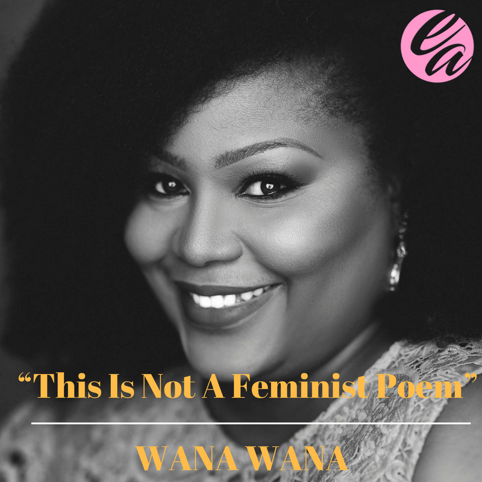
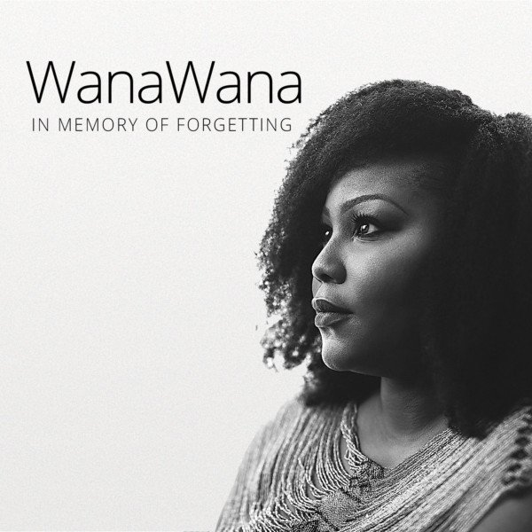

# Wana Udobang’s “This Is Not A Feminist Poem” is a must listen to

[Uncategorized](https://estheradeniyi.com/category/uncategorized/)
# Wana Udobang&#x2019;s &#x201C;This Is Not A Feminist Poem&#x201D; is a must listen to

by [Esther Adeniyi](https://estheradeniyi.com/author/esther-adeniyi/)on [September 19, 2017April 27, 2018](https://estheradeniyi.com/wana-udobangs-this-is-not-feminist-poe/)[Leave a Comment on Wana Udobang&#x2019;s &#x201C;This Is Not A Feminist Poem&#x201D; is a must listen to](https://estheradeniyi.com/wana-udobangs-this-is-not-feminist-poe/#respond)

Sharing is caring!

- [0](https://www.facebook.com/sharer/sharer.php?u=https%3A%2F%2Festheradeniyi.com%2Fwana-udobangs-this-is-not-feminist-poe%2F&amp;t=Wana%20Udobang%E2%80%99s%20%E2%80%9CThis%20Is%20Not%20A%20Feminist%20Poem%E2%80%9D%20is%20a%20must%20listen%20to)
- [0](https://twitter.com/intent/tweet?text=Wana%20Udobang%E2%80%99s%20%E2%80%9CThis%20Is%20Not%20A%20Feminist%20Poem%E2%80%9D%20is%20a%20must%20listen%20to&amp;url=https%3A%2F%2Festheradeniyi.com%2Fwana-udobangs-this-is-not-feminist-poe%2F)
- [0](#)

0shares

 &#x201C;This Is Not A Feminist Poem&#x201D; by [WanaWana](http://wanawana.net/) is a poem that you should listen to. It bares the woe of feminine living and the injustice faced in the plight of vulnerability. It is not a call, a motion, a move, as she says. It is an awareness to the silence in suffering and marginalization, of suffering, hypocrisy, complacency, violence against the [woman](https://www.estheradeniyi.com/the-true-beauty-of-woman).

&#xA0;This poem by&#xA0;Wana Udobang is a powerful, deep and enthralling lyrical message.

Check&#xA0;Wana Udobang&#x2018;s amazing &#x201C;[In Memory of Forgetting](https://www.bellanaija.com/2017/08/exploring-vulnerability-brokenness-renewal-wana-udobangs-poetry-album-memory-forgetting/)&#x201D; poetry album [here](https://store.cdbaby.com/cd/wanawana).

Listen to&#xA0;&#x201C;This Is Not A Feminist Poem&#x201D; by WanaWana below:

 You can also read the fully transcribed version of &#x201C;This Is Not A Feminist Poem&#x201D;. Find the lyrics below:

 &#x201C;This is not a feminist poem

 This is not contorted metaphors with neither punch
 line nor chorus

 This is not a feminist poem

 It is a woman learning to trade possessions before
 her lover takes his last breath.

 She will never get the chance to say goodbye
 because those final hours are one match-point away from the backstroke of
 ravenous relatives.

 You see where we come from, widows learn to bid
 their dead farewell even before they are lowered into the ground.

 Because grief requires time and time is a luxury
 she cannot afford.

 But I don&#x2019;t want to talk about funeral rites or a
 daughter&#x2019;s non-inheritance

 Because this is not a feminist poem

 It is a thirteen-year-old leaking between her legs.
 She cannot will her waste to stop because culture demands that babies must
 birth babies even before they are whole.

 This is Mercy, waiting to be fully formed before
 the doctors can fix her. We exchange broken smiles but mine is crackling with
 questions and I want to ask, how does a six year old ask to be gang raped for
 lunch after school?

 As she fiddles with the beads of a rosary that
 crawl around her neck, my lips are too drowsy to ask God why?

 But I am trying to not be feminist about this
 because

 This is not a [feminist poem](https://onedio.co/content/24-empowering-short-poems-from-feminist-poet-rupi-kaur-12146)

 It is the landlord who pays off your father to
 clench his teeth over choking tears for what his son had done to you.

 And your daddy knows that homelessness is too close
 to home so he washes of your shame with a sponge, dabs your wounds with
 scripture hoping these words will in turn douse the stench of the breath, erase
 the handprints that form maps across your skin, and glue together all that is
 broken of you.

 But instead memory has an interesting way of
 refusing to disappear, so this is how you exist with a tape loop in your head
 playing over and over again.

 I am not here to talk about the kidnap of justice
 in my country or whom, how and why we have refused to pay her ransom

 Because this is not a feminist poem

 It is piercing screams of gaping mouths choking as
 hands stifle their lungs of ambition

 It is men in uniform with bellies swollen from
 bribe, sworn to protect you but tell you that domestic matters are [familymatters](https://www.estheradeniyi.com/expectations-vs-reality-in-family-life).

 So you drink up your pain till you are full, your
 throat is parched and yet again you begin to thirst for it yet again.

 It is walking around with a womb too hollow to bear
 an heir that you take in the seeds of betrayal wanting it to pull together the
 remnants of matrimony. This is what it means to be a real woman.

 It is the girls who are sent to school only to come
 back home knowing that their future is dangling between their bodies and their
 silence, yet deciding which to betray first

 It is those 2 am text messages from your boss&#x2019; phone
 that leaves you reminded that you will always loose so you grin, dust it off a
 shoulder and bear it. You return to your job because this meager wage pays for
 your little brother&#x2019;s tuition and your mother&#x2019;s heart medicine.

 But this is not a feminist poem

 It is acquainting your self with the normalcy that
 your body is a minefield, trampled upon by the politics of culture

 It is a reminder that you are click, you are bait,
 you are currency and by virtue of your existence you are only half human never
 equal, never the same.

 It is learning that the heavy medals of your
 success are meaningless until they are smelted into a ring on your finger

 But I told you at the beginning that this is not a
 feminist poem

 It is not a rant or a call to action

 It is not a call for your attention

 It is not a checklist of everything you already
 know

 This is not a feminist poem

 This is a poem about life, about rights, for my
 sisters who struggle and continue to fight&#x201D;

Share your thoughts below.&#xA0;

Sharing is caring!

- [0](https://www.facebook.com/sharer/sharer.php?u=https%3A%2F%2Festheradeniyi.com%2Fwana-udobangs-this-is-not-feminist-poe%2F&amp;t=Wana%20Udobang%E2%80%99s%20%E2%80%9CThis%20Is%20Not%20A%20Feminist%20Poem%E2%80%9D%20is%20a%20must%20listen%20to)
- [0](https://twitter.com/intent/tweet?text=Wana%20Udobang%E2%80%99s%20%E2%80%9CThis%20Is%20Not%20A%20Feminist%20Poem%E2%80%9D%20is%20a%20must%20listen%20to&amp;url=https%3A%2F%2Festheradeniyi.com%2Fwana-udobangs-this-is-not-feminist-poe%2F)
- [0](#)

0shares

Tags:[Celebrating Women](https://estheradeniyi.com/tag/celebrating-women/)[Lyrics](https://estheradeniyi.com/tag/lyrics/)[Poems](https://estheradeniyi.com/tag/poems/)[Women](https://estheradeniyi.com/tag/women/)[Women Empowerment](https://estheradeniyi.com/tag/women-empowerment/)