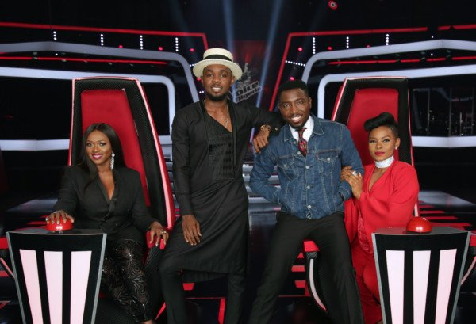

# Watch The Voice Nigeria Season 2 Episode 2 (Recap)

[Uncategorized](https://estheradeniyi.com/category/uncategorized/)
# Watch The Voice Nigeria Season 2 Episode 2 (Recap)

by [Esther Adeniyi](https://estheradeniyi.com/author/esther-adeniyi/)on [June 28, 2017April 27, 2018](https://estheradeniyi.com/watch-voice-nigeria-season-2-episode-2/)[Leave a Comment on Watch The Voice Nigeria Season 2 Episode 2 (Recap)](https://estheradeniyi.com/watch-voice-nigeria-season-2-episode-2/#respond)

Sharing is caring!

- [0](https://www.facebook.com/sharer/sharer.php?u=https%3A%2F%2Festheradeniyi.com%2Fwatch-voice-nigeria-season-2-episode-2%2F&amp;t=Watch%20The%20Voice%20Nigeria%20Season%202%20Episode%202%20%28Recap%29)
- [0](https://twitter.com/intent/tweet?text=Watch%20The%20Voice%20Nigeria%20Season%202%20Episode%202%20%28Recap%29&amp;url=https%3A%2F%2Festheradeniyi.com%2Fwatch-voice-nigeria-season-2-episode-2%2F)
- [0](#)

0shares

The Voice Nigeria coaches/judges
 Here is The Voice Nigeria Season 2 Episode 2 recap in case you missed it.&#xA0;Watch The Voice Nigeria online on my blog

The judges were exceptionally thrilled in this episode and that was clearly evident because those of them who already made up their minds about who they wanted did it as soon as they heard their voices. They wasted no time! [Timi Dakolo](https://www.estheradeniyi.com/iyawo-mi-by-timi-dakolo-lyrics) especially. Man, I love that man&#x2019;s drive.

Daniel &#x2013; I like his spirit. He came to fight for his spot and he got it. I love his voice texture, so sleek, so smooth. He wooed me with his voice. His delivery was perfect. He launched that episode like a star. Omg!

Wilson- He wanted all four coaches to turn for him. Three did! They say his control was perfect. He sounded like a professional. He took the song and sang it, he sang it like he wanted. And the way he went for Waje ehn&#x2026;

Itunu &#x2013; I didn&#x2019;t like her passive spirit at first. I don&#x2019;t like anyone going in for a fight going to say whatever happens. No, you give it whatever it takes. I liked her song choice, it brought all her voice capabilities.

[Watch The Voice Nigeria Episode 1 here](https://draft.blogger.com/blogger.g?blogID=1357085971903772764#editor/target=post;postID=3394822366973287816;onPublishedMenu=allposts;onClosedMenu=allposts;postNum=10;src=link)

Ogechi &#x2013; She was great despite that she claimed to be shy. I guess music overtakes you and overthrows your deficiency. Her voice is so so strong.

Annie &#x2013; I think with a friend like she&#x2019;s got, she will go places. You need people to motivate you. She dared pick Asa&#x2019;s You are beautiful. Who does that in blind auditions? Annie did that. She is a bold one! I tell you and she killed it.

Chris- 21 and awesome. He is going engaging and free. He pulled back at some point. I actually think the judges were not impressed. Yemi Alade kind of just saved the day.

Bob &#x2013; she owned her style. She did her thing. Her song choice was a little cliche but she infused her syle. Her tone and range are great. Waje already spotted her weaknesses.

Kendris- Another pessimist. Nah, start with a fight, I think. But alas, his voice texture was crazy good. All the judges were impressed! I was blown too. Judges fought for him.

 What do you think of this Season 2 episode 2 blind audition?

[Download The Voice Nigeria season 2 episode 2 here](http://novice2star.com/2017/06/26/video-voice-nigeria-2017-season-2-episode-2/)

P.S &#x2013; Follow us to get new post updates. Facebook and Instagram &#x2013; @estheradeniyisblog; Twitter&#xA0;@estheradeniyi10

Sharing is caring!

- [0](https://www.facebook.com/sharer/sharer.php?u=https%3A%2F%2Festheradeniyi.com%2Fwatch-voice-nigeria-season-2-episode-2%2F&amp;t=Watch%20The%20Voice%20Nigeria%20Season%202%20Episode%202%20%28Recap%29)
- [0](https://twitter.com/intent/tweet?text=Watch%20The%20Voice%20Nigeria%20Season%202%20Episode%202%20%28Recap%29&amp;url=https%3A%2F%2Festheradeniyi.com%2Fwatch-voice-nigeria-season-2-episode-2%2F)
- [0](#)

0shares

Tags:[Music](https://estheradeniyi.com/tag/music/)[News](https://estheradeniyi.com/tag/news/)