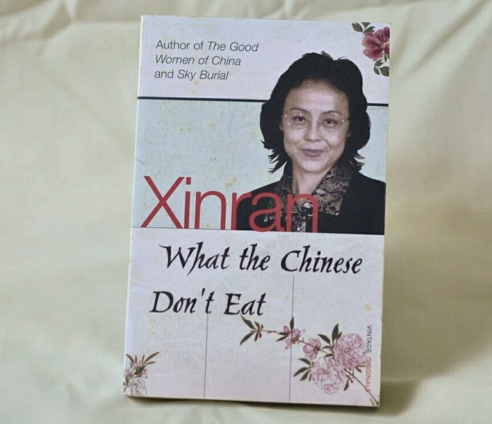

# What the Chinese Don’t Eat by Xinran

[Books](https://estheradeniyi.com/category/books/)
# What the Chinese Don&#x2019;t Eat by Xinran

by [Esther Adeniyi](https://estheradeniyi.com/author/esther-adeniyi/)on [June 3, 2016April 27, 2018](https://estheradeniyi.com/what-chinese-dont-eat-by-xinran/)[2 Comments on What the Chinese Don&#x2019;t Eat by Xinran](https://estheradeniyi.com/what-chinese-dont-eat-by-xinran/#comments)

Sharing is caring!

- [0](https://www.facebook.com/sharer/sharer.php?u=https%3A%2F%2Festheradeniyi.com%2Fwhat-chinese-dont-eat-by-xinran%2F&amp;t=What%20the%20Chinese%20Don%27t%20Eat%20by%20Xinran)
- [0](https://twitter.com/intent/tweet?text=What%20the%20Chinese%20Don%27t%20Eat%20by%20Xinran&amp;url=https%3A%2F%2Festheradeniyi.com%2Fwhat-chinese-dont-eat-by-xinran%2F)
- [0](#)

0shares

Lately, &#xA0;I have been reading about women of different cultures. One thing I am constantly learning is that exposure helps you debunk the idea that the bad side of your culture is the worst. With culture has come sacrifices and pain, &#xA0;discipline and fun, &#xA0;hurdles and stereotypes, &#xA0;togetherness and identity. So, &#xA0;guess what? &#xA0;No culture is totally right or wrong; or good or bad.

&#x2018;What the Chinese Don&#x2019;t Eat&#x2019; &#xA0;by Xinran is a compilation of her weekly column in the Guardian about China. The exposure to food, &#xA0;education, &#xA0;morals, sex and a lot more about Chinese women is very intriguing. It was an interesting read overall. &#xA0;Not only was I amused at the stuff I didn&#x2019;t know, &#xA0;I was thrilled about learning stuff I learned on a personal level. More so, &#xA0;I have never even met a Chinese!

These are my favorite excerpts and quotes from the book:

&#x201C;I hope that soon we can be more free and open to tell people how much our Chinese grandmothers and mothers have given us through their suffering. The past is what makes up the roots of today; we need it for our future. &#x201D;

&#x201D; I heard the second story from a teacher at London University. Four students &#x2013; from America, Europe, &#xA0;Africa and China &#x2013; are asked by a journalist: &#x2018;what&#x2019;s your personal opinion about the international food shortage? &#x2018;
 The American replies: &#x2018;What does international mean?&#x2019; The European asks: &#x2018;What is shortage?&#x2019; &#xA0;The African asks: &#x2018;What is food?&#x2019; And the Chinese student says: &#x2018;What do you mean by personal opinion? &#x2018; &#x201D;

&#x201C;Could we do more than giving international aid to the Asian survivors? Yes, &#xA0;they need the support for their hearts to keep them going for years to come.&#x201D;

&#x201C;There are still students in China who believe babies come out of their mother&#x2019;s tummy buttons &#x201D;

&#x201C;If it flies, if it swims, &#xA0;or if it has four legs but is not a table or chair, the Chinese eat it.&#x201D;

The last of my favorite quotes is just hilarious. I guess I can understand this because I am always baffled at their meals in movies. I have one time been moved to throwing up before, really. Okay, &#xA0;so, &#xA0;have you ever read this book? What are your favorite quotes? If you haven&#x2019;t, is this something you would like to read?

Sharing is caring!

- [0](https://www.facebook.com/sharer/sharer.php?u=https%3A%2F%2Festheradeniyi.com%2Fwhat-chinese-dont-eat-by-xinran%2F&amp;t=What%20the%20Chinese%20Don%27t%20Eat%20by%20Xinran)
- [0](https://twitter.com/intent/tweet?text=What%20the%20Chinese%20Don%27t%20Eat%20by%20Xinran&amp;url=https%3A%2F%2Festheradeniyi.com%2Fwhat-chinese-dont-eat-by-xinran%2F)
- [0](#)

0shares

Tags:[Books](https://estheradeniyi.com/tag/books/)