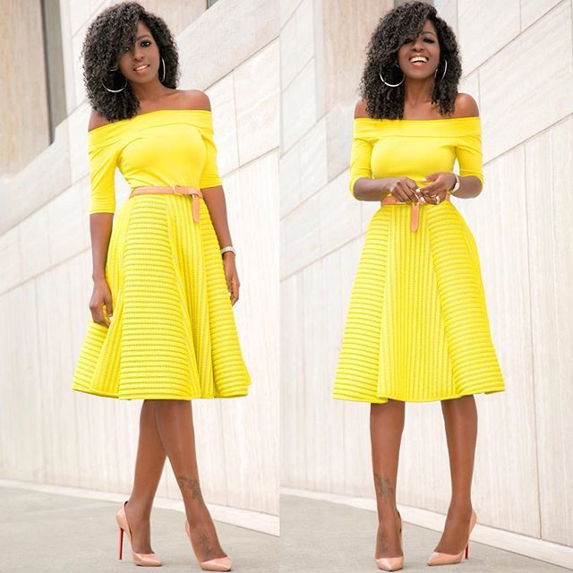

# What Style is, And Not

[Fashion](https://estheradeniyi.com/category/fashion/)
# What Style is, And Not

by [Esther Adeniyi](https://estheradeniyi.com/author/esther-adeniyi/)on [September 7, 2017May 25, 2018](https://estheradeniyi.com/what-style-is-and-no/)[Leave a Comment on What Style is, And Not](https://estheradeniyi.com/what-style-is-and-no/#respond)

Sharing is caring!

- [0](https://www.facebook.com/sharer/sharer.php?u=https%3A%2F%2Festheradeniyi.com%2Fwhat-style-is-and-no%2F&amp;t=What%20Style%20is%2C%20And%20Not)
- [0](https://twitter.com/intent/tweet?text=What%20Style%20is%2C%20And%20Not&amp;url=https%3A%2F%2Festheradeniyi.com%2Fwhat-style-is-and-no%2F)
- [257](#)

257shares

&#xA0;

These days we confuse style with fashion.
 In fact, some people use these terms interchangeably and that isn&#x2019;t supposed to
 be so. This piece is to help you see the difference between these terms.

## Style is personal, it is you

Style&#xA0;is individual, it is your brand. The way a woman chooses to express
 herself in spite of trends is her style. Style goes beyond your dressing, it is
 your totality. Your style is seen in your body posture, body language, the way
 you talk and the way you do things generally. A stylish woman is one who knows
 how best to express herself effectively without mincing words. Style differs
 from woman to woman.

You could be experimental, forward, daring
 and extroverted.

[The real difference between fashion and style](http://myyearwithoutclothesshopping.com/fashion-style-shopping/the-real-difference-between-fashion-and-style/)

You could also be shy, withdrawn and
 introverted.

Style goes way beyond your facial beauty.
 It is knowing your body and how to accentuate its positives and conceal its
 negatives. It is owning your guts, rocking your world and showing your inner
 self unapologetically.

## Style is not fashion

Fashion is what goes around, style is what
 happens within. Fashion is adopting trends, style is expressing self. A stylish
 woman closes her eyes to a new trend if she is well intuitive to know that it
 will not work well for her. See, you cannot rock everything you see on the
 runway. No. You can only get ideas from the craze. Fashion is crazy. Yeah, I
 just said that and am&#x2019;masay it again.Fashion.Is.Crazy. Dump fashion, pick
 style. Express your innermost self; enjoy dressing up; have fun [combining your wardrobe pieces](https://www.estheradeniyi.com/building-your-capsule-wardrobe-from); shop with gladness.

Style is you, &#xA0;fashion is them, &#xA0;so, &#xA0;savour every stylish moment.

Photo Credit: Folake Kuye Huntoon

Sharing is caring!

- [0](https://www.facebook.com/sharer/sharer.php?u=https%3A%2F%2Festheradeniyi.com%2Fwhat-style-is-and-no%2F&amp;t=What%20Style%20is%2C%20And%20Not)
- [0](https://twitter.com/intent/tweet?text=What%20Style%20is%2C%20And%20Not&amp;url=https%3A%2F%2Festheradeniyi.com%2Fwhat-style-is-and-no%2F)
- [257](#)

257shares

Tags:[Style](https://estheradeniyi.com/tag/style/)