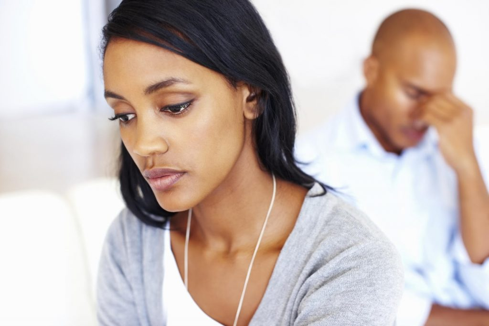

# Why do people cheat on their spouses?

[Relationships](https://estheradeniyi.com/category/relationships/)
# Why do people cheat on their spouses?

by [Esther Adeniyi](https://estheradeniyi.com/author/esther-adeniyi/)on [September 22, 2017May 25, 2018](https://estheradeniyi.com/why-do-people-cheat-on-their-spouses/)[1 Comment on Why do people cheat on their spouses?](https://estheradeniyi.com/why-do-people-cheat-on-their-spouses/#comments)

Sharing is caring!

- [0](https://www.facebook.com/sharer/sharer.php?u=https%3A%2F%2Festheradeniyi.com%2Fwhy-do-people-cheat-on-their-spouses%2F&amp;t=Why%20do%20people%20cheat%20on%20their%20spouses%3F)
- [0](https://twitter.com/intent/tweet?text=Why%20do%20people%20cheat%20on%20their%20spouses%3F&amp;url=https%3A%2F%2Festheradeniyi.com%2Fwhy-do-people-cheat-on-their-spouses%2F)
- [0](#)

0shares

Are they all built or structured to cheat.This is a question that I always ask.What makes you want to cheat?

When going into a relationship, both partners are expected to give it their all. They should be able to stick together through thick and thin but that seems like a thing of the past now. Men think they can do anything and women too have thrown caution to the wind.

[Why do people cheat on their spouses](https://www.thespruce.com/why-married-people-cheat-2300656)?

Nowadays it is normal when a man cheats, they don&#x2019;t really see it as a big deal. Commitments no longer mean anything, a lady then decides to cheat in turn because she is hurt by her spouse&#x2019;s actions.

This should not be the case. Even though it is true that some relationships have been rocky from the start while some do not even know what went wrong, I believe when love is still in the equation you can make things right.

I believe if you work back memory lane you should be able able to find the root of whatever problem you are having, trying to look for comfort elsewhere won&#x2019;t present itself as solution. Tell your spouse what you want, tell him or her what you feel they should be doing or rather what interests you more.

&#xA0;Is it the kind of panties they wear, the way they carry themselves or the way they make love? You can always teach you spouse all this. With [good communication](https://www.estheradeniyi.com/4-easy-communication-tips-for-couples) you are good to go. I have heard some women say NO I can&#x2019;t do that, always remember that one man&#x2019;s meat is another man&#x2019;s poison.There are some people waiting and hoping you will push him out. He is your husband, so work out your magic on him.
Women should always remember to compliment their spouses. A compliment, praise, show of love every now and then shows they are in your thoughts. It makes a man feel loved. Remember that cheating does not stop the problem, it&#x2019;s only the beginning of a new problem.

Keep this in mind the next time it crosses your mind to cheat.

Sharing is caring!

- [0](https://www.facebook.com/sharer/sharer.php?u=https%3A%2F%2Festheradeniyi.com%2Fwhy-do-people-cheat-on-their-spouses%2F&amp;t=Why%20do%20people%20cheat%20on%20their%20spouses%3F)
- [0](https://twitter.com/intent/tweet?text=Why%20do%20people%20cheat%20on%20their%20spouses%3F&amp;url=https%3A%2F%2Festheradeniyi.com%2Fwhy-do-people-cheat-on-their-spouses%2F)
- [0](#)

0shares

Tags:[Cheating](https://estheradeniyi.com/tag/cheating/)[Infidelity](https://estheradeniyi.com/tag/infidelity/)[Relationships](https://estheradeniyi.com/tag/relationships/)