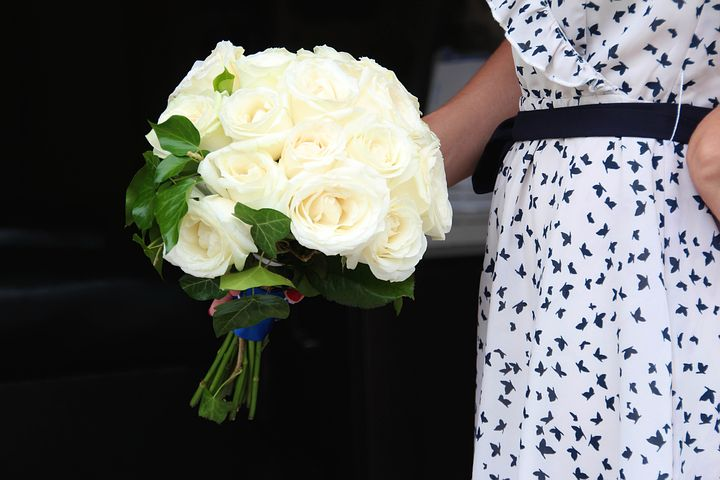

# Why do you want to get married?

[Uncategorized](https://estheradeniyi.com/category/uncategorized/)
# Why do you want to get married?

by [Esther Adeniyi](https://estheradeniyi.com/author/esther-adeniyi/)on [April 26, 2017April 27, 2018](https://estheradeniyi.com/why-do-you-want-to-get-married/)[7 Comments on Why do you want to get married?](https://estheradeniyi.com/why-do-you-want-to-get-married/#comments)

Sharing is caring!

- [0](https://www.facebook.com/sharer/sharer.php?u=https%3A%2F%2Festheradeniyi.com%2Fwhy-do-you-want-to-get-married%2F&amp;t=Why%20do%20you%20want%20to%20get%20married%3F)
- [0](https://twitter.com/intent/tweet?text=Why%20do%20you%20want%20to%20get%20married%3F&amp;url=https%3A%2F%2Festheradeniyi.com%2Fwhy-do-you-want-to-get-married%2F)
- [0](#)

0shares

 Hello ladies, get in here; this is exclusively for you.

I belong to an only ladies&#x2019; whatsapp group (The Refined Babes Network) where we had this discussion and I hope you&#x2019;d take time to pick out one or two lessons from it.

Let&#x2019;s talk about why you want to get married.

This will launch us into other important discussions. We are vowing to consciously be refined in all areas from henceforth.

Let&#x2019;s start by asking, what is your own definition of marriage?

Marriage is synergy.

Marriage is a union between two ready individuals who know what they want, are willing to go for it and do what it takes to make it work.

Marriage is the coming together of a man and woman, uniting to become one spiritually, physically, emotionally and in all other aspects

Marriage is a union of two matured individuals, who are ready to give what it takes to stay with their genuine vows to each other.

What is love to you?

Love is knowing the in and out of a person, their strengths and weaknesses and deciding to stick with them in spite of their many flaws, helping them to grow through the process of becoming better.

Love is loving me even when you hate me.

Love is being able to call me out on my crap.

Love is knowing you and I aren&#x2019;t Siamese twins but remaining willing to learn about me and adjust.

Our knowledge of love and marriage will help us in our decision to settle down among other things

&#x201C;What is love to me?&#x201D;
 We should daily ask and answer this question sincerely.

This is because the definition can change as a result of situations or environment or whatever. However, as it changes, a word or phrase will still reoccur and remain constant in the different definitions..

That word or phrase is your true definition of love.

Sometimes, our definition of love and reason for marriage stems from what we lacked while growing up or what we see around us.

This definition or reason for marriage may not be true because our true selves, asides from environment may want something different.

For instance, I may have grown in a family where my father does not show love to his children. I grow up seeking and defining love as blah blah blah and want to marry a man that shows his feelings or care or whatever. Meanwhile, my true self wants a man who can just provide for his family and I will be fine.

Sometimes, against what we front as our reason for falling in love or getting married, are hidden things which drive us more, such as things we lacked while growing up, things that are our weakness, things we can&#x2019;t do, to feel among, to feel complete, etc

Let me reiterate what we must have heard countless times:

MARRIAGE DOES NOT COMPLETE YOU.

YOU HAVE TO FIND YOURSELF BEFORE MARRIAGE

MARRIAGE DOES NOT TAKE AWAY YOUR HURT OR INSECURITIES

MARRIAGE DOESN&#x2019;T COVER &#xA0;OR TAKE AWAY YOUR WEAKNESSES

MARRIAGE DOES NOT MAKE YOU SANE

MARRIAGE DOES NOT GIVE YOU ANY EDGE OVER YOUR MATES (Except that some eye service people will start calling you madam and kini)

MARRIAGE DOES NOT SOLVE YOUR INADEQUACIES

MARRIAGE DOES NOT MAKE YOUR UGLY PAST LEAVE YOU ALONE.

ETC

You have to consciously deal with all of the above mentioned things before getting yoked with someone else, otherwise, you will just be carrying even worse baggage around.

In deciding that we are in love or want to get married, let&#x2019;s check whether what we are fronting as our reason for getting married aligns with what our inner reason is.

How do you do this?

Take time constantly to relax. Look at the things happening around you in different marriages that you don&#x2019;t like. If those things were not there and all was rosy, will you still have those reasons as reasons to get married?

Now, it&#x2019;s also one thing to want to marry and another thing to be ready to marry and another one yet, to know when you are ready to marry.

Where we often times get stuck is knowing when we are ready to get married.

If you don&#x2019;t know when you are ready to get married, you wee kuku marry and it will be katakata every other day.

There are no written rules to know when you&#x2019;re ready to get married that I am aware of. No laid down determining factors. It&#x2019;s all a personal business.

But I will explain quickly

To want to marry= Reason(s) for marrying

To be ready= You have ticked almost all your boxes good. You have worked on all your flaws or almost. You have known yourself and developed yourself. You have known what it takes to be yoked and stay yoked, etc.

To know you are ready= You have come to a point of awareness that you have satisfied your steps to being ready

It&#x2019;s a problem to think you are ready for marriage. You ought to know, don&#x2019;t just think it.

But hey! How can you even know when you have not set anything as standards or steps to take before marriage?

Where we often miss our step is in the preparation.

We hold the crap that &#x201C;If he loves me, he will love my flaws&#x201D; to heart. My friend, get serious! Who flaws epp? Time and space to love and do another thing, he will be loving flaws abi?

Love is not blind. It can choose to wear sunshades but love cannot be blind. It&#x2019;s our core values that merge in a relationship/marriage.

Our love relationship/marriage is only as good as our content as individuals. And love is beautiful! Not all men or women are scum ?

That all marriages around you are failing does not mean yours will fail.

That your parents don&#x2019;t have a beautiful love story does not mean you can&#x2019;t have one.

Inasmuch as our environment affects us too, we can consciously build ourselves for our homes. That&#x2019;s the part about setting guidelines or steps personally towards being ready for marriage. You should consciously work on the things you think made marriages around you fail so that you don&#x2019;t end up that way

Marriage is NOT HARD WORK, you should do all the hard work before you get married.

It still boils down to your getting ready for marriage and knowing that you are ready

Work on your self. Work on your flaws and weaknesses. Find yourself. Be complete before getting entangled.

I don&#x2019;t want to go into the spiritual angle so I will just say find, seek and KNOW GOD for and by YOURSELF. He is the ULTIMATE of all. If we do all the preparation and He doesn&#x2019;t bless it, OYO is our case.

So, before you decide to &#x2018;settle down&#x2019;, ask yourself, &#x201C;What are the guidelines I have set in preparation for marriage?&#x201D;

If you don&#x2019;t have, get a book and pen. Write stuffs you intend to work on down.

If you are still sleeping around,
 If you still love your own company more than life
 If you can&#x2019;t share your space
 If you still lie
 If you still gossip
 If you still pretend
 If you still live your life to please others
 If you are still a collection of people&#x2019;s opinions
 If you don&#x2019;t know why you are living
 If you are still dabbling into everything you see
 If you don&#x2019;t know and practice the power of compromise
 If you are too independent to a fault &#xA0;(I know this one will raise questions)
 If you are still following confused people to chant feminism (think it well)
 If you still think marriage will save you from yourself
 If&#x2026;.

YOU ARE NOT READY TO GET MARRIED and you have no business putting another human in your mess.

People lose themselves in marriage, how do you know if you find yourself here?
 First of all, do you know yourself? If you do, you will know when you are not doing you and then you will know that you have started loosing yourself. .

Also, when you have suddenly veered off from what makes you tick. People call it destiny or purpose or something. When you have started living your life for living sake, you are loosing you.

Lemme add here that your purpose and that of your hubby will be interwoven. They might not have the same process but the end product will be the same. That&#x2019;s where the synergy thing comes in and one chasing a thousand and two chasing millions.

Before I enter purpose, lemme pause

As babes with quality character, let&#x2019;s be deliberate in these things so that we will have years to keep celebrating.

We have to consciously attend to certain things and do all the hard work before marriage.

You that is thinking knowing God solves it all, you are in for a long ride.

God will not come down and do ya marriage for you. You have to be deliberate about these things.

Shebi marrying wrongly they say, is the worst thing that can happen to one. Especially for believers that don&#x2019;t believe in divorce.

To avoid stories that touch, DO THE WORK NOW!

If you don&#x2019;t do the work now, marriage will be hard work for you. It will be stressful. It will be boring. It will be problematic. It will be so so and so

Lastly, I will recommend TD Jakes&#x2019; book &#x201C;Before you say I do&#x201D;. It contains lots of questions one can ask at different stages of life.

I wish you a successful marriage even as you take time to scrutinize your reasons for getting married.

Content Credit: All the babes of The Refined Babes Network
 Cc: Ugochi Gold Nwachukwu, Eunice Adesina, Maryjane Okobi, Becky Oladimeji Olatunji

Sharing is caring!

- [0](https://www.facebook.com/sharer/sharer.php?u=https%3A%2F%2Festheradeniyi.com%2Fwhy-do-you-want-to-get-married%2F&amp;t=Why%20do%20you%20want%20to%20get%20married%3F)
- [0](https://twitter.com/intent/tweet?text=Why%20do%20you%20want%20to%20get%20married%3F&amp;url=https%3A%2F%2Festheradeniyi.com%2Fwhy-do-you-want-to-get-married%2F)
- [0](#)

0shares

Tags:[Relationships](https://estheradeniyi.com/tag/relationships/)