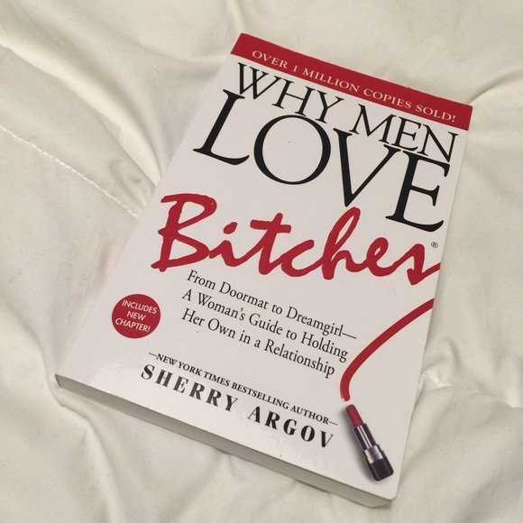

# Why Men Love Bitches by Sherry Argov

[Books](https://estheradeniyi.com/category/books/)
# Why Men Love Bitches by Sherry Argov

by [Esther Adeniyi](https://estheradeniyi.com/author/esther-adeniyi/)on [September 30, 2017April 27, 2018](https://estheradeniyi.com/why-men-love-bitches-by-sherry-argov/)[4 Comments on Why Men Love Bitches by Sherry Argov](https://estheradeniyi.com/why-men-love-bitches-by-sherry-argov/#comments)

Sharing is caring!

- [0](https://www.facebook.com/sharer/sharer.php?u=https%3A%2F%2Festheradeniyi.com%2Fwhy-men-love-bitches-by-sherry-argov%2F&amp;t=Why%20Men%20Love%20Bitches%20by%20Sherry%20Argov)
- [0](https://twitter.com/intent/tweet?text=Why%20Men%20Love%20Bitches%20by%20Sherry%20Argov&amp;url=https%3A%2F%2Festheradeniyi.com%2Fwhy-men-love-bitches-by-sherry-argov%2F)
- [0](#)

0shares

## &#x201C;Why Men Love Bitches by Sherry Argov&#x201D; is a guest post by Blessing Okakwu

A while back I got into a relationship and for a few weeks dude was cool then without warning dude began to act like God&#x2019;s gift to me. You know when you are so sure of something you completely stop trying. I was truly shocked and couldn&#x2019;t understand where all the attitude was coming from.

I complained to a friend of mine and she gave me a book to read; Why Men Love Bitches by [Sherry Argov](https://en.m.wikipedia.org/wiki/Sherry_Argov). The book like other Sherry Argov&#x2019;s books was truly an eye opener for me. I have been living my life as a &#x2018;nice girl&#x2019; to please when I should have just folded my arms and watch him please me.

Of course there is nothing wrong with being nice, in fact the book categorically tells you this. But when you are being overly nice and trying to impress someone who should wake up every day thinking of ways to impress you then you are certainly killing all the fun for him.

[Read #Girlboss by Sophia Amoruso review here](https://www.estheradeniyi.com/book-review-girl-boss-by-sophia-amoruso)

I know some people will try to argue that a sensible guy will choose a nice girl over a bitch any day any time, but the bitch the book by Sherry Argov refers to isn&#x2019;t someone who is vulgar or cold hearted mean spirited, the bitch referred to here is just someone who will fold her arms and watch as her man sweats to please her. Trust me, Men love these kind of ladies.

How many of you have seen a man leave a perfectly nice girl, the one who cleans cook and does his laundry for someone who wouldn&#x2019;t touch his clothes with a 10ft pole, someone who makes him order out regularly and how many of you have seen these men do things for these ladies they will never do for the &#x2018;nice girl&#x2019;.

Some people even go as far as calling the man names without realizing that &#x2018;the bitch&#x2019; is giving the guy the opportunity to show his manliness. She is making him value her with every single thing he does for her, while the nice girl is just making everything too easy there by making him bored in no time.

The difference between the [&#x2018;nice girl&#x2019; and &#x2018;the bitch&#x2019;](https://www.estheradeniyi.com/good-girls-versus-smart-girls) is the challenge the bitch presents. The truth is men love mental challenge, and the minute something stops being challenging, they begin to lose interest little by little until you become a complete bore. The main idea here is to ensure that your man doesn&#x2019;t begin to think that he has a &#x2018;100&#x2019; percent hold over you. At every point in time, the bitch knows not to get swept up by romantic fantasies.

You might be wondering how to know if you are a &#x2018;nice girl&#x2019; or &#x2018;a bitch&#x2019;. Well if you do any of these things, you are a nice girl and you need to stop it. [Go from being a doormat to the dream girl](https://www.estheradeniyi.com/go-from-being-doormat-to-dream-girl).

If you are the type of girl who overcompensates in a relationship with a man you barely know, a man who hasn&#x2019;t really invested in the relationship, simply because you want love so badly you are throwing it all out. Then you need to check it. If you continue that way you may never get what you want.

If you are the type of girl who wants to do anything you think your man will like or want, then you need to watch it, if not you will become a bore a faster than you can spell your name.

If you are the type of girl who invites your man over and decides to cook pounded yam and egusi soup for him after just two dates then you better watch it. He may end up leaving you for someone who cannot even cook indomie.

If you are the type of girl who believes in being intimate with a man you barely know simply because you want to keep him, then you need to check it. He will have do as much as he wants to and then walk away just because he is bored.

Why Men Love Bitches by Sherry Argov talks about a lot more characters of a nice girl, you should read it. The book also talks about how to move from being a nice girl to a dream girl (bitch). Though this may not hold for every relationship but it holds for a lot. Give it a try, you will see just how right the author is.

Photo credit : [Posh Mark](https://poshmark.com/listing/Why-Men-Love-Bitches-by-Sherry-Argov-565e71c96ba9e6f2cf04a11d)

Related: What the Chinese don&#x2019;t eat by [Xinran](https://www.estheradeniyi.com/what-chinese-dont-eat-by-xinran)

## Other books by Sherry Argov

Why men marry bitches by Sherry Argov

Sharing is caring!

- [0](https://www.facebook.com/sharer/sharer.php?u=https%3A%2F%2Festheradeniyi.com%2Fwhy-men-love-bitches-by-sherry-argov%2F&amp;t=Why%20Men%20Love%20Bitches%20by%20Sherry%20Argov)
- [0](https://twitter.com/intent/tweet?text=Why%20Men%20Love%20Bitches%20by%20Sherry%20Argov&amp;url=https%3A%2F%2Festheradeniyi.com%2Fwhy-men-love-bitches-by-sherry-argov%2F)
- [0](#)

0shares

Tags:[Book reviews](https://estheradeniyi.com/tag/book-reviews/)[Books](https://estheradeniyi.com/tag/books/)[Guest post](https://estheradeniyi.com/tag/guest-post/)[Relationships](https://estheradeniyi.com/tag/relationships/)[Reviews](https://estheradeniyi.com/tag/reviews/)