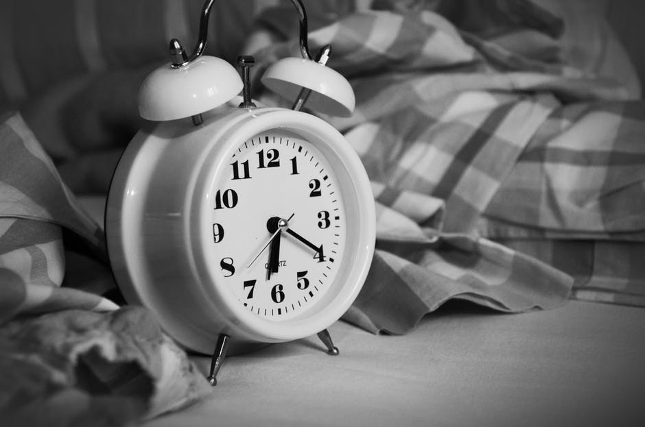

# Why You May Not Be Sleeping Well

[Health and fitness](https://estheradeniyi.com/category/health-and-fitness/)
# Why You May Not Be Sleeping Well

by [Esther Adeniyi](https://estheradeniyi.com/author/esther-adeniyi/)on [February 15, 2016May 25, 2018](https://estheradeniyi.com/why-you-may-not-be-sleeping-we/)[Leave a Comment on Why You May Not Be Sleeping Well](https://estheradeniyi.com/why-you-may-not-be-sleeping-we/#respond)

Sharing is caring!

- [0](https://www.facebook.com/sharer/sharer.php?u=https%3A%2F%2Festheradeniyi.com%2Fwhy-you-may-not-be-sleeping-we%2F&amp;t=Why%20You%20May%20Not%20Be%20Sleeping%20Well)
- [0](https://twitter.com/intent/tweet?text=Why%20You%20May%20Not%20Be%20Sleeping%20Well&amp;url=https%3A%2F%2Festheradeniyi.com%2Fwhy-you-may-not-be-sleeping-we%2F)
- [1](#)

1shares

These days we rarely have time to cool off from the hustling and bustling everywhere. &#xA0;It is getting harder and harder to rest like we really should. &#xA0;It is as bad as having sleeping disorders including insomnia.

At some point in our busy lives we are led to believe that we can&#x2019;t help it. You might have brainwashed yourself by yourself that it is practically impossible to sleep peacefully. &#xA0;I used to wonder if it was ever possible for a busy woman to get the required 6-8 hours of sleep. &#xA0;I am now more convinced that any woman can get it no matter how busy she is. Oh, &#xA0;yes, &#xA0;it is a matter of effective time management.

I am not going to be addressing [how long you should sleep.](https://www.thesleepjudge.com/how-much-sleep-do-you-need/) &#xA0;I am in this article concerned about getting quality night rest no matter how short. And yes, &#xA0;it is possible.

There are many factors that affect poor sleep but I believe that this one I want to make mention of is one of the most common causes of sleeping disorders of all sorts and the sooner you take strict and quick decisions about it, &#xA0;the better it will be for your lifestyle as a whole.

Asking people to stay away from their phones once in a while during the day is a tough one. &#xA0;But you need to be disciplined about this now that it is your sleeping hours.

This is one difficult advice to take in for people who think that they need to be active every time all day on the Internet. &#xA0;I understand that we all have different work schedules and expectations.

But take a look at this:

&#x201C;In a study of 10,000 16-19 year olds, &#xA0;researchers in Norway found that the longer a young person spent at looking at an electronic screen &#xA0;before going to bed, &#xA0;the worse quality sleep they were likely to have&#x201D;, &#xA0;Charlie Cooper in Independent.co.uk

How bad is that? &#xA0;Very bad.

Do you want to know what&#x2019;s worse? &#xA0;Even during our sleep we are still exposed to the dangers of our Internet enabled phones e.g Smartphones if they are not switched off.

I am a [lifestyle Blogger](https://www.estheradeniyi.com/what-is-lifestyle-blogging) and I must confess to you: managing my gadgets used to be difficult for me. I didn&#x2019;t take any tangible decision until I realized how deep the effect was chipping into my sleep. There would be a Facebook pop notification sound, whatsapp ping sound. &#xA0;If it wasn&#x2019;t my email notifying me of a new message, &#xA0;it was Instagram notifying me of a new like, &#xA0;comment or following.

It is tempting to check these notifications if they succeed in waking you up. &#xA0;By doing this, &#xA0;you have altered your all night pattern. &#xA0;You may be lucky to have no problems in getting back to your sleep but you have &#x2018;cut the flow&#x2019;. &#xA0;Have you ever wondered why you sometimes wake up with a heavy head, &#xA0;an ache or pain?

Now is the time to make the decision for you might be overly exposing yourself to your smart phones, &#xA0;laptops and ipads. &#xA0;It is time to take one very important decision that may help you have a good night rest, &#xA0;boost your energy and give you the necessary motivation you need for the following day.

You can leave your primary contact phone on but turn off the other gadgets tonight !

Sharing is caring!

- [0](https://www.facebook.com/sharer/sharer.php?u=https%3A%2F%2Festheradeniyi.com%2Fwhy-you-may-not-be-sleeping-we%2F&amp;t=Why%20You%20May%20Not%20Be%20Sleeping%20Well)
- [0](https://twitter.com/intent/tweet?text=Why%20You%20May%20Not%20Be%20Sleeping%20Well&amp;url=https%3A%2F%2Festheradeniyi.com%2Fwhy-you-may-not-be-sleeping-we%2F)
- [1](#)

1shares

Tags:[Health and fitness](https://estheradeniyi.com/tag/health-and-fitness/)