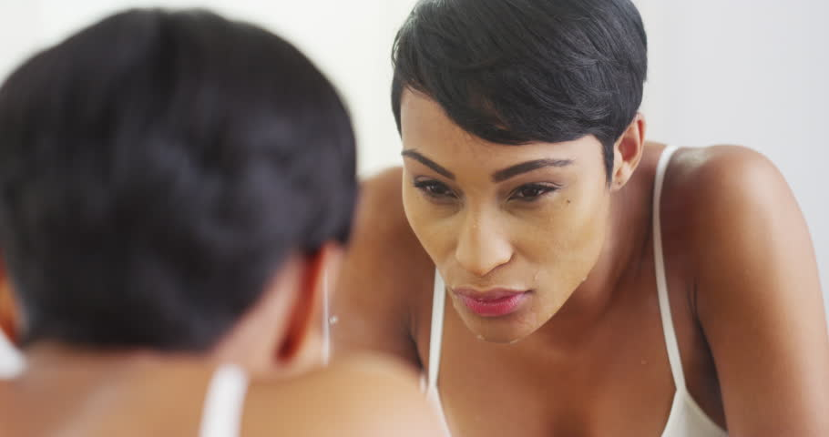

# Wood ash face mask for a fresher skin

[Beauty](https://estheradeniyi.com/category/beauty/)
# Wood ash face mask for a fresher skin

by [Esther Adeniyi](https://estheradeniyi.com/author/esther-adeniyi/)on [September 21, 2017May 25, 2018](https://estheradeniyi.com/wood-ash-face-mask-for-fresher-skin/)[5 Comments on Wood ash face mask for a fresher skin](https://estheradeniyi.com/wood-ash-face-mask-for-fresher-skin/#comments)

Sharing is caring!

- [1](https://www.facebook.com/sharer/sharer.php?u=https%3A%2F%2Festheradeniyi.com%2Fwood-ash-face-mask-for-fresher-skin%2F&amp;t=Wood%20ash%20face%20mask%20for%20a%20fresher%20skin)
- [0](https://twitter.com/intent/tweet?text=Wood%20ash%20face%20mask%20for%20a%20fresher%20skin&amp;url=https%3A%2F%2Festheradeniyi.com%2Fwood-ash-face-mask-for-fresher-skin%2F)
- [1](#)

2shares

In today&#x2019;s beauty world, almost everything is coming in handy. Wood ash face mask is a direct testament to that. Wood ash skin benefits is so immense that I can&#x2019;t help but make it a thing.

Who would think ashes could help the skin in any way, but &#x201C;He has given us beauty in stead of ashes&#x201D;. I am quoting from the Bible. These words could mean there was an ash before the beauty abi??

Of all the very many benefits of [wood ash](http://www.naturallivingideas.com/wood-ash-uses/), the use of it as a face mask is one that is rather surprising. It helps against dark spots. Have a clean, fresh and smooth facial skin with wood ash. Read below to see how to make it.

## What we&#x2019;ll need to make wood ash face mask

1/4 cup clay
 1/4 cup wood ash

[Also read about Vaseline beauty hacks here](https://www.estheradeniyi.com/these-vaseline-beauty-hacks-will-make)

## Directions for making your wood ash face mask&#xA0;

Put 1/4 cup clay and 1/4 cup wood ash in a bowl.

Add water till it becomes a thick paste.

Put it on your face and leave for ten minutes.

Remove it and apply any type of raw oil on your face (coconut, olive etc).

There you go, your wood ash face mask.

Photo credit: Shutterstock

Sharing is caring!

- [1](https://www.facebook.com/sharer/sharer.php?u=https%3A%2F%2Festheradeniyi.com%2Fwood-ash-face-mask-for-fresher-skin%2F&amp;t=Wood%20ash%20face%20mask%20for%20a%20fresher%20skin)
- [0](https://twitter.com/intent/tweet?text=Wood%20ash%20face%20mask%20for%20a%20fresher%20skin&amp;url=https%3A%2F%2Festheradeniyi.com%2Fwood-ash-face-mask-for-fresher-skin%2F)
- [1](#)

2shares

Tags:[Beauty](https://estheradeniyi.com/tag/beauty/)[DIY](https://estheradeniyi.com/tag/diy/)[Facial mask](https://estheradeniyi.com/tag/facial-mask/)